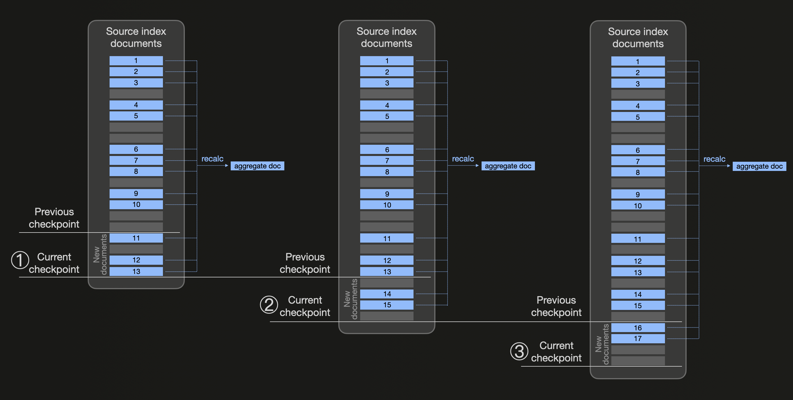
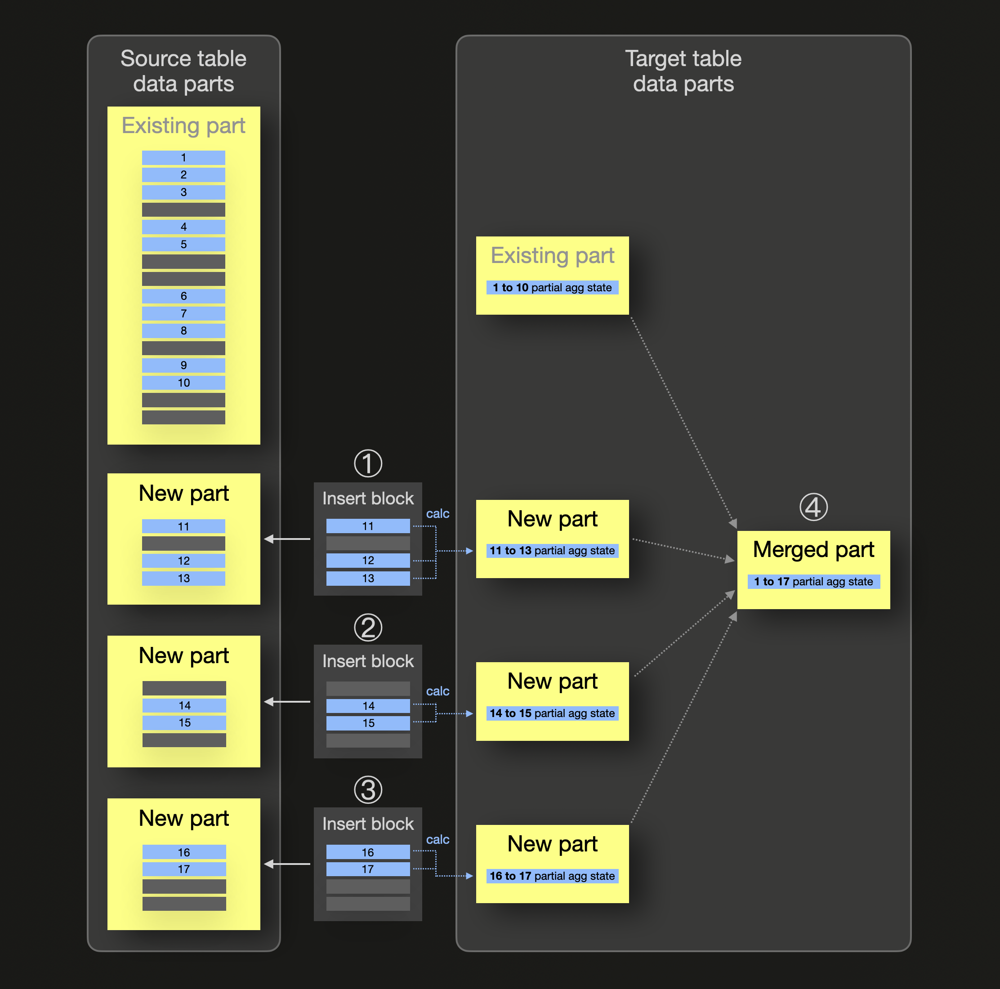
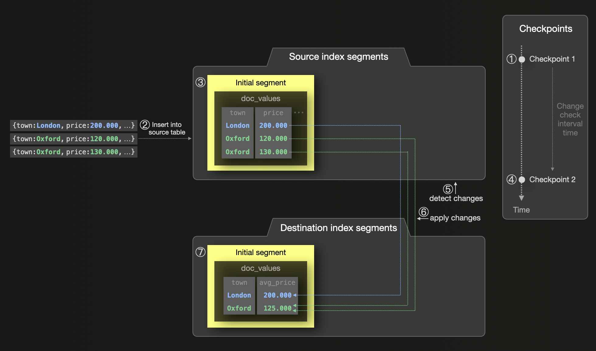
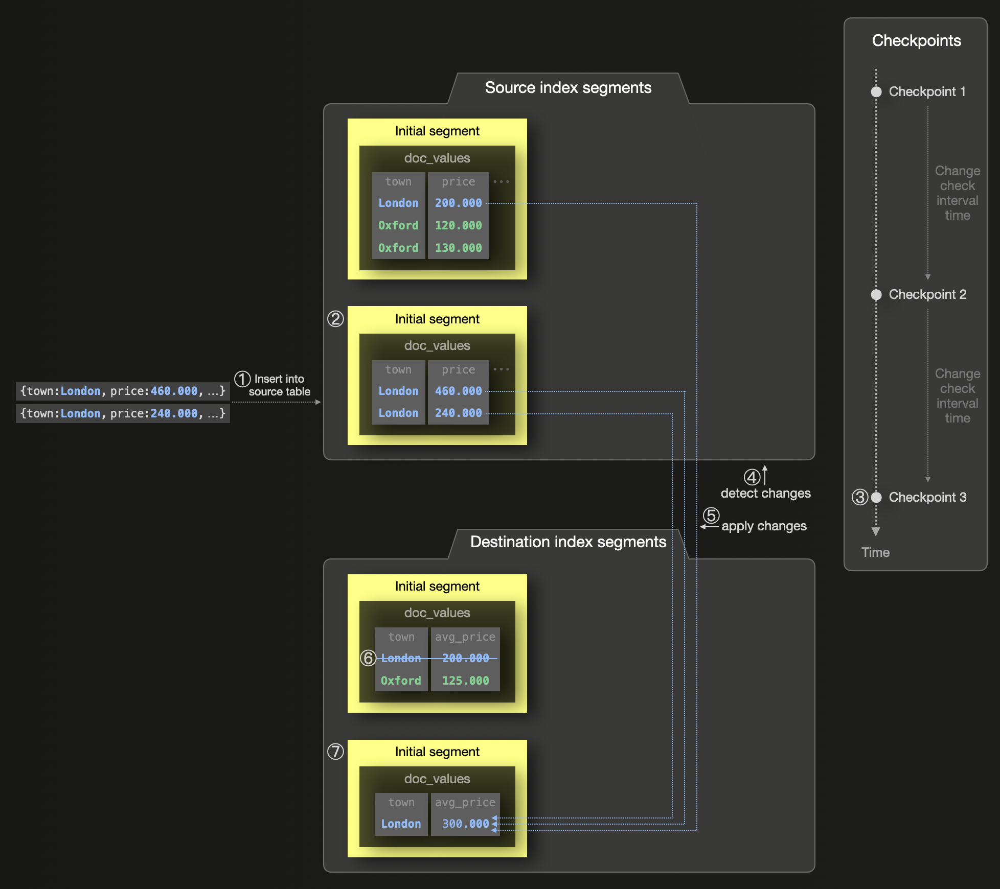
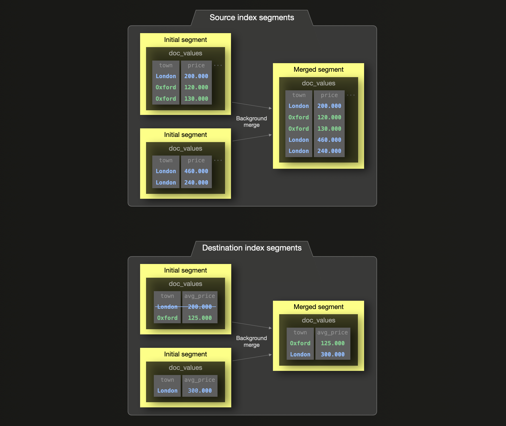
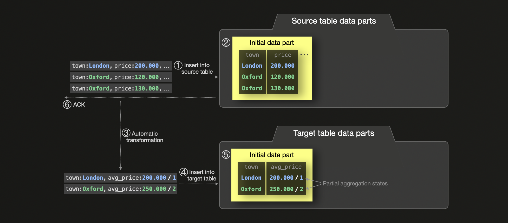
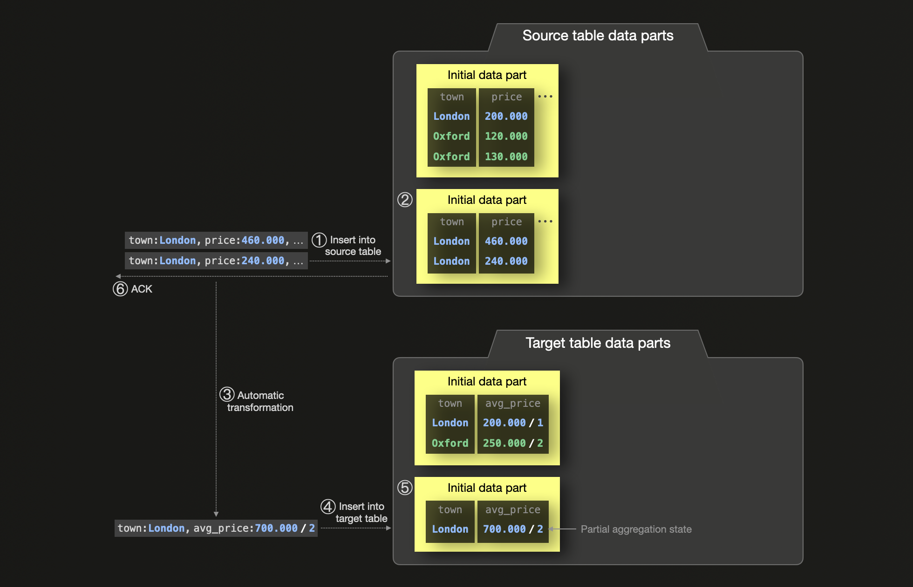
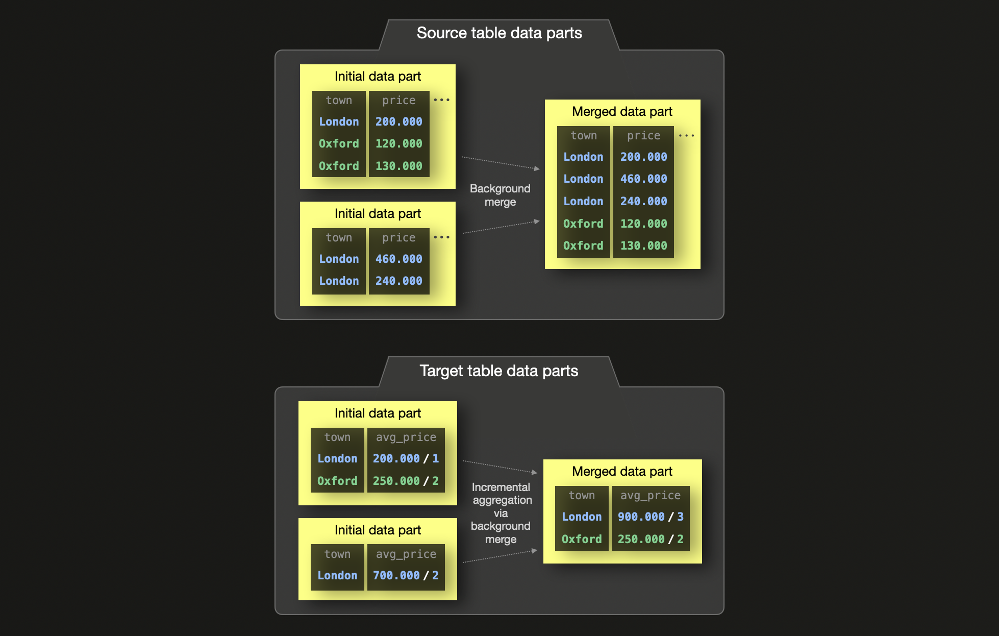

# Continuous data transformation techniques

Based on the [Elasticsearch on-disk format](../On-disk_format_and_insert_processing/README.md#elasticsearch) and [ClickHouse on-disk format](../On-disk_format_and_insert_processing/README.md#clickhouse), we describe how their techniques for continuous data transformation work in detail here.

## Elasticsearch

Elasticsearch provides a mechanism called [transforms](https://www.elastic.co/guide/en/elasticsearch/reference/current/transforms.html) for batch-converting existing indices into summarized indices or continuously converting index data.   

The following diagram sketches abstractly how continuous transforms work (note that we use the blue color for all documents belonging to the same bucket for which we want to pre-calculate aggregate values): 

Continuous transforms use transform [checkpoints](https://www.elastic.co/guide/en/elasticsearch/reference/current/transform-checkpoints.html) based on a configurable check interval time (transform [frequency](https://www.elastic.co/guide/en/elasticsearch/reference/current/put-transform.html) with a default value of 1 minute). In the diagram above, we assume ① a new checkpoint is created after the check interval time has elapsed. Now Elasticsearch checks for changes in the transforms’ source index and detects three new `blue` documents (11, 12, and 13) that exist since the previous checkpoint. Therefore the source index is filtered for all existing `blue` documents, and, with a [composite aggregation](https://www.elastic.co/guide/en/elasticsearch/reference/current/search-aggregations-bucket-composite-aggregation.html) (to utilize result [pagination](https://www.elastic.co/guide/en/elasticsearch/reference/current/paginate-search-results.html)), the aggregate values are recalculated (and the destination index is updated with a document replacing the document containing the previous aggregation values). Similarly, at ② and ③, new checkpoints are processed by checking for changes and recalculating the aggregate values from all existing documents belonging to the same ‘blue’ bucket.

You can see a more concrete example of Elasticsearch transforms [here](./README.md#elasticsearch-transforms). 

## ClickHouse

ClickHouse uses [materialized views](https://clickhouse.com/docs/en/guides/developer/cascading-materialized-views) in combination with the [AggregatingMergeTree](https://clickhouse.com/docs/en/engines/table-engines/mergetree-family/aggregatingmergetree#aggregatingmergetree) table engine and [partial aggregation states](https://clickhouse.com/docs/en/sql-reference/data-types/aggregatefunction) for automatic and, in contrast to Elasticsearch, **incremental** data transformation.  

We sketch the mechanics of incremental materialized views abstractly (note that we use the blue color for all rows belonging to the same group for which we want to pre-calculate aggregate values): 

In the diagram above, the materialized view’s source table already contains a data part storing some `blue` rows (1 to 10) belonging to the same group. For this group, there also already exists a data part in the materialized view’s target table storing a [partial aggregation state](https://www.youtube.com/watch?v=QDAJTKZT8y4) for the `blue` group. When ① ② ③ inserts into the source table with new rows take place, a corresponding source table data part is created for each insert, and, in parallel, (just) for each block of newly inserted rows, a partial aggregation state is calculated and inserted in the form of a data part into the materialized view’s target table. ④ During background part merges, the partial aggregation states are merged, resulting in incremental data aggregation. 

Note that all [over 90 aggregate functions](https://clickhouse.com/docs/en/sql-reference/aggregate-functions/reference), including their combination with aggregate function [combinators](https://www.youtube.com/watch?v=7ApwD0cfAFI), support [partial aggregation states](https://clickhouse.com/docs/en/sql-reference/data-types/aggregatefunction). 

You can see a more concrete example of ClickHouse materializes views [here](./README.md#clickhouse-materialized-views). 

# Continuous data transformation example

We use the [UK property prices dataset](https://clickhouse.com/docs/en/getting-started/example-datasets/uk-price-paid) where we want to pre-aggregate the average property price per city.

## Elasticsearch transforms

The following diagram shows how three documents are inserted (e.g. via [bulk api](https://www.elastic.co/guide/en/elasticsearch/reference/current/docs-bulk.html)) into an initially empty index for storing the raw data. This index is configured to be the source index for continuous transforms into a destination index storing the pre-calculated average price per city:

① The initial transform checkpoint occurred while the source index was empty. ② A bulk insert with three documents ③ creates a corresponding source index segment. ④ After the check interval time has elapsed, a new checkpoint is created, ⑤ changes in the source index are detected, ⑥ aggregate values are calculated, and ⑦ a corresponding destination index segment is created.

The following diagram visualizes an additional bulk insert into the source index:

① A bulk insert with two documents ② creates a new source index segment. ③ After the check interval time has elapsed, a checkpoint is created, ④ changes in the source index are detected, ⑤ aggregate values are re-calculated (from scratch), ⑥ the previous aggregate values for the changed bucket are marked as deleted, and ⑦ a corresponding destination index segment is created.

For completeness, we also sketch background segment merges:

## ClickHouse materialized views

① A bulk insert with three rows ② creates a corresponding source table data part. ③ In parallel, the block of newly inserted rows is transformed into partial aggregation states (e.g., a `sum` and a `count` for `avg()`) by the materialized view’s [transformation query](https://www.youtube.com/watch?v=QDAJTKZT8y4), and ④ a corresponding ⑤ data part is inserted into the materialized view’s target table. Finally, ⑥ the insert into the source table is acknowledged.

We visualize another bulk insert into the source table:

① A bulk insert with two rows ② creates a source table data part. ③ In parallel, the block of newly inserted rows is transformed into partial `avg` aggregation states,  ④ a corresponding ⑤ data part is inserted into the materialized view’s target table, and ⑥ the insert into the source table is acknowledged.

Background part merges continue the incremental data transformation:

The diagram above shows how the partial aggregation states for `avg` are combined during a background part merge.

Users can consolidate the partial aggregation states in the materialized view’s target table using `avg()` with the -[Merge](https://clickhouse.com/docs/en/sql-reference/aggregate-functions/combinators#-merge) extension to obtain the final result.

Note that all [over 90 aggregate functions](https://clickhouse.com/docs/en/sql-reference/aggregate-functions/reference), including their combination with aggregate function [combinators](https://www.youtube.com/watch?v=7ApwD0cfAFI), support partial aggregation states. To give one additional example, the partial state for [uniqExact](https://clickhouse.com/docs/en/sql-reference/aggregate-functions/reference/uniqexact) is a hashtable containing unique value hashes.