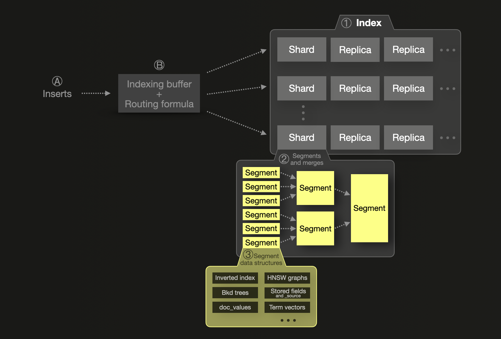
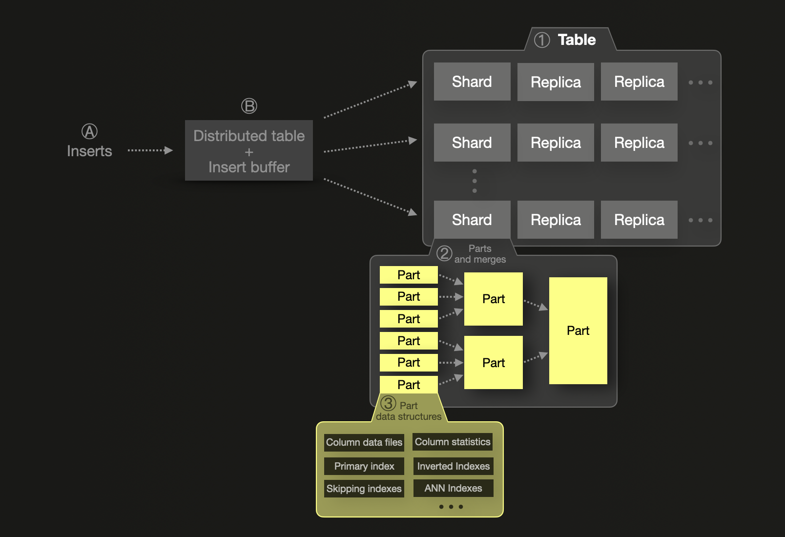

# On-disk format and insert processing primer

## Elasticsearch

Elasticsearch stores and indexes JSON documents within an ① [index](https://www.elastic.co/blog/what-is-an-elasticsearch-index), a logical grouping of one or more physical shards. A shard can have one or more physical copies called replica shards for resilience. For scalability, shards and replicas can be [distributed](https://www.elastic.co/guide/en/elasticsearch/reference/current/scalability.html) over several nodes. A single shard ② consists of one or more immutable segments. A segment is the basic indexing structure of [Lucene](https://lucene.apache.org/), the Java library providing the indexing and search features on which Elasticsearch is based. A segment ③ is a container for several data structures: \

* [Inverted index](https://en.wikipedia.org/wiki/Inverted_index) is the basic data structure for full-text searches.
* [Block K-D trees](https://users.cs.duke.edu/~pankaj/publications/papers/bkd-sstd.pdf) are used for searches on geospatial data and numeric and date ranges. 
* [Doc_values](https://www.elastic.co/guide/en/elasticsearch/reference/current/doc-values.html) store values in a column-oriented on-disk data structure, providing optimal data access patterns for aggregations, sorts, and scripted field values access.
* [HNSW graphs](https://en.wikipedia.org/wiki/Hierarchical_Navigable_Small_World_graphs) are utilized for vector searches.
* [Stored fields](https://www.elastic.co/guide/en/elasticsearch/reference/current/mapping-store.html) are used to return the original values of fields in the response to a search query. By default, stored fields also store [_source](https://www.elastic.co/guide/en/elasticsearch/reference/current/mapping-source-field.html) - which contains the original JSON document body passed at index time.
* [Term vectors](https://www.elastic.co/guide/en/elasticsearch/reference/current/term-vector.html) are per-document inverted indices.

In Elasticsearch, [index mappings](https://www.elastic.co/guide/en/elasticsearch/reference/current/mapping.html) (equivalent to table schemas in ClickHouse) control which of the above-listed segment data structures are populated from the fields of indexed JSON documents.

Ⓐ Newly inserted documents Ⓑ first go into an in-memory [indexing buffer](https://www.elastic.co/guide/en/elasticsearch/reference/8.13/near-real-time.html) that is flushed by default once per second. A [routing formula](https://www.elastic.co/guide/en/elasticsearch/reference/current/mapping-routing-field.html) is used to determine the target shard for flushed documents, and a new segment is written for the shard on disk. To improve query efficiency and enable the physical deletion of deleted or updated documents, segments are continuously merged in the background into larger segments until they reach a [max size](https://lucene.apache.org/core/9_9_1/core/org/apache/lucene/index/MergePolicy.html#DEFAULT_MAX_CFS_SEGMENT_SIZE) of 5 GB. It is possible to [force](https://www.elastic.co/guide/en/elasticsearch/reference/current/indices-forcemerge.html) a merge into larger segments, though.

Some segment data structures (e.g. stored fields and doc_values) are stored in a compressed format ([LZ4](https://en.wikipedia.org/wiki/LZ4_(compression_algorithm)) by default, optionally [Deflate](https://en.wikipedia.org/wiki/Deflate) for a higher compression ratio, at the [expense](https://www.elastic.co/guide/en/elasticsearch/reference/current/index-modules.html) of slower `stored fields` performance).

Furthermore, it is possible to configure how the data stored in some segment data structures (e.g., doc_values) is physically sorted on disk. By default, Lucene does not apply any sorting. When segment and search sort orders are the same, early termination of the search request is possible.

## ClickHouse

The logical on-disk data structuring and insert processing are similar to Elasticsearch:

ClickHouse stores rows in tables. Similar to an Elasticsearch index, the data of a ClickHouse table can be ① split into several shards that can be [distributed](https://www.youtube.com/watch?v=vBjCJtw_Ei0) over multiple nodes for scalability. Each shard can have physical copies called replicas for resilience. The data within a single shard is organized as a collection of ② immutable data parts containing ③ several data structures: 

* [Column data files](https://clickhouse.com/docs/en/optimize/sparse-primary-indexes#data-is-stored-on-disk-ordered-by-primary-key-columns) contain the table’s compressed ([LZ4](https://en.wikipedia.org/wiki/LZ4_(compression_algorithm)) by default, optionally [ZSTD](https://en.wikipedia.org/wiki/Zstd)) column data.
* [Primary index](https://clickhouse.com/docs/en/optimize/sparse-primary-indexes#clickhouse-index-design) is used for skipping data during query processing.
* [Skipping indexes](https://clickhouse.com/docs/en/optimize/skipping-indexes) are secondary indexes for skipping data during query processing.
* [Column statistics](https://clickhouse.com/blog/clickhouse-release-23-11#column-statistics-for-prewhere) enable better query optimization.
* [Inverted indexes](https://en.wikipedia.org/wiki/Inverted_index) speed up full-text searches.
* [ANN Indexes](https://clickhouse.com/docs/en/engines/table-engines/mergetree-family/annindexes) speed up vector searches.    

  

A table’s schema controls which of the above data structures are created.

Ⓐ newly inserted rows first go into an Ⓑ in-memory insert buffer (if [asynchronous data inserts](https://clickhouse.com/blog/asynchronous-data-inserts-in-clickhouse) are used) that is flushed by default once every 200 milliseconds. If multiple shards are used, a [distributed table](https://clickhouse.com/docs/en/engines/table-engines/special/distributed) is used for routing newly inserted rows to their target shard. A new part is written for the shard on disk. Similar to Elasticsearch, to improve query efficiency and enable the physical deletion of deleted or updated rows, parts are continuously merged in the background into larger parts until they reach a [max size](https://clickhouse.com/docs/en/operations/settings/merge-tree-settings#max-bytes-to-merge-at-max-space-in-pool) of 150 GB. However, it is possible to [force](https://clickhouse.com/docs/en/sql-reference/statements/optimize) a merge into larger parts. The table’s [engine type](https://clickhouse.com/docs/en/engines/table-engines) determines the applied [merge strategy](https://www.youtube.com/watch?v=QDAJTKZT8y4). For example, [replacing merges](https://clickhouse.com/docs/en/engines/table-engines/mergetree-family/replacingmergetree#replacingmergetree) retain only the most recently inserted version of a row, and [aggregating merges](https://clickhouse.com/docs/en/engines/table-engines/mergetree-family/aggregatingmergetree#aggregatingmergetree) collapse rows with equal [primary key](https://clickhouse.com/docs/en/optimize/sparse-primary-indexes#a-table-with-a-primary-key) column values into an aggregated row. Data of column files is stored on disk [ordered](https://clickhouse.com/docs/en/optimize/sparse-primary-indexes#data-is-stored-on-disk-ordered-by-primary-key-columns) by primary key columns. 

