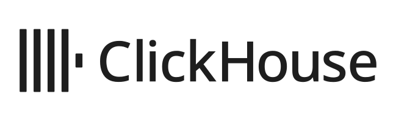

<div align="center">
<p>
<a href="https://clickhouse.com">
  <!-- Official, unmodified assets: https://clickhouse.design/brand/logo-usage -->
  <picture>
    <source media="(prefers-color-scheme: dark)" srcset="./assets/clickhouse-logo-white.svg">
    <source media="(prefers-color-scheme: light)" srcset="./assets/clickhouse-logo-black.svg">
    
  </picture>
</a>
</p>
<h1>ClickHouse Examples</h1>
</div>

[](./LICENSE)
[](https://clickhouse.com/slack)
[](https://x.com/ClickHouseDB)
[](https://www.youtube.com/@ClickHouseDB)

Examples and recipes for building with ClickHouse, from your first SQL query to applications, data pipelines, observability, and AI agents. Explore a product below, or jump to the [repository contents](#repository-contents).

**[Try ClickHouse Cloud](https://console.clickhouse.cloud/signUp)** · [Documentation](https://clickhouse.com/docs) · [SQL playground](https://sql.clickhouse.com/) · [Learn ClickHouse with Mark](./LearnClickHouseWithMark/README.md)

## What is ClickHouse?

[ClickHouse](https://clickhouse.com/clickhouse) is an open-source, column-oriented SQL database for fast analytics on large datasets. It powers real-time dashboards, reporting, observability, and applications that need to query data as it arrives.

You can use the engine as a managed Cloud service, run your own server, embed it in Python with chDB, or query files from the command line with `clickhouse-local`. The wider ClickHouse ecosystem brings together Postgres for transactions, ClickStack for observability, and LibreChat for working with data through AI agents.

## How to get started

For a managed service, [sign up for ClickHouse Cloud](https://console.clickhouse.cloud/signUp) and follow the [Cloud quickstart](https://clickhouse.com/docs/products/cloud/getting-started/cloud-get-started). To run ClickHouse yourself, follow the [installation guide](https://clickhouse.com/docs/get-started/setup/install). You can also explore public datasets in the [SQL playground](https://sql.clickhouse.com/) or start with the local file examples below.

To run an example, clone this repository:

```sh
git clone https://github.com/ClickHouse/examples.git
cd examples
```

Open the example's README for its prerequisites, setup, and commands. Each example documents the tools and services it needs.

## Explore products and examples

### ClickHouse and ClickHouse Cloud: real-time analytics

Use [ClickHouse](https://clickhouse.com/clickhouse) to ingest, transform, and query analytical data with SQL. [ClickHouse Cloud](https://clickhouse.com/cloud) runs it as a fully managed service on AWS, Google Cloud, and Azure, handling infrastructure, scaling, and upgrades so you can focus on your application.

- [Report results and run history](./applications/report-history/README.md): Build a TypeScript application that provisions ClickHouse Cloud, stores report results, and queries across completed runs.
- [Docker Compose recipes](./docker-compose-recipes/README.md): Run ClickHouse locally alongside Grafana, Dagster, Redpanda, SeaweedFS, and RustFS, or explore replicated clusters.
- [Learn ClickHouse with Mark](./LearnClickHouseWithMark/README.md): Work through SQL techniques, JSON, aggregations, geospatial queries, and more, with companion videos.

### Language clients: the same tour in eight official clients

ClickHouse ships official client libraries for [C# / .NET](https://clickhouse.com/docs/integrations/csharp), [Java](https://clickhouse.com/docs/integrations/language-clients/java) (Client V2 and JDBC), [Rust](https://clickhouse.com/docs/integrations/rust), [Go](https://clickhouse.com/docs/integrations/go), [C++](https://clickhouse.com/docs/integrations/language-clients/cpp), [Python](https://clickhouse.com/docs/integrations/python), and [Node.js](https://clickhouse.com/docs/integrations/javascript). The language clients example writes one small program in every one of them against a ClickHouse Cloud service provisioned with `clickhousectl`: connect over TLS, create a table, batch insert typed rows, bind query parameters, stream results, map aggregates into typed records, and handle a server error.

- [Language client tour](./language-clients/README.md): Pick your language, run it, and compare it side by side with the others. Every implementation prints the same output.

### clickhousectl: manage local and Cloud services

[`clickhousectl`](https://clickhouse.com/docs/products/cloud/features/cli) is the CLI for managing local ClickHouse installations and ClickHouse Cloud. Install and switch local versions, start development servers, provision and scale Cloud services, run queries, and manage Postgres and ClickPipes. JSON output and installable agent skills make it useful for scripts and AI coding agents. See the [CLI repository](https://github.com/ClickHouse/clickhousectl) for source code and installation options.

- [Provision a database for a TypeScript application](./applications/report-history/README.md): Use `clickhousectl` to create the Cloud service for a report-history application.
- [Investigate and resolve a latency SLA breach](./ai/clickhousectl/agentic-sla-scaling/README.md): Give an agent access to `clickhousectl` to inspect a live service and apply a scaling change.

### Postgres managed by ClickHouse: transactions alongside analytics

[Postgres managed by ClickHouse](https://clickhouse.com/cloud/postgres) is a managed PostgreSQL service in ClickHouse Cloud for transactional applications, with native integration into ClickHouse for analytics. Use Postgres for application records and transactions, then replicate changes to ClickHouse for reporting and aggregation.

[ClickPipes](https://clickhouse.com/cloud/clickpipes) provides managed ingestion into ClickHouse Cloud, including Postgres change data capture (CDC), streaming sources, and object storage.

- [Postgres-to-ClickHouse data modeling](./postgresql-clickhouse-data-modeling/README.md): Replicate a tiny fixture from PostgreSQL to ClickHouse with PeerDB, then verify inserts, updates, and deletes. Follow the separate managed Postgres and ClickPipes walkthrough for ClickHouse Cloud; a larger Stack Overflow import is optional.

### ClickStack: logs, metrics, traces, and session replay

[ClickStack](https://clickhouse.com/clickstack) is an open-source observability stack that combines ClickHouse, OpenTelemetry, and the HyperDX UI. Use it to investigate application behavior and correlate telemetry in one place. Run it yourself or use [Managed ClickStack](https://clickhouse.com/cloud/clickstack) in ClickHouse Cloud.

- [Instrument an OpenAI client](./clickstack/openai/README.md): Send OpenTelemetry traces to ClickStack and inspect LLM calls.
- [Observe LibreChat and the ClickHouse MCP server](./clickstack/librechat-llm-observability/README.md): Trace an AI chat application as it queries ClickHouse.

### LibreChat and the Agentic Data Stack: chat with your data

LibreChat is an open-source chat interface for working with different LLM providers and building AI agents. Connect it to the ClickHouse MCP server so agents can explore datasets and answer questions using SQL. The [Agentic Data Stack](https://clickhouse.com/ai) brings together LibreChat, ClickHouse, MCP, and Langfuse for LLM tracing and evaluation.

- [LibreChat with the ClickHouse MCP server](./ai/mcp/librechat/README.md): Run a chat interface connected to the public ClickHouse playground.
- [More MCP integrations](./ai/mcp/README.md): Connect ClickHouse to other chat interfaces and agent frameworks.

### chDB: ClickHouse inside Python

[chDB](https://clickhouse.com/chdb) embeds the ClickHouse engine in your Python process. Query files and DataFrames with SQL, or use its pandas-compatible DataStore API, without running a database server. It's useful for notebooks, data exploration, scripts, and embedded analytics.

- [Read and analyze Parquet in Python](./local-analytics/chdb-parquet/README.md): Filter and aggregate a Parquet dataset with the DataStore API.
- [Flatten nested JSON](./local-analytics/chdb-flatten-nested-json/README.md): Turn nested records into data you can analyze.
- [Build a Streamlit app with chDB](./LearnClickHouseWithMark/Streamlit-chDB/README.md): Explore energy usage in an interactive application.

### clickhouse-local: SQL on files from your terminal

[`clickhouse-local`](https://clickhouse.com/docs/concepts/features/tools-and-utilities/clickhouse-local) runs the ClickHouse engine from the command line. Query local or remote files, join datasets, and convert formats without starting a server or loading data into a running database. It uses the same `clickhouse` binary, invoked as `clickhouse local`.

- [Start with clickhouse-local](./local-analytics/clickhouse-local-intro/README.md): Try queries, schema inspection, joins, and remote data access.
- [Query CSV files](./local-analytics/clickhouse-local-csv/README.md) or [Parquet files](./local-analytics/clickhouse-local-parquet/README.md): Run SQL directly over your files.
- [Convert CSV to Parquet](./local-analytics/convert-csv-to-parquet/README.md): Explore format conversion, compression, and inferred types.

Browse [all local analytics examples](./local-analytics/README.md) for more file formats, conversions, and Python recipes.

## Repository contents

| Directory | What you'll find |
| --- | --- |
| [applications](./applications/) | Application examples, including report results and run history with ClickHouse Cloud. |
| [ai](./ai/README.md) | AI agents, MCP integrations, and workflows using `clickhousectl`. |
| [blog-examples](./blog-examples/) | Code and resources accompanying the [ClickHouse Blog](https://clickhouse.com/blog). |
| [clickstack](./clickstack/) | Observability examples for LLM applications and MCP servers. |
| [docker-compose-recipes](./docker-compose-recipes/README.md) | Local deployments, integrations, and cluster configurations. |
| [ethereum](./ethereum/README.md) | Blockchain schemas, batch and streaming ingestion, and queries. |
| [language-clients](./language-clients/README.md) | The same client tour in C#, Java, Rust, Go, C++, Python, and Node.js against ClickHouse Cloud. |
| [LearnClickHouseWithMark](./LearnClickHouseWithMark/README.md) | Code accompanying Mark Needham's ClickHouse video tutorials. |
| [local-analytics](./local-analytics/README.md) | File queries and conversions with `clickhouse-local` and chDB. |
| [postgresql-clickhouse-data-modeling](./postgresql-clickhouse-data-modeling/README.md) | PostgreSQL replication and data modeling with PeerDB and ClickHouse. |

## Contributing

Anyone is welcome to contribute to this repository by submitting a PR!

New contributors will need to sign the CLA when submitting their first PR.

If there's an example you'd love to see, feel free to open an issue to request it (or submit a PR!).

### Standards & conventions

- All examples should be self-contained, including documentation to use the example without relying on external resources (i.e., include a full README.md in the repo and do not just link to an external article).
- Directories and files should use kebab-case.

### ClickHouse employees

The [blog-examples](./blog-examples/) directory contains resources that support the [ClickHouse Blog](https://clickhouse.com/blog). If you are writing a blog post and want to store resources in this repo, add a new directory here and follow the same standards and conventions as other examples in this repo.

---

ClickHouse, the ClickHouse logo, and related marks are trademarks or registered trademarks of ClickHouse, Inc. or its affiliates.
