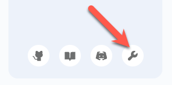
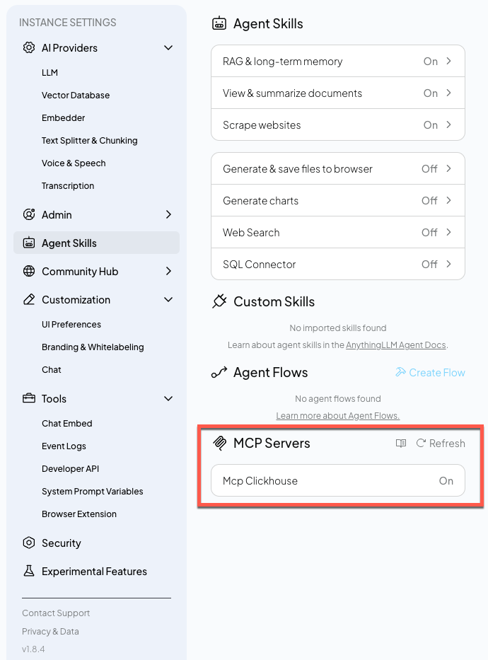
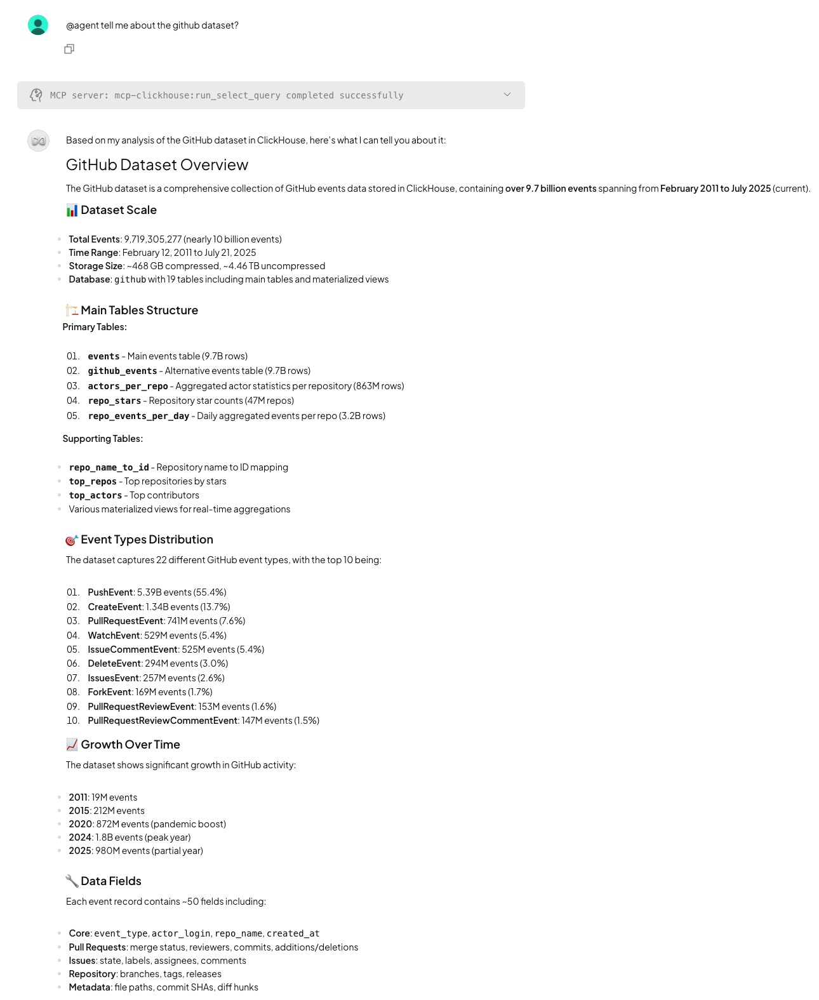

# AnythingLLM and the ClickHouse MCP Server

AnythingLLM lets you build LLM-based chat and agent apps.

If you want to run these examples locally, you'll need to first clone the repository:

```
git clone https://github.com/ClickHouse/examples.git
cd examples/ai/mcp/anythingllm
```

```
docker pull mintplexlabs/anythingllm:latest
```

Setup storage location:

```bash
export STORAGE_LOCATION=$PWD/anythingllm && \
mkdir -p $STORAGE_LOCATION && \
touch "$STORAGE_LOCATION/.env" 
```

```bash
mkdir -p $STORAGE_LOCATION/plugins
cp anythingllm_mcp_servers.json $STORAGE_LOCATION/plugins
```


```bash
docker run -p 3001:3001 \
--cap-add SYS_ADMIN \
-v ${STORAGE_LOCATION}:/app/server/storage \
-v ${STORAGE_LOCATION}/.env:/app/server/.env \
-e STORAGE_DIR="/app/server/storage" \
mintplexlabs/anythingllm
```

Navigate to http://localhost:3001 and select the model that you want to use and provide your API key.

Click on the tool icon in the bottom left-hand side of the UI:



Click on `Agent Skills` and look under the `MCP Servers` section. 
Wait until you see `Mcp ClickHouse` set to `On`



We're now ready to start a chat. 
To make MCP Servers available to a chat, you'll need to prefix the first message in the conversation with `@agent`.

