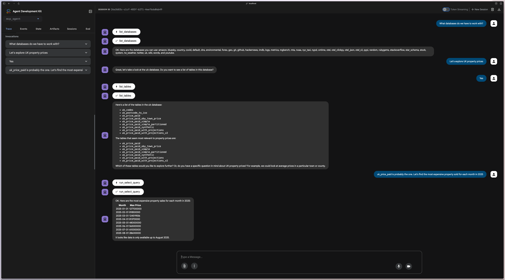

# Google Agent Development Kit and the ClickHouse MCP Server


```
git clone https://github.com/ClickHouse/examples.git
cd examples/ai/mcp/google-agent-development-kit
```

Copy the `.env.example` file to `.env` in the `mcp_agent` directory:

```
cp mcp_agent/.env.example mcp_agent/.env
```

Edit the `.env` file to include your [Google AI API key](https://aistudio.google.com/).

Run the agent using the Agent Development Kit Web UI:

```
uv run --with google-adk adk web
```

Navigate to http://localhost:8000/ to access the Agent Development Kit Web UI.
You should something like the following:

