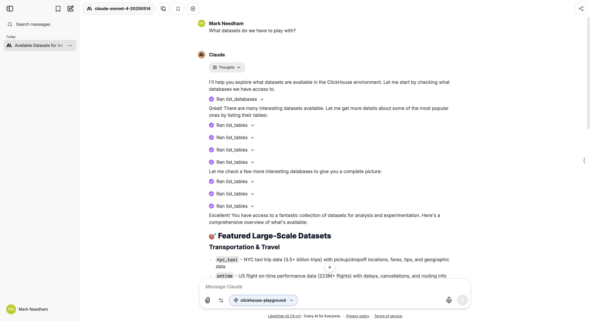

# LibreChat and the ClickHouse MCP Server

LibreChat lets you build LLM-based chat apps.

If you want to run these examples locally, you'll need to first clone the repository:

```
git clone https://github.com/ClickHouse/examples.git
cd examples/ai/mcp/librechat
```

Next, we'll clone the LibreChat repository:

```
git clone https://github.com/danny-avila/LibreChat.git libre
```

Copy the `docker-compose-override.yml` file into the `libre` directory:

```
cp docker-compose.override.yml libre
```

Navigate into the `LibreChat` directory:

```
cd libre
```

Create and edit the `.env` file to include your API key:

```
cp .env.example .env
```

Create the librechat.yaml configuration file:

```
cp librechat.example.yaml librechat.yaml
```

Add the following configuration to the end of the file:

```
mcpServers:
  clickhouse-playground:
    type: sse
    url: http://host.docker.internal:8001/sse
```

Run LibreChat:

```
docker compose up
```

Navigate to http://localhost:3080/.
You should now see the LibreChat interface connected to the ClickHouse MCP server

