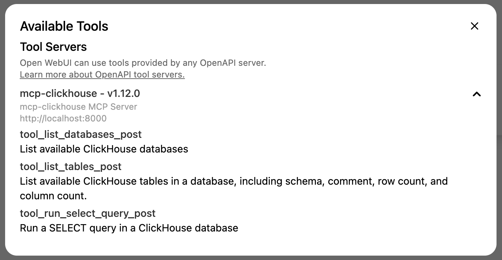

# Open WebUI and the ClickHouse MCP Server

Open WebUI lets you build LLM-based chat apps.

If you want to run these examples locally, you'll need to first clone the repository:

```
git clone https://github.com/ClickHouse/examples.git
cd examples/ai/mcp/open-webui
```

To launch Open WebUI, you can run the following command:

```bash
uv run --with open-webui open-webui serve
```

Navigate to http://localhost:8080/ to see the UI.

## Configure ClickHouse MCP Server

To setup the ClickHouse MCP Server, we'll need to convert the MCP Server to Open API endpoints.
Let's first set environmental variables that will let us connect to the ClickHouse SQL Playground:

```
export CLICKHOUSE_HOST="sql-clickhouse.clickhouse.com"
export CLICKHOUSE_USER="demo"
export CLICKHOUSE_PASSWORD=""
```

And, then, we can run `mcpo` to create the Open API endpoints: 

```
uvx mcpo --port 8000 -- uv run --with mcp-clickhouse --python 3.10 mcp-clickhouse
```

You can see a list of the endpoints created by navigating to http://localhost:8000/docs


To use these endpoints with Open WebUI, we need to navigate to settings:


Click on `Tools`:


Add http://localhost:8000 as the tool URL:


Once we've done this, we should see a `1` next to the tool icon on the chat bar:


If we click on the tool icon, we can then list the available tools:



## Configure OpenAI

By default, Open WebUI works with Ollama models, but we can add OpenAI compatible endpoints as well.
These are configured via the settings menu, but this time we need to click on the `Connections` tab:


Let's add the endpoint and our OpenAI key:


The OpenAI models will then be available on the top menu:


## Chat to ClickHouse MCP Server

We can then have a conversation and Open WebUI will call the MCP Server if necessary:

