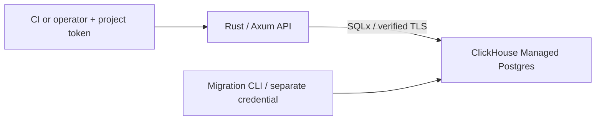

# Release registry

Register immutable release metadata and change channel pointers with **Rust,
Axum, SQLx, Tokio and ClickHouse Managed Postgres (public beta)**. A version belongs
to one project. Matching registration retries return the original release;
conflicting data returns 409. Promotion requires the channel's current revision.
This API records decisions; it never deploys software or downloads artifacts.

[ClickHouse Cloud](https://clickhouse.com/cloud) is the managed data platform.
[ClickHouse Managed Postgres](https://clickhouse.com/docs/products/managed-postgres/overview)
stores projects, releases and channels. This example needs no analytical database.



| Route | Behavior |
| --- | --- |
| `POST /releases` | 201 for a new version, 200 for matching canonical data, 409 for a mismatch |
| `GET /releases?limit=20&offset=0` | List your project's releases, newest first |
| `GET /releases/{version}` | Inspect your project's version; absent or foreign returns 404 |
| `GET /channels/{name}` | Read staging or production and its revision |
| `PUT /channels/{name}` | Set a project-owned release if `expected_revision` matches; otherwise 409 |
| `GET /health` | Public connectivity probe with no release data |

Except health, every route needs a configured project bearer token. The service
binds localhost. Tokens are bounded server-to-server credentials, not a user
account system; keep them out of browser code. A hosted application needs HTTPS,
rate limits and network controls. This example doesn't provision an app host.

## Build in Linux

Use Rust 1.99.0, Git, `curl`, `jq`, OpenSSL, build tools and `psql` 15+.
Validation used native storage in an Ubuntu 24.04 ARM64 VM. Install Rust with
[rustup](https://rustup.rs/) and build from the app directory:

```sh
git clone https://github.com/ClickHouse/examples.git
cd examples/applications/release-registry
cargo fmt --check
cargo test --locked
cargo build --locked
```

The toolchain file pins Rust, Cargo.lock pins dependencies, and Cargo.toml pins
Axum 0.8.9, SQLx 0.9.0 and Tokio 1.53.1. Queries use static SQL, bound parameters
and `query_as` with `FromRow`. SQL and column mappings are checked when executed,
not against a database during compilation. No `DATABASE_URL` or offline query
metadata is needed to build. The migration macro embeds local SQL files only.
CI runs two unit tests and builds without Cloud credentials; six Cloud tests are
ignored unless explicitly selected.

### Create the Cloud service

Install [clickhousectl](https://clickhouse.com/docs/interfaces/cli), authenticate
with an Admin Cloud API key, and choose your organization. Interactive login
avoids secrets in shell history. Commands were validated with CLI 0.5.0:

```sh
curl -fsSL https://clickhouse.com/cli | sh
export PATH="$HOME/.local/bin:$PATH"
clickhousectl cloud auth login --interactive
clickhousectl cloud auth status
clickhousectl cloud org list
umask 077
mkdir -p .deployment
```

Create `.deployment/resources.env` in an editor:

```dotenv
CH_ORG_ID=YOUR_ORGANIZATION_ID
CLOUD_REGION=us-east-1
PG_SIZE=c6gd.large
```

Use a supported region/size for your organization. This fixture used AWS
`us-east-1`, `c6gd.large`, Postgres 18 and no HA, matching the shape in the
[CLI example](https://clickhouse.com/blog/clickhousectl-v0-2-0-postgres-clickpipes-more).
Review [pricing](https://clickhouse.com/docs/products/managed-postgres/pricing):
compute, storage, backups and network can incur charges. Stopping Rust or your VM
doesn't delete the Cloud service or end its charges.

```sh
source .deployment/resources.env
clickhousectl cloud postgres create --org-id "$CH_ORG_ID" \
  --name release-registry-example --provider aws --region "$CLOUD_REGION" \
  --size "$PG_SIZE" --pg-version 18 --ha-type none --tag project=release-registry \
  --json > .deployment/postgres-create.json
PG_SERVICE_ID="$(jq -er '.id' .deployment/postgres-create.json)"
printf 'PG_SERVICE_ID=%s\n' "$PG_SERVICE_ID" >> .deployment/resources.env
```

Preserve the private receipt: it includes the initial password. If creation is
interrupted, reconcile with `postgres list` before retrying. Repeat **get**, not
create, until `state` is `running`; then retrieve the PEM certificate:

```sh
clickhousectl cloud postgres get "$PG_SERVICE_ID" --org-id "$CH_ORG_ID" \
  --json > .deployment/postgres-status.json
jq '{id, state, size, postgresVersion}' .deployment/postgres-status.json
clickhousectl cloud postgres certs get "$PG_SERVICE_ID" --org-id "$CH_ORG_ID" \
  --output .deployment/postgres-ca.pem
```

If provisioning elsewhere, transfer only the receipt and CA privately to Linux.

### Bootstrap, migrate and seed

From the Linux app directory, generate passwords once. Preserve this file when
retrying; bootstrap intentionally fails if the roles already exist.

```sh
umask 077
cat > .deployment/passwords.env <<PASSWORDS
REGISTRY_MIGRATOR_PASSWORD=Aa1_$(openssl rand -hex 24)
REGISTRY_APP_PASSWORD=Aa1_$(openssl rand -hex 24)
PASSWORDS
source .deployment/passwords.env
export REGISTRY_MIGRATOR_PASSWORD REGISTRY_APP_PASSWORD
export PGHOST="$(jq -er '.hostname' .deployment/postgres-create.json)"
export PGPORT=5432 PGDATABASE=postgres PGSSLMODE=verify-full
export PGSSLROOTCERT="$PWD/.deployment/postgres-ca.pem"
export PGPASSWORD="$(jq -er '.password' .deployment/postgres-create.json)"
PGADMIN="$(jq -er '.username' .deployment/postgres-create.json)"
psql -X -v ON_ERROR_STOP=1 -U "$PGADMIN" -f sql/bootstrap.sql
export PGUSER=registry_migrator PGPASSWORD="$REGISTRY_MIGRATOR_PASSWORD"
target/debug/release-registry migrate
target/debug/release-registry seed
```

The migrator assumes non-login `registry_owner` for schema/seed operations.
SQLx applies versioned migrations and records them in `registry._sqlx_migrations`.
Repeated `migrate` is a no-op; seed creates two projects and missing channels
without resetting pointers or revisions. On a disposable service, `revert` drops
all application tables/data; follow it with `migrate` and `seed` to check the
down/up lifecycle. Never apply migration SQL manually behind SQLx's history.

`registry_app` can read application tables, insert release data columns, and
update channel state columns. It can't update/delete releases, alter this schema
or read migration history. The composite foreign key also rejects a channel
pointing to another project's release. This shared database role isn't tenant
isolation: API tokens enforce read/request scope. Database operators and the
application process remain trusted; a stolen database credential bypasses API
scope and the API's revision precondition.

### Configure the API

Copy `.env.example` to `.deployment/app.env`, editing the endpoint, CA path,
runtime password and distinct random tokens (`openssl rand -hex 32`). Keep admin
and migrator passwords out of the runtime file. Seeded projects are:

| Project | ID |
| --- | --- |
| Documentation site | `00000000-0000-4000-8000-000000000001` |
| Marketing site | `00000000-0000-4000-8000-000000000002` |

`PROJECT_TOKENS` maps those UUIDs to tokens. Startup verifies configured projects;
requests derive scope from the bearer token and reject caller-supplied project
fields. Token rotation with the same UUID preserves access to existing releases.
At most 20 projects are configured; each token is 32–256 bytes with no whitespace.

Start a fresh shell before loading the runtime file, so exported bootstrap/admin
credentials aren't inherited by the API:

```sh
set -a
source .deployment/app.env
set +a
target/debug/release-registry serve
```

SQLx uses the explicit Cloud hostname, `VerifyFull` and the supplied CA; it never
falls back to plaintext. It doesn't consult `.pgpass`. Each process has at most
five pooled connections and a five-second statement timeout. Keep certificate
and hostname verification enabled when troubleshooting.

## Register and promote

In another shell, load endpoint/token configuration, create a request, and register:

```sh
set -a; source .deployment/app.env; set +a
API_TOKEN="$(printf '%s' "$PROJECT_TOKENS" | jq -er '.["00000000-0000-4000-8000-000000000001"]')"
jq -n '{version:"1.0.0",digest:("sha256:"+("a"*64)),metadata:{commit:"abc123",built_by:"ci"}}' \
  > .deployment/release.json
curl --fail-with-body -sS http://127.0.0.1:3000/releases \
  -H "Authorization: Bearer $API_TOKEN" -H 'Content-Type: application/json' \
  --data-binary @.deployment/release.json > .deployment/release-response.json
jq . .deployment/release-response.json
```

Versions are case-sensitive opaque labels, 1–64 ASCII letters/digits/`._-`, not
ordered SemVer. Digests require `sha256:` plus 64 hex digits; hex is normalized
to lowercase. The API stores an assertion and never verifies an artifact's bytes.
Metadata is a string map: at most ten keys, 1–40 bytes per key, 256 bytes per
value, and 2,048 bytes of canonical serialized JSON. Bodies are limited to 8 KiB.
JSON whitespace/key order doesn't affect replay; metadata string changes do.
Metadata keys and values reject NUL characters.

Repeating the POST returns 200 and the same ID; different digest/metadata for the
same project/version returns 409. A different project can use the same version.
Missing metadata and `{}` are equivalent. Extra request fields are rejected.

Read the current channel revision before promotion:

```sh
curl --fail-with-body -sS http://127.0.0.1:3000/channels/staging \
  -H "Authorization: Bearer $API_TOKEN" > .deployment/channel.json
jq -n --arg id "$(jq -r .id .deployment/release-response.json)" \
  --argjson rev "$(jq -r .revision .deployment/channel.json)" \
  '{release_id:$id,expected_revision:$rev}' > .deployment/promotion.json
curl --fail-with-body -sS -X PUT http://127.0.0.1:3000/channels/staging \
  -H "Authorization: Bearer $API_TOKEN" -H 'Content-Type: application/json' \
  --data-binary @.deployment/promotion.json | jq
```

Every accepted promotion increments the revision, even when the pointer already
matches. A repeated old revision returns 409: after a timeout or lost response,
read the channel again to discover whether the decision committed. There is no
deployment side effect or promotion history. Registration and promotion are
separate atomic operations; registration doesn't automatically promote.

List order is `(created_at DESC, id DESC)`, with limit 1–100 and offset 0–10,000.
This bounded offset list isn't a snapshot: new registrations can shift pages and
cause duplicates/omissions while browsing. Inspect by version for stable identity.

## Validate against a disposable Cloud service

**Cloud tests truncate releases and channels. Use a dedicated service only.**
In a fresh shell, load the runtime endpoint/CA fields and the separate migration
password. The restart script launches its child API with only the runtime fields:

```sh
set -a; source .deployment/app.env; set +a
source .deployment/passwords.env
export TEST_MIGRATOR_PASSWORD="$REGISTRY_MIGRATOR_PASSWORD"
openssl req -x509 -newkey rsa:2048 -nodes -keyout .deployment/wrong-key.pem \
  -out .deployment/wrong-ca.pem -days 1 -subj /CN=unrelated.invalid
export TEST_WRONG_CA="$PWD/.deployment/wrong-ca.pem"
cargo test --locked --test cloud -- --ignored --test-threads=1 --nocapture
bash scripts/process-restart.sh
```

Six tests prove a 12-request duplicate race, conflicting retries, concurrent
promotion and stale replay, scoped reads and the database FK, invalid/oversized
requests, restricted privileges, rollback, and both wrong-CA and wrong-hostname
TLS rejection. The separate script starts, stops and restarts the executable,
checks persisted release/channel identity, and exercises replay after restart.
Its local results go to ignored `.deployment/restart-results`.

Validation on 2 October 2026 passed two unit tests, all six Cloud tests, the real
process restart and migrate/down/up lifecycle against PostgreSQL 18.6. A fresh
target directory built with all database/token variables absent. These are
correctness checks, not load or performance benchmarks.

## Cleanup

Stop the API, then delete only the disposable service you created:

```sh
source .deployment/resources.env
clickhousectl cloud postgres delete "$PG_SERVICE_ID" --org-id "$CH_ORG_ID" --force
clickhousectl cloud postgres list --org-id "$CH_ORG_ID" --json
```

Confirm its ID is absent. If keeping the service for unrelated work, remove just
this example's schema/roles using the receipt's **administrator** credential;
`app.env` contains the restricted runtime login:

```sh
set -a; source .deployment/app.env; set +a
export PGSSLMODE=verify-full
export PGPASSWORD="$(jq -er '.password' .deployment/postgres-create.json)"
psql -X -v ON_ERROR_STOP=1 -U "$(jq -er '.username' .deployment/postgres-create.json)" \
  -f sql/cleanup.sql
```

After cleanup, securely remove private receipts, passwords and tokens. Never
commit `.deployment`, `.env`, target directories or Cloud credentials.
