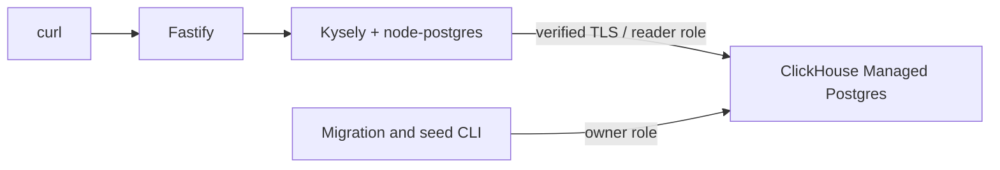

# Searchable catalogue API

Search an outdoor product catalogue with **Fastify, Kysely, node-postgres and
ClickHouse Managed Postgres (public beta)**. The API combines English full-text
search, category and inclusive price filters, and signed cursor pagination.
Equal prices are ordered by product ID. The example is read-only over HTTP;
administrators load products through a separate migration login.

[ClickHouse Cloud](https://clickhouse.com/cloud) is the managed data platform.
[ClickHouse Managed Postgres](https://clickhouse.com/docs/products/managed-postgres)
stores this application's catalogue. The ClickHouse analytical database service
isn't required for this workflow.



| Route | Purpose |
| --- | --- |
| `GET /products` | Filter and paginate active products |
| `GET /products/:id` | Read one active product; missing/inactive returns 404 |
| `GET /health` | Verify database connectivity |

There are no write routes or user accounts. Product data is intentionally public.
The development listener is localhost only. For hosted use add HTTPS, ingress
rate limiting and network access controls; this example does not provision an
application host.

## Set up in Linux

Use Node.js 24, npm, Git, `curl`, `jq`, OpenSSL and `psql` 15+. Run application
installs, builds and tests in Linux native storage. The validated environment was
Ubuntu 24.04 in a dedicated OrbStack VM; no laptop dependency installation is
needed. Install Node 24 from [Node.js](https://nodejs.org/en/download), then:

```sh
git clone https://github.com/ClickHouse/examples.git
cd examples/applications/searchable-catalogue
npm ci
npm run build
```

### Create a dedicated Cloud Postgres service

Install [clickhousectl](https://clickhouse.com/docs/interfaces/cli) and sign in
with an Admin Cloud API key. Interactive login keeps the secret out of shell
history. The commands below were checked with clickhousectl 0.5.0.

```sh
curl -fsSL https://clickhouse.com/cli | sh
export PATH="$HOME/.local/bin:$PATH"
clickhousectl cloud auth login --interactive
clickhousectl cloud auth status
clickhousectl cloud org list
umask 077
mkdir -p .deployment
```

Choose a region and instance size supported by your organization in the Cloud
console. We validated `c6gd.large` in `us-east-1` with Postgres 18 and no HA; this
shape also appears in the [official CLI example](https://clickhouse.com/blog/clickhousectl-v0-2-0-postgres-clickpipes-more).
Review [pricing](https://clickhouse.com/docs/products/managed-postgres/pricing)
before creation. Compute, storage, backups and network usage can incur charges.
Stopping the API or VM does not stop Cloud service charges.

Create `.deployment/resources.env` in an editor:

```dotenv
CH_ORG_ID=YOUR_ORGANIZATION_ID
CLOUD_REGION=us-east-1
PG_SIZE=c6gd.large
```

Create once and save the receipt privately; the initial password is returned
only by creation. If interrupted, reconcile with `postgres list` before retrying.

```sh
source .deployment/resources.env
clickhousectl cloud postgres create \
  --org-id "$CH_ORG_ID" --name searchable-catalogue-example \
  --provider aws --region "$CLOUD_REGION" --size "$PG_SIZE" \
  --pg-version 18 --ha-type none --tag project=searchable-catalogue --json \
  > .deployment/postgres-create.json
PG_SERVICE_ID="$(jq -er '.id' .deployment/postgres-create.json)"
printf 'PG_SERVICE_ID=%s\n' "$PG_SERVICE_ID" >> .deployment/resources.env
```

Repeat **get** until `state` is `running`, then obtain its CA:

```sh
clickhousectl cloud postgres get "$PG_SERVICE_ID" --org-id "$CH_ORG_ID" \
  --json > .deployment/postgres-status.json
jq '{id, state, size, postgresVersion}' .deployment/postgres-status.json
clickhousectl cloud postgres certs get "$PG_SERVICE_ID" --org-id "$CH_ORG_ID" \
  --output .deployment/postgres-ca.pem
```

Use `--output` for a PEM file, not JSON redirected to a `.pem` filename. Transfer
only the receipt and certificate if provisioning outside your Linux environment.

### Bootstrap roles, migrate and seed

Run these commands in Linux from the app directory. Generate passwords once;
preserve the file on retries. Bootstrap intentionally fails if roles exist.

```sh
umask 077
cat > .deployment/passwords.env <<PASSWORDS
CATALOGUE_MIGRATOR_PASSWORD=Aa1_$(openssl rand -hex 24)
CATALOGUE_READER_PASSWORD=Aa1_$(openssl rand -hex 24)
PASSWORDS
source .deployment/passwords.env
export CATALOGUE_MIGRATOR_PASSWORD CATALOGUE_READER_PASSWORD
export PGHOST="$(jq -er '.hostname' .deployment/postgres-create.json)"
export PGPORT=5432 PGDATABASE=postgres
export PGSSLROOTCERT="$PWD/.deployment/postgres-ca.pem" PGSSLMODE=verify-full
export PGPASSWORD="$(jq -er '.password' .deployment/postgres-create.json)"
PGADMIN="$(jq -er '.username' .deployment/postgres-create.json)"
psql -X -v ON_ERROR_STOP=1 -U "$PGADMIN" -f sql/bootstrap.sql
export PGUSER=catalogue_migrator PGPASSWORD="$CATALOGUE_MIGRATOR_PASSWORD"
npm run migrate -- up
npm run seed
```

The bootstrap creates a non-login owner, a migration login allowed to assume
that owner, and a reader login. Kysely's migrator records `001_products` in the
`catalogue` schema and applies the schema transactionally. Rerunning `up` is a
no-op; seeding upserts the same 12 IDs (11 active). **Seed resets those demo
products to their original values.** It doesn't delete other products.

Migration connections explicitly assume `catalogue_owner`. The reader has only
schema usage and product select privileges; it cannot alter tables or read
migration tables. Its default transactions are also read-only. The migration
contains price/category B-tree indexes and a GIN full-text index. It does not
promise any index will be chosen for a tiny seed dataset.

For a disposable service, `npm run migrate -- down` drops products and their
data; `up` then recreates them. Review this destructive operation before use.
Never apply migration files manually around Kysely's history.

### Start with the reader role

Copy `.env.example` to `.deployment/app.env` and edit it with the reader password,
endpoint fields, and absolute CA path. Set `CURSOR_SECRET` to the output of
`openssl rand -hex 32`. Keep it stable across restarts and API replicas.

```sh
set -a
source .deployment/app.env
set +a
npm start
```

The server checks its connection before listening on `127.0.0.1:3000`.
node-postgres receives explicit TLS options that verify both the certificate
and endpoint hostname. Separate connection fields avoid connection-string SSL
options overriding those settings. Do not disable verification to fix failures.

## Search and continue

Prices are integer GBP pence. `q` is at most 120 characters and uses
`plainto_tsquery('english', q)`: words are normalized and combined with AND.
There is no substring, prefix, fuzzy or relevance-ranked search. Punctuation is
handled by PostgreSQL's parser rather than interpreted as SQL or query syntax.

```sh
BASE_URL=http://127.0.0.1:3000
curl --fail-with-body -sS "$BASE_URL/products?category=camping&min_price=1800&max_price=4500&limit=2" \
  > .deployment/page.json
jq . .deployment/page.json
CURSOR="$(jq -er '.next_cursor' .deployment/page.json)"
curl --fail-with-body -sS --get "$BASE_URL/products" \
  --data-urlencode category=camping --data-urlencode min_price=1800 \
  --data-urlencode max_price=4500 --data-urlencode limit=2 \
  --data-urlencode "cursor=$CURSOR" | jq
curl --fail-with-body -sS --get "$BASE_URL/products" \
  --data-urlencode q=hiking --data-urlencode category=clothing | jq
```

`limit` is 1–100, default 20. Price bounds are inclusive, 0–100,000,000 pence.
Categories are `camping`, `clothing`, `cycling`. Unknown query fields, invalid
bounds/IDs/cursors and changed cursor filters return 400. Database failures return
503 without connection details. An empty result has `items: []`, `next_cursor: null`.

Rows always sort by `(price_pence ASC, id ASC)`. A signed cursor carries the
last price, ID and hash of normalized filters. Continuation uses
`(price_pence, id) > (last_price, last_id)` and fetches `limit + 1` rows to decide
whether another page exists. Changing `limit` is allowed; changing filters isn't.
Cursor contents are encoded, not encrypted. Rotating the secret invalidates
existing cursors. There is no expiry in this example.

For unchanged products this provides complete, duplicate-free traversal,
including equal prices. Each request reads the current committed catalogue:
new rows behind the cursor won't appear, new rows ahead can appear, and price
or filter changes can omit/repeat products. Deletions disappear. This is **not
a frozen snapshot across requests**. Use a versioned catalogue or a server-held
snapshot if an export needs fixed membership and ordering.

## Verify against a dedicated Cloud service

The tests use actual HTTP listeners and real Cloud Postgres. They temporarily
insert two fixture products and reprice two demo products, restoring them in
cleanup. Do not run against shared or production data; run tests serially.
Load `app.env` first, then supply the separate migration password:

```sh
export TEST_MIGRATOR_PASSWORD="$CATALOGUE_MIGRATOR_PASSWORD"
openssl req -x509 -newkey rsa:2048 -nodes \
  -keyout .deployment/wrong-key.pem -out .deployment/wrong-ca.pem \
  -days 1 -subj /CN=unrelated.invalid
export TEST_WRONG_CA="$PWD/.deployment/wrong-ca.pem"
npm run build
npm test
```

Nine workflow subtests cover tied-price traversal at three page sizes, text and
combined filters, signed cursor binding/tampering, invalid inputs, insert/update
limitations, reader permissions even after disabling transaction read-only,
wrong-CA/wrong-host TLS rejection, and persistence/cursors after API restart.
CI runs a clean install and TypeScript build without Cloud credentials. Cloud
integration tests are a separate explicit check.

## Cleanup

Stop the API with Ctrl-C. On a retained service, review `sql/cleanup.sql` and run
it explicitly with the administrator; it removes this schema and its roles.
It does not stop Cloud charges. For a dedicated service, verify the saved ID,
delete it, and confirm that ID is absent:

```sh
source .deployment/resources.env
clickhousectl cloud postgres get "$PG_SERVICE_ID" --org-id "$CH_ORG_ID" --json
clickhousectl cloud postgres delete "$PG_SERVICE_ID" --org-id "$CH_ORG_ID"
clickhousectl cloud postgres list --org-id "$CH_ORG_ID" --json
```

Keep private receipts until deletion is confirmed, then remove unneeded credential
files. Never delete a shared service to clean up this example.
