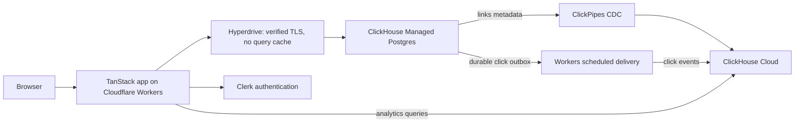

# Shortwave

[Read the accompanying article](https://clickhouse.com/resources/engineering/build-saas-link-shortener-postgres-clickhouse).

A link-shortener example built on ClickHouse Cloud's unified data stack:
**[ClickHouse Managed Postgres](https://clickhouse.com/cloud/postgres)** stores
application data, **ClickPipes** syncs link metadata, and **ClickHouse** powers
click analytics. The TanStack Start application uses React, Click UI, and Clerk
and runs on Cloudflare Workers.

Create and edit short links, organize them with tags and folders, save UTM
templates, download QR codes, and explore recorded traffic.

**[Sign up for a ClickHouse Cloud free trial with $300 in credits](https://clickhouse.com/cloud).**

This example is intended for an owner-operated deployment with restricted signup.
See [scope and limits](docs/v1-readiness.md#scope-and-limits) before deploying.

## How it works



Postgres owns authorization and redirects. A redirect GET commits its event to
an outbox before returning. A scheduled Worker delivers events to ClickHouse;
reports count distinct event IDs so delivery retries do not inflate totals.
ClickPipes independently replicates link metadata into `default.cdc_links`.
Current tags can regroup earlier traffic after sync; UTM values are recorded
at click time. Reports use UTC and include bots and previews. Raw events have a
180-day TTL; deletion by TTL is eventual.

Both databases and the ClickPipe run in **ClickHouse Cloud**. Cloudflare hosts
the complete app, server routes, redirects, and scheduler. No development machine
is needed for hosted operation. See [architecture](docs/architecture.md).

## Deploy your own instance

Run the CLI tools on your laptop. They create the databases in ClickHouse Cloud
and deploy the application to Cloudflare Workers. Once deployed, the application
runs independently of your laptop.

### 1. Install tools, clone the repo, and sign in

You need:

- [Node.js 22](https://nodejs.org/en/download) (22.12 or later), npm, and Git.
- A [ClickHouse Cloud account](https://clickhouse.com/cloud) with ClickHouse Managed Postgres
  and Postgres ClickPipes available.
- A [Cloudflare account](https://dash.cloudflare.com/sign-up) with Workers,
  Hyperdrive, and an active DNS zone for your domain.
- A [Clerk application](https://dashboard.clerk.com/) for sign-in. Use production
  keys when serving real users.

The commands below work in Bash or zsh on macOS and Linux. Start by installing
[clickhousectl](https://clickhouse.com/docs/interfaces/cli):

```sh
curl -fsSL https://clickhouse.com/cli | sh
export PATH="$HOME/.local/bin:$PATH"
clickhousectl --version
```

Clone the examples repository and open this application:

```sh
git clone https://github.com/ClickHouse/examples.git
cd examples/applications/shortwave
npm ci
npx wrangler --version
```

`npm ci` installs the app dependencies and the repository's
[Wrangler version](https://developers.cloudflare.com/workers/wrangler/install-and-update/).
Run the remaining commands from this directory.

The SQL steps also use the Postgres client (`psql` 15 or later), `jq` to read CLI
responses, and OpenSSL to generate passwords. If needed, install them:

**macOS with [Homebrew](https://brew.sh):**

```sh
brew install libpq jq openssl@3
export PATH="$(brew --prefix libpq)/bin:$(brew --prefix openssl@3)/bin:$PATH"
```

**Ubuntu/Debian:**

```sh
sudo apt-get update
sudo apt-get install -y postgresql-client jq openssl
```

Create an Admin API key in your ClickHouse Cloud organization using
[these instructions](https://clickhouse.com/docs/cloud/manage/openapi), then sign
in to both CLIs. ClickHouse prompts for your Key ID and Key secret; Wrangler
opens your browser to sign in.

```sh
clickhousectl cloud auth login --interactive
clickhousectl cloud auth status
clickhousectl cloud org list
npx wrangler login
npx wrangler whoami
```

Cloud creation requires API key authentication; ClickHouse OAuth is read-only.
Keep the CLI credential store (`.clickhouse/`) and credentials private.

Create a private directory for deployment settings and command results.
`umask 077` makes newly created files readable only by your user:

```sh
umask 077
mkdir -p .deployment
```

Create `.deployment/resources.env` in an editor with these inputs, replacing
all placeholders. Add the returned IDs and endpoints to it as you proceed.
`source` loads these saved values into your current terminal so later commands
can use names such as `$CH_ORG_ID`. Run it again after editing the file or opening
a new terminal.

```dotenv
CH_ORG_ID=YOUR_ORGANIZATION_UUID
DEPLOYMENT_NAME=shortwave-example
CLOUD_REGION=us-east-1
PG_SIZE=YOUR_AVAILABLE_POSTGRES_SIZE
PROVISIONING_CIDR=YOUR_PUBLIC_EGRESS_IP/32
```

```sh
source .deployment/resources.env
```

Review the region, instance size, replica count, and ingress before creation.
The commands below request one ClickHouse replica with 8 GiB and non-HA Postgres
18. Confirm availability and cost for your organization:
[ClickHouse pricing](https://clickhouse.com/pricing),
[Workers pricing](https://developers.cloudflare.com/workers/platform/pricing/),
[Hyperdrive pricing](https://developers.cloudflare.com/hyperdrive/platform/pricing/).

`.deployment/` holds private inputs, credentials, and CLI receipts. Back it up.
Run each create command once and preserve its output. If one fails or is
interrupted, [inspect the outcome](docs/operations.md#interrupted-setup) before
retrying; reuse resources that already exist. Run setup from one terminal at a time.

### 2. Create the two databases

Create ClickHouse with explicit provisioning ingress:

```sh
clickhousectl cloud service create \
  --org-id "$CH_ORG_ID" --name "$DEPLOYMENT_NAME-ch" \
  --provider aws --region "$CLOUD_REGION" \
  --min-replica-memory-gb 8 --max-replica-memory-gb 8 --num-replicas 1 \
  --ip-allow "$PROVISIONING_CIDR" --json \
  > .deployment/clickhouse-create.json
```

Create ClickHouse Managed Postgres:

```sh
clickhousectl cloud postgres create \
  --org-id "$CH_ORG_ID" --name "$DEPLOYMENT_NAME-pg" \
  --provider aws --region "$CLOUD_REGION" --size "$PG_SIZE" \
  --pg-version 18 --ha-type none --json \
  > .deployment/postgres-create.json
```

These receipts include the initial credentials, which are returned once. Keep
them private. Extract the IDs and save them in `.deployment/resources.env`:

```sh
CH_SERVICE_ID="$(jq -er '.service.id' .deployment/clickhouse-create.json)"
PG_SERVICE_ID="$(jq -er '.id' .deployment/postgres-create.json)"
```

Check readiness with these commands. Repeat inspection until both report
`running` (ClickHouse may also report `idle`); do not repeat creation while waiting.

```sh
clickhousectl cloud service get "$CH_SERVICE_ID" --org-id "$CH_ORG_ID" --json
clickhousectl cloud postgres get "$PG_SERVICE_ID" --org-id "$CH_ORG_ID" --json
clickhousectl cloud postgres certs get "$PG_SERVICE_ID" --org-id "$CH_ORG_ID" \
  --output .deployment/postgres-ca.pem
```

Record `PGHOST`, `PGPORT`, `PGDATABASE`, and `PGADMIN` from the direct Postgres
connection details, and `CLICKHOUSE_URL` from the HTTPS endpoint, in
`.deployment/resources.env`. Use the direct Postgres port, not a transaction
pooler, for migrations and CDC. The default source database is normally `postgres`;
use the database in your connection details.

### 3. Create Postgres roles and apply SQL

Generate separate passwords once, before creating any roles. The generated
values are safe in shell files and connection URLs. Keep the existing file on
retries; creating a role that already exists does not change its password.

```sh
cat > .deployment/passwords.env <<PASSWORDS
PG_APP_PASSWORD=Aa1_$(openssl rand -hex 30)
PG_MIGRATION_PASSWORD=Aa1_$(openssl rand -hex 30)
PG_CDC_PASSWORD=Aa1_$(openssl rand -hex 30)
CH_APP_PASSWORD=Aa1_$(openssl rand -hex 30)
PASSWORDS
source .deployment/resources.env
source .deployment/passwords.env
export PG_APP_PASSWORD PG_MIGRATION_PASSWORD PG_CDC_PASSWORD
export PGSSLMODE=verify-full
export PGSSLROOTCERT="$PWD/.deployment/postgres-ca.pem"
```

`export` passes these three passwords to the Postgres client; the role SQL reads
them by name. The other saved values are used directly in the commands.

Load the service administrator's password from the private create receipt (or
restore it from your password manager if recovering an existing deployment):

```sh
export PGPASSWORD="$(jq -er '.password' .deployment/postgres-create.json)"
clickhousectl local postgres client --host "$PGHOST" --port "$PGPORT" \
  --queries-file infra/postgres/001_roles.sql \
  -- -X -v ON_ERROR_STOP=1 -U "$PGADMIN" -d "$PGDATABASE"
```

Despite the `local postgres client` name, `--host` connects `psql` directly to
ClickHouse Managed Postgres using `psql` on your laptop.
[001_roles.sql](infra/postgres/001_roles.sql) creates the migration, runtime and
replication logins and schema permissions. Passwords are read from the environment
and quoted by `psql`. No extension is required by the application schema.

Switch to the migration login and run each schema file in order:

```sh
export PGPASSWORD="$PG_MIGRATION_PASSWORD"
clickhousectl local postgres client --host "$PGHOST" --port "$PGPORT" \
  --queries-file migrations/postgres/001_initial.sql \
  -- -X -v ON_ERROR_STOP=1 -U link_shortener_migration -d "$PGDATABASE"
clickhousectl local postgres client --host "$PGHOST" --port "$PGPORT" \
  --queries-file migrations/postgres/002_saved_tags.sql \
  -- -X -v ON_ERROR_STOP=1 -U link_shortener_migration -d "$PGDATABASE"
clickhousectl local postgres client --host "$PGHOST" --port "$PGPORT" \
  --queries-file migrations/postgres/003_folders.sql \
  -- -X -v ON_ERROR_STOP=1 -U link_shortener_migration -d "$PGDATABASE"
clickhousectl local postgres client --host "$PGHOST" --port "$PGPORT" \
  --queries-file migrations/postgres/004_custom_domains.sql \
  -- -X -v ON_ERROR_STOP=1 -U link_shortener_migration -d "$PGDATABASE"
clickhousectl local postgres client --host "$PGHOST" --port "$PGPORT" \
  --queries-file migrations/postgres/005_domain_links.sql \
  -- -X -v ON_ERROR_STOP=1 -U link_shortener_migration -d "$PGDATABASE"
clickhousectl local postgres client --host "$PGHOST" --port "$PGPORT" \
  --queries-file infra/postgres/002_grants.sql \
  -- -X -v ON_ERROR_STOP=1 -U link_shortener_migration -d "$PGDATABASE"
```

The last file grants application CRUD and links-only replication access, and
sets `REPLICA IDENTITY FULL` to preserve unchanged large values during CDC.
Each Postgres file is transactional. Record the successful filenames and source
revision privately; [migration guidance](migrations/README.md) covers upgrades
and existing deployments. Do not run an unrestricted directory of SQL files.

Create the publication as the administrator:

```sh
export PGPASSWORD="$(jq -er '.password' .deployment/postgres-create.json)"
clickhousectl local postgres client --host "$PGHOST" --port "$PGPORT" \
  --queries-file infra/postgres/003_publication.sql \
  -- -X -v ON_ERROR_STOP=1 -U "$PGADMIN" -d "$PGDATABASE"
unset PGPASSWORD
```

This file requires `wal_level=logical` and a publication containing only
`public.links`. If logical replication is disabled, inspect
`clickhousectl cloud postgres config get "$PG_SERVICE_ID" --org-id "$CH_ORG_ID"`
and follow the [Postgres ClickPipes prerequisites](https://clickhouse.com/docs/integrations/clickpipes/postgres).
Do not include the outbox, accounts, or domain claims in the publication.

### 4. Create the ClickHouse schema and runtime user

The Cloud Query API executes one statement per request. Each ClickHouse setup
file below contains one statement. The CLI uses a service Query API credential
for schema administration, separate from the application's database login; it
can provision that query credential using your Admin API key on first use.
Keep the CLI's `.clickhouse/` credential store private.

```sh
clickhousectl cloud service query --org-id "$CH_ORG_ID" --id "$CH_SERVICE_ID" \
  --queries-file infra/clickhouse/001_database.sql
clickhousectl cloud service query --org-id "$CH_ORG_ID" --id "$CH_SERVICE_ID" \
  --database link_shortener --queries-file migrations/clickhouse/001_events.sql
```

Render the runtime user's password hash into a private SQL file, then execute it:

```sh
CH_APP_PASSWORD_SHA256="$(printf '%s' "$CH_APP_PASSWORD" | openssl dgst -sha256 | awk '{print $NF}')"
sed "s/REPLACE_WITH_SHA256_HASH/$CH_APP_PASSWORD_SHA256/" infra/clickhouse/002_app_user.sql \
  > .deployment/clickhouse-app-user.sql
clickhousectl cloud service query --org-id "$CH_ORG_ID" --id "$CH_SERVICE_ID" \
  --queries-file .deployment/clickhouse-app-user.sql
clickhousectl cloud service query --org-id "$CH_ORG_ID" --id "$CH_SERVICE_ID" \
  --queries-file infra/clickhouse/003_events_grant.sql
```

The [runtime user](https://clickhouse.com/docs/sql-reference/statements/create/user)
can read and insert events, but cannot manage the schema.
Never apply `migrations/clickhouse/002_local_metadata.sql` to Cloud: ClickPipes
creates and owns its destination table.

### 5. Create the links ClickPipe

The [mapping file](infra/clickpipe-links.json) explicitly selects `public.links`,
`ReplacingMergeTree`, and sorting by `id`. CDC takes an initial snapshot and then
streams changes. Keep delete tombstones for the application's current-row reads.

```sh
clickhousectl cloud clickpipe create postgres "$CH_SERVICE_ID" \
  --org-id "$CH_ORG_ID" --name "$DEPLOYMENT_NAME-cdc" \
  --host "$PGHOST" --port "$PGPORT" --pg-database "$PGDATABASE" \
  --username link_shortener_cdc --password "$PG_CDC_PASSWORD" \
  --ca-certificate .deployment/postgres-ca.pem \
  --publication-name link_shortener_clickpipe --replication-mode cdc \
  --sync-interval-seconds 10 --delete-on-merge false \
  --table-mapping-json "$(cat infra/clickpipe-links.json)" --json \
  > .deployment/clickpipe-create.json
CLICKPIPE_ID="$(jq -er '.id' .deployment/clickpipe-create.json)"
clickhousectl cloud clickpipe get "$CH_SERVICE_ID" "$CLICKPIPE_ID" \
  --org-id "$CH_ORG_ID" --json
```

Save `CLICKPIPE_ID` in `.deployment/resources.env`. Keep shell tracing off when
running commands with passwords, and keep their output private.

Wait for `default.cdc_links` to exist, then check its versioned engine and grant
runtime read access:

```sh
clickhousectl cloud service query --org-id "$CH_ORG_ID" --id "$CH_SERVICE_ID" \
  --queries-file infra/clickhouse/verify-cdc.sql
clickhousectl cloud service query --org-id "$CH_ORG_ID" --id "$CH_SERVICE_ID" \
  --queries-file infra/clickhouse/004_cdc_grant.sql
clickhousectl cloud service query --org-id "$CH_ORG_ID" --id "$CH_SERVICE_ID" \
  --query 'SHOW GRANTS FOR link_shortener_app'
```

Expect one CDC table using `ReplacingMergeTree`, sorted by `id`, with
`_peerdb_version` and `_peerdb_is_deleted`. Expect only event SELECT/INSERT and CDC
SELECT grants for the application. See [CDC verification](infra/README.md#verify-data-flow)
for insert/update/delete checks; schema inspection alone does not prove sync.

### 6. Save runtime configuration and verify Postgres

Create a runtime-only environment for local development and acceptance checks:

```sh
cat > .deployment/runtime.env <<RUNTIME
DATABASE_URL=postgresql://link_shortener_app:${PG_APP_PASSWORD}@${PGHOST}:${PGPORT}/${PGDATABASE}
PG_CA_CERT_PATH=.deployment/postgres-ca.pem
CLICKHOUSE_URL=${CLICKHOUSE_URL}
CLICKHOUSE_USERNAME=link_shortener_app
CLICKHOUSE_PASSWORD=${CH_APP_PASSWORD}
CLICKHOUSE_DATABASE=link_shortener
CLICKHOUSE_CDC_DATABASE=default
RUNTIME
PGPASSWORD="$PG_APP_PASSWORD" clickhousectl local postgres client \
  --host "$PGHOST" --port "$PGPORT" --queries-file infra/postgres/verify.sql \
  -- -X -v ON_ERROR_STOP=1 -U link_shortener_app -d "$PGDATABASE"
```

Verification should show only `public.links` in the publication, replica identity
`f` (FULL), and TLS `t`. It rejects a runtime login with schema/management rights.
Keep management keys and migration/CDC passwords out of this runtime file.

### 7. Create Hyperdrive and deploy the Worker

Follow the [Workers hosting commands](docs/hosting.md): authenticate Wrangler,
upload the Postgres CA, configure ClickHouse ingress, create Hyperdrive with
verified TLS and caching disabled, and fill the private Wrangler configuration.
Then build with your Clerk publishable key, upload runtime secrets and deploy
with Wrangler. Every resource creation and deployment command is shown there.

### 8. Verify your short domain and operate the application

Open `https://app.mydomain.com`, sign in, and choose **Domains**. Add your short
hostname, copy the exact TXT record shown into DNS, then verify it in the app.
Routing/HTTPS and the app's ownership check are separate requirements; see
[custom domains](docs/custom-domains.md).

Create a link and visit `https://mydomain.com/r/<slug>`. Complete the
[fresh-deployment checklist](docs/v1-readiness.md): redirects must change
immediately after edits, analytics must receive scheduled events, tag edits must
sync, disabled links must return 410, HEAD must not count, and a second account
must not access your data. Verify that visits and analytics keep working after
you close the deployment terminal.

Creating a link writes application data; it does not create infrastructure.
Use [operations](docs/operations.md) for upgrades, interrupted commands, credential
rotation and explicit deletion commands. Cloud resources remain billable until
you remove them.

## Develop and contribute

See [development and checks](docs/development.md) to run the app locally or contribute.
The ordinary checks run without Cloud credentials; integration, browser and
hosted acceptance use explicitly configured test resources.

```sh
npm test
npm run types:workers
npm run typecheck
npm run build:workers
npx wrangler deploy --dry-run
```

- [Deployment inputs and order](docs/setup-plan.md)
- [Architecture](docs/architecture.md) and [decisions](docs/decisions.md)
- [Deployment and release checklist](docs/v1-readiness.md)

V1 supports Cloudflare Workers hosting. Vercel, automatic customer-domain
provisioning, ClickStack, and pg_clickhouse are future extensions.
