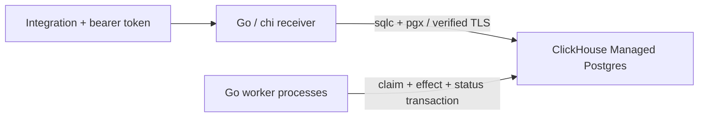

# Durable webhook inbox

Receive and process webhook events with **Go, chi, pgx, sqlc, and ClickHouse
Managed Postgres**. Two seeded integrations have separate tokens.
The receiver stores one event per integration/external ID and exposes its status.
Workers use `FOR UPDATE SKIP LOCKED` to process a database-only operation in the
same transaction as the claim and completion status.

[ClickHouse Cloud](https://clickhouse.com/cloud) is the managed data platform.
[ClickHouse Managed Postgres](https://clickhouse.com/docs/products/managed-postgres/overview)
stores the inbox, activity and counters. The ClickHouse analytical database
service isn't required for this example.



| Route | Behavior |
| --- | --- |
| `POST /events` | Require bearer token and `X-Event-ID`; accept a validated JSON event |
| `GET /events/:externalID` | Inspect your integration's event; another integration's ID returns 404 |
| `GET /stats` | Read your integration's processed counter |
| `GET /health` | Verify database connectivity; no event data |

The development server binds localhost. Tokens are preconfigured server-to-server
credentials, not browser keys or a signup flow. Never expose tokens in public
frontend code. Hosted deployment needs HTTPS, ingress rate limiting and network
controls; the example doesn't provision an application host.

## Setup in Linux

Use Go 1.27.1, sqlc 1.31.1, Git, `curl`, `jq`, OpenSSL and `psql` 15+.
The validated environment was a dedicated Ubuntu 24.04 ARM64 VM. Install/build
in native Linux storage; don't install dependencies on a shared host mount.
Use the [official Go distribution](https://go.dev/dl/) and
[sqlc installation instructions](https://docs.sqlc.dev/en/latest/overview/install.html).
The module pins chi 5.3.2 and pgx 5.11.0; go.sum records dependency checksums.

```sh
git clone https://github.com/ClickHouse/examples.git
cd examples/applications/webhook-inbox
go mod download
sqlc generate
git diff --exit-code -- internal/store
go test ./...
mkdir -p bin
go build -o bin/inbox ./cmd/inbox
```

`sql/queries.sql` is the source for the checked-in `internal/store` bindings.
`sql/sqlc_schema.sql` supplies parser context only; bootstrap creates the actual
schema. Application queries use the generated methods, including `WithTx` for
the worker. Migration history and the reviewed SQL files are separate from sqlc.

### Create the Cloud service

Install [clickhousectl](https://clickhouse.com/docs/interfaces/cli) where you
manage Cloud resources. Sign in with an Admin Cloud API key; interactive login
keeps the secret out of shell history. These commands were checked with CLI 0.5.0.

```sh
curl -fsSL https://clickhouse.com/cli | sh
export PATH="$HOME/.local/bin:$PATH"
clickhousectl cloud auth login --interactive
clickhousectl cloud auth status
clickhousectl cloud org list
umask 077
mkdir -p .deployment
```

Choose a region and size supported by your organization. Validation used
`c6gd.large` in `us-east-1`, Postgres 18, no HA; this shape also appears in our
[CLI provisioning example](https://clickhouse.com/blog/clickhousectl-v0-2-0-postgres-clickpipes-more).
Review [pricing](https://clickhouse.com/docs/products/managed-postgres/pricing)
before creation. Compute, storage, backups and network use can incur charges.
Stopping Go or your VM does not stop Cloud service charges.

Create `.deployment/resources.env` in an editor:

```dotenv
CH_ORG_ID=YOUR_ORGANIZATION_ID
CLOUD_REGION=us-east-1
PG_SIZE=c6gd.large
```

Create once and preserve the private receipt, which contains the initial password:

```sh
source .deployment/resources.env
clickhousectl cloud postgres create --org-id "$CH_ORG_ID" \
  --name webhook-inbox-example --provider aws --region "$CLOUD_REGION" \
  --size "$PG_SIZE" --pg-version 18 --ha-type none --tag project=webhook-inbox \
  --json > .deployment/postgres-create.json
PG_SERVICE_ID="$(jq -er '.id' .deployment/postgres-create.json)"
printf 'PG_SERVICE_ID=%s\n' "$PG_SERVICE_ID" >> .deployment/resources.env
```

If creation is interrupted, reconcile with `postgres list` before trying again.
Repeat **get**, not create, until `state` is `running`; then fetch the CA:

```sh
clickhousectl cloud postgres get "$PG_SERVICE_ID" --org-id "$CH_ORG_ID" \
  --json > .deployment/postgres-status.json
jq '{id, state, size, postgresVersion}' .deployment/postgres-status.json
clickhousectl cloud postgres certs get "$PG_SERVICE_ID" --org-id "$CH_ORG_ID" \
  --output .deployment/postgres-ca.pem
```

`--output` writes PEM. JSON redirected to a `.pem` filename isn't a usable CA.
Transfer only the receipt and certificate if provisioning outside Linux.

### Bootstrap roles, migrate and seed

Run in Linux from the app directory. Generate passwords once and preserve the
file on retries; bootstrap intentionally fails if its roles already exist.

```sh
umask 077
cat > .deployment/passwords.env <<PASSWORDS
WEBHOOK_MIGRATOR_PASSWORD=Aa1_$(openssl rand -hex 24)
WEBHOOK_RECEIVER_PASSWORD=Aa1_$(openssl rand -hex 24)
WEBHOOK_WORKER_PASSWORD=Aa1_$(openssl rand -hex 24)
PASSWORDS
source .deployment/passwords.env
export WEBHOOK_MIGRATOR_PASSWORD WEBHOOK_RECEIVER_PASSWORD WEBHOOK_WORKER_PASSWORD
export PGHOST="$(jq -er '.hostname' .deployment/postgres-create.json)"
export PGPORT=5432 PGDATABASE=postgres
export PGSSLROOTCERT="$PWD/.deployment/postgres-ca.pem" PGSSLMODE=verify-full
export PGPASSWORD="$(jq -er '.password' .deployment/postgres-create.json)"
PGADMIN="$(jq -er '.username' .deployment/postgres-create.json)"
psql -X -v ON_ERROR_STOP=1 -U "$PGADMIN" -f sql/bootstrap.sql
export PGUSER=webhook_migrator PGPASSWORD="$WEBHOOK_MIGRATOR_PASSWORD"
bin/inbox migrate
bin/inbox seed
```

Migrations assume a non-login owner, lock migration application with a transaction
advisory lock, and record version 1 in `webhook.schema_migrations`. Rerunning
`migrate` is a no-op. Seed upserts two integration names and creates missing counters
without resetting existing counts. `migrate-down` drops all application data;
on a disposable service it can verify rollback followed by `migrate` and `seed`.
Review destructive operations before use. Don't bypass migration tracking by
applying the initial SQL manually.

The receiver can insert event identity/payload columns and read events/counters,
but cannot update status, increment counters or alter schema. The worker can
change processing state, increment counters and insert activity, but cannot
change an event's identity or payload. Neither runtime role can read migration
history. These shared roles aren't database tenant isolation: the API enforces
integration scope, and privileged operators remain trusted.

### Configure receiver and worker

Copy `.env.example` to `.deployment/app.env` and edit the endpoint, Cloud CA
path and receiver password. `INTEGRATION_TOKENS` maps these seeded IDs to distinct
random tokens from `openssl rand -hex 32`:

| Integration | ID |
| --- | --- |
| Documentation site | `00000000-0000-4000-8000-000000000001` |
| Marketing site | `00000000-0000-4000-8000-000000000002` |

Startup checks that configured integrations exist. Each request derives its ID
from the token; the caller never supplies the owner. Rotating a token while
keeping its integration ID preserves access to existing events.

```sh
set -a
source .deployment/app.env
set +a
bin/inbox serve
```

In a separate shell, load the same endpoint/CA and a **separate** worker login:

```sh
set -a
source .deployment/app.env
set +a
source .deployment/passwords.env
unset INTEGRATION_TOKENS
export PGUSER=webhook_worker PGPASSWORD="$WEBHOOK_WORKER_PASSWORD"
bin/inbox worker
```

Keep worker and migrator passwords out of the receiver's runtime file. The worker
doesn't need HTTP tokens. Both use pgx with the Cloud CA, verified hostname and
TLS 1.2 minimum, with plaintext fallbacks removed. Separate PG fields avoid URL
credential escaping problems. Don't disable TLS verification to fix failures.
Each process has at most five pooled connections.

## Receive, replay and process

In another shell, load `app.env`, select the first integration token, and preserve
the request file unchanged for retries:

```sh
set -a; source .deployment/app.env; set +a
API_TOKEN="$(printf '%s' "$INTEGRATION_TOKENS" | jq -er '.["00000000-0000-4000-8000-000000000001"]')"
printf '%s' '{"kind":"page_view","path":"/pricing"}' > .deployment/event.json
curl --fail-with-body -sS http://127.0.0.1:3000/events \
  -H "Authorization: Bearer $API_TOKEN" -H 'X-Event-ID: demo-001' \
  -H 'Content-Type: application/json' --data-binary @.deployment/event.json | jq
```

New and identical repeated deliveries return 202. `replayed` identifies the
duplicate; its status can already be processed or failed. Uniqueness is per
integration, so the other integration can use `demo-001` independently. SHA-256
compares **exact request bytes**: changing JSON whitespace or key order also
conflicts (409), even if JSON values are equivalent. The stored JSONB response
doesn't preserve original formatting; keep the sender's original request file.
On an ambiguous timeout,
retry the same event ID and bytes. IDs are 1–80 ASCII letters, digits, `_`, `.` or
`-`; payloads are at most 4096 bytes, including streamed bodies.

```sh
curl --fail-with-body -sS http://127.0.0.1:3000/events/demo-001 \
  -H "Authorization: Bearer $API_TOKEN" | jq
curl --fail-with-body -sS http://127.0.0.1:3000/stats \
  -H "Authorization: Bearer $API_TOKEN" | jq
```

The supported object has exactly `kind` and `path`. `page_view` appends activity
and increments a counter. `demo_failure` exercises the retry/terminal path without
an external dependency; use `{"kind":"demo_failure","path":"/demo"}` with a new
ID. Paths start with `/` and are 1–256 bytes. Unknown fields/kinds and invalid IDs
return 400, missing/wrong tokens 401, unsupported content type 415, oversized
bodies 413, and database failures 503 without private connection details.

For a bounded manual step, stop continuous workers and run `bin/inbox worker-once`
with the worker login. It prints whether one eligible event was processed. A
continuous worker polls every 500 ms when idle or after a transaction error.

## Transaction and retry boundary

The worker claims one ready pending event using `FOR UPDATE SKIP LOCKED` inside
a READ COMMITTED transaction. In that same transaction it writes an activity
record, increments the integration counter and marks the event processed. A
primary key on activity's event ID is an additional duplicate-effect guard.
Commit makes all these changes visible together. Competing workers skip locked
events; no durable lease or separate running status is needed.

A processing rejection commits an attempt and last error with a one-second,
then two-second delay. Attempt three marks the event failed permanently. Failed
events have no activity or counter effect and remain inspectable. There is no
automatic terminal requeue command. SQL/connection errors roll back the entire
transaction and don't consume a processing attempt; the loop retries after a
short pause. Persistent infrastructure failures need operator investigation.

If a worker dies before commit, its connection closes, the transaction rolls back
and the row lock releases. Another worker can claim it again. If commit succeeded
but its acknowledgement was lost, the processed status prevents another claim.
This boundary covers **database-only effects**. It doesn't guarantee exactly-once
email, payment, HTTP callbacks or any other external effect. Adding external
work needs a different delivery/idempotency protocol. SKIP LOCKED provides a
queue claim view, not a consistent reporting snapshot. Rows can be skipped and
processing order isn't globally strict; integration counter updates serialize
within an integration.

Retain events for the sender's retry window. Deleting an inbox row removes its
deduplication history. This example has no retention job, unbounded list endpoint,
frontend, external callback execution, or token-management UI.

## Verify changes

Fast tests need no database:

```sh
go test -race ./...
```

Cloud integration tests **truncate this example's events/activity and reset its
counters**, so use a dedicated service and stop normal receivers/workers first.
Load the receiver environment, provide separate test credentials and an unrelated
CA, then run serially:

```sh
set -a
source .deployment/app.env
set +a
source .deployment/passwords.env
export TEST_MIGRATOR_PASSWORD="$WEBHOOK_MIGRATOR_PASSWORD"
export TEST_WORKER_PASSWORD="$WEBHOOK_WORKER_PASSWORD"
openssl req -x509 -newkey rsa:2048 -nodes -days 1 -subj /CN=unrelated.invalid \
  -keyout .deployment/wrong-key.pem -out .deployment/wrong-ca.pem
export TEST_WRONG_CA="$PWD/.deployment/wrong-ca.pem"
go test -race -tags integration ./... -v
```

Tests exercise 16 concurrent identical deliveries, two integration scopes,
byte conflicts, invalid/streamed requests, 24 events with four competing workers,
bounded failure, rollback after effects, actual worker-process kill while holding
a transaction, reader/worker privilege restrictions, negative CA/hostname TLS,
and listener/pool recreation. They inspect stored events, activity and counters.
The subprocess crash hook exists only in the tests; the CLI has no crash mode.
CI runs unit/race tests, build and generated-code consistency without Cloud secrets.

## Cleanup

Stop receiver/workers. On a service you retain, inspect `sql/cleanup.sql` and run
it explicitly as administrator, since your shell may still have a runtime login:

```sh
export PGPASSWORD="$(jq -er '.password' .deployment/postgres-create.json)"
PGADMIN="$(jq -er '.username' .deployment/postgres-create.json)"
psql -X -v ON_ERROR_STOP=1 -U "$PGADMIN" -f sql/cleanup.sql
unset PGPASSWORD
```

Use the replacement password if the administrator password was rotated.
Removing the schema doesn't stop Cloud charges. For a service created only for
this example, verify the saved ID, delete it and confirm it is absent:

```sh
source .deployment/resources.env
clickhousectl cloud postgres get "$PG_SERVICE_ID" --org-id "$CH_ORG_ID" --json
clickhousectl cloud postgres delete "$PG_SERVICE_ID" --org-id "$CH_ORG_ID"
clickhousectl cloud postgres list --org-id "$CH_ORG_ID" --json
```

Keep private receipts until the outcome is clear, then remove unneeded
credentials. Never delete a shared service to clean up this example.
