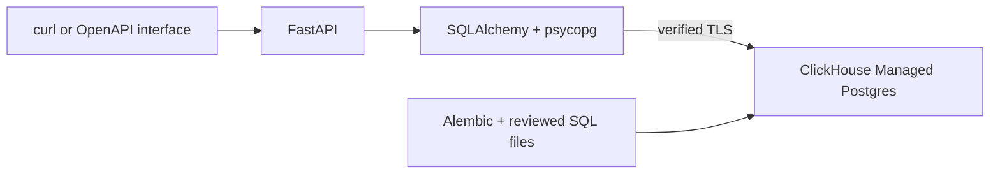

# Workshop Booking API

Book a workshop seat, check availability, and cancel a booking with **FastAPI**,
**SQLAlchemy**, **psycopg**, and **Alembic** on **ClickHouse Managed Postgres**.
The example demonstrates a small but important promise: two concurrent requests
cannot take the same last seat. FastAPI's generated OpenAPI interface lets you
explore the application without building a separate frontend.

Read the companion guide:
[Build a workshop booking API with FastAPI, SQLAlchemy, and Postgres](https://clickhouse.com/resources/engineering/build-workshop-booking-api-fastapi-sqlalchemy-postgres).

**[Sign up for ClickHouse Cloud with $300 in free trial credits](https://clickhouse.com/cloud).**

[ClickHouse Cloud](https://clickhouse.com/cloud) is the overall managed data
platform. Within it, [ClickHouse](https://clickhouse.com/clickhouse) is the
analytical database service, and
[ClickHouse Managed Postgres](https://clickhouse.com/cloud/postgres) is the
PostgreSQL service for transactional applications.

ClickHouse Managed Postgres runs on local NVMe storage, with managed backups and
options for high availability. It integrates with the ClickHouse analytical
database through ClickPipes CDC and the `pg_clickhouse` extension. Together, the
two database services provide a unified transactional and analytical data stack
within ClickHouse Cloud.

This application uses only the ClickHouse Managed Postgres service: bookings
need transactions, constraints, and current availability. [Shortwave](../shortwave)
provides the complete example and explicit setup commands for using both database
services with ClickPipes.

## How it works



| Route | Purpose | Success |
| --- | --- | --- |
| `GET /workshops` | List upcoming workshops and available seats | `200` |
| `POST /bookings` | Book one seat using `{ "id": "UUID", "workshop_id": "UUID" }` | `201`, or `200` on retry |
| `GET /bookings/{id}` | Read your booking | `200` |
| `DELETE /bookings/{id}` | Cancel your booking | `200` |

The booking routes require a bearer token. The server maps tokens to seeded
attendees; callers cannot choose a different owner in the request. Another
attendee's booking returns `404` on read or cancellation. The workshop list is
public and contains no attendee information.

Three tables live in the `workshop_booking` schema: `workshops`, `attendees`, and
`bookings`. To book a seat, the API locks the workshop row, checks the current
active booking count, and inserts the booking in the same transaction.
Cancellation acquires the same workshop lock. A partial unique index permits at
most one active booking per attendee and workshop. All writes to bookings must
follow this locking protocol; the capacity rule is a transaction rule, not a
cross-table database constraint.

## Set up the example

Use a ClickHouse Cloud account with Managed Postgres access, Git, `curl`, `jq`,
OpenSSL, `psql` 15 or newer, and Python 3.12. Run application dependencies in a
Linux development environment. On macOS, maintainers can create an
[isolated OrbStack machine](https://docs.orbstack.dev/machines/isolated):

```sh
orb create --isolated --isolate-network ubuntu:24.04 workshop-booking-dev
orb -m workshop-booking-dev
```

This disables host file sharing and integration, SSH-agent forwarding, and
access from the machine to the host and other machines. No host mounts are
needed. Keep Cloud API credentials on the machine you use for provisioning;
transfer only the database credentials needed for each step into Linux.
The commands below use Bash and run from the application directory unless noted.

### 1. Install the application in Linux

```sh
sudo apt-get update
sudo apt-get install -y python3 python3-venv ca-certificates git curl jq openssl postgresql-client
git clone https://github.com/ClickHouse/examples.git
cd examples/applications/workshop-booking
python3 --version
python3 -m venv .venv
.venv/bin/python -m pip install -r requirements.txt
```

The requirements file pins the dependency set. There is no Node.js installation
or JavaScript build step.

### 2. Sign in to ClickHouse Cloud

Run these provisioning commands where you manage Cloud resources. Install
[clickhousectl](https://clickhouse.com/docs/interfaces/cli), then sign in with
an Admin API key created using the [Cloud API instructions](https://clickhouse.com/docs/cloud/manage/openapi).
The interactive prompt keeps the secret out of shell history. OAuth is
read-only for Postgres provisioning.

```sh
curl -fsSL https://clickhouse.com/cli | sh
export PATH="$HOME/.local/bin:$PATH"
clickhousectl --version
clickhousectl cloud auth login --interactive
clickhousectl cloud auth status
clickhousectl cloud org list
umask 077
mkdir -p .deployment
```

In an editor, create `.deployment/resources.env` with your organization ID and
a region and size supported by your organization:

```dotenv
CH_ORG_ID=YOUR_ORGANIZATION_UUID
DEPLOYMENT_NAME=workshop-booking-example
CLOUD_REGION=YOUR_AVAILABLE_AWS_REGION
PG_SIZE=YOUR_AVAILABLE_POSTGRES_SIZE
```

Review [Managed Postgres pricing](https://clickhouse.com/pricing) before creation.
This example provisions one Postgres 18 service without HA. Compute, storage,
backups, and network usage can incur charges. Stopping Python or the development
VM does not stop database charges; delete an unneeded dedicated service when
finished.

### 3. Create Postgres and download its CA

Run creation once. Preserve the response privately: it contains the initial
administrator password.

```sh
source .deployment/resources.env
clickhousectl cloud postgres create \
  --org-id "$CH_ORG_ID" --name "$DEPLOYMENT_NAME" \
  --provider aws --region "$CLOUD_REGION" --size "$PG_SIZE" \
  --pg-version 18 --ha-type none \
  --tag project=workshop-booking --tag environment=development --json \
  > .deployment/postgres-create.json
PG_SERVICE_ID="$(jq -er '.id' .deployment/postgres-create.json)"
printf 'PG_SERVICE_ID=%s\n' "$PG_SERVICE_ID" >> .deployment/resources.env
```

Repeat **get** until `state` is `running`; do not repeat **create**:

```sh
clickhousectl cloud postgres get "$PG_SERVICE_ID" \
  --org-id "$CH_ORG_ID" --json > .deployment/postgres-status.json
jq '{id, state, hostname, username, postgresVersion, size}' \
  .deployment/postgres-status.json
```

If creation was interrupted, first reconcile against
`clickhousectl cloud postgres list --org-id "$CH_ORG_ID" --json`. A missing local
response does not mean the service was not created. Retrieve the CA only after
the service is running:

```sh
clickhousectl cloud postgres certs get "$PG_SERVICE_ID" \
  --org-id "$CH_ORG_ID" --output .deployment/postgres-ca.pem
```

Use `--output` to obtain a PEM certificate file. JSON-mode output redirected into
a `.pem` file is not a usable CA. Record the returned direct hostname and
administrator username in `.deployment/resources.env`:

```dotenv
PGHOST=YOUR_POSTGRES_HOSTNAME
PGPORT=5432
PGDATABASE=postgres
PGADMIN=YOUR_SERVICE_ADMIN_USERNAME
```

Use the service's direct Postgres endpoint for both migrations and runtime.
If using an isolated VM, copy the private provisioning receipt and CA only for
database setup, then remove administrator credentials from the runtime copy.
Do not copy the Cloud API credential store into the VM.

### 4. Create roles, migrate, and seed

The following commands run in Linux, where `psql`, Python, and the application
files are installed. Generate passwords **once** and preserve the file on retries:

```sh
umask 077
mkdir -p .deployment
cat > .deployment/passwords.env <<PASSWORDS
WORKSHOP_MIGRATOR_PASSWORD=Aa1_$(openssl rand -hex 30)
WORKSHOP_APP_PASSWORD=Aa1_$(openssl rand -hex 30)
PASSWORDS
source .deployment/resources.env
source .deployment/passwords.env
export PGHOST PGPORT PGDATABASE WORKSHOP_MIGRATOR_PASSWORD WORKSHOP_APP_PASSWORD
export PGSSLMODE=verify-full
export PGSSLROOTCERT="$PWD/.deployment/postgres-ca.pem"
export PGPASSWORD="$(jq -er '.password' .deployment/postgres-create.json)"
psql -X -v ON_ERROR_STOP=1 -U "$PGADMIN" -f sql/bootstrap.sql
```

The bootstrap creates a non-login schema owner, a migration login, and a
separate runtime login. Passwords are read through `psql`'s `\getenv` and quoted
as SQL values, rather than embedded in SQL files or process arguments.
Run the Alembic migration with the migration login:

```sh
export PGUSER=workshop_booking_migrator
export PGPASSWORD="$WORKSHOP_MIGRATOR_PASSWORD"
.venv/bin/alembic upgrade head
.venv/bin/alembic current
psql -X -v ON_ERROR_STOP=1 -f sql/seed.sql
unset PGPASSWORD
```

| File | Responsibility |
| --- | --- |
| [sql/bootstrap.sql](sql/bootstrap.sql) | Database roles and schema ownership |
| [sql/migrations/001_initial.sql](sql/migrations/001_initial.sql) | Tables, constraints, and indexes |
| [migrations](migrations) | Alembic revision and migration environment |
| [sql/grants.sql](sql/grants.sql) | Runtime permissions |
| [sql/seed.sql](sql/seed.sql) | Demo attendees and upcoming workshops |
| [sql/cleanup.sql](sql/cleanup.sql) | Explicit removal of this example's objects |

Alembic applies the reviewed schema and grants SQL and records the revision in Postgres.
Run `alembic upgrade head` when resuming or upgrading; do not apply the initial
SQL separately and bypass migration tracking. Bootstrap runs once and fails if
its objects already exist. Seed data can be reapplied. Never execute
the whole SQL directory, which also contains destructive cleanup.

### 5. Configure the API

Create a runtime environment file containing only the application login and
attendee tokens. See [.env.example](.env.example) for all options and the demo
attendee IDs from [sql/seed.sql](sql/seed.sql).

```sh
cp .env.example .deployment/app.env
```

Edit `app.env`: set `PGHOST`, `PGPORT`, `PGDATABASE`, `PGUSER=workshop_booking_app`,
`PGPASSWORD` to `WORKSHOP_APP_PASSWORD`, and `PGSSLROOTCERT` to the absolute
downloaded CA path. Generate a separate token for each attendee:

```sh
openssl rand -hex 32
```

Put the tokens in `API_BEARER_TOKENS`, a JSON object mapping an attendee UUID to
its token. Keep the same UUID when rotating a token so existing bookings remain
owned by that attendee. Every configured attendee must exist in the database;
startup checks this. These tokens are server-to-server credentials, not public
browser keys. Restart the process after changing the configuration.

The application builds a SQLAlchemy connection using psycopg and forces
`sslmode=verify-full`: both the certificate chain and server hostname must verify
against the supplied CA. Separate `PG*` fields avoid password URL-encoding traps.
Do not disable TLS verification to work around a connection failure.

Load the runtime file and start the server:

```sh
set -a
source .deployment/app.env
set +a
.venv/bin/uvicorn app.main:app --host 127.0.0.1 --port 8000
```

The application checks its connection before accepting requests. Explore the
generated interface at `http://127.0.0.1:8000/docs` and the schema at
`http://127.0.0.1:8000/openapi.json` from the environment running the server.
For an isolated VM, the commands below can all run in a second VM shell.

## Book, retry, and cancel

In a second shell, load `app.env` as above and select the first configured token:

```sh
BASE_URL=http://127.0.0.1:8000
API_TOKEN="$(printf '%s' "$API_BEARER_TOKENS" | jq -er 'to_entries[0].value')"
curl --fail-with-body -sS "$BASE_URL/workshops" > .deployment/workshops.json
jq . .deployment/workshops.json
```

Choose a workshop ID from that response and generate one booking ID. Preserve
the booking ID when retrying a request after a timeout or lost response:

```sh
WORKSHOP_ID=UUID_FROM_WORKSHOPS_RESPONSE
BOOKING_ID="$(.venv/bin/python -c 'import uuid; print(uuid.uuid4())')"
jq -n --arg id "$BOOKING_ID" --arg workshop "$WORKSHOP_ID" \
  '{id: $id, workshop_id: $workshop}' > .deployment/booking-request.json
curl --fail-with-body -sS -i "$BASE_URL/bookings" \
  -H "Authorization: Bearer $API_TOKEN" \
  -H 'Content-Type: application/json' \
  --data-binary @.deployment/booking-request.json
```

A new booking returns `201` with `status: "confirmed"`. Repeat the exact request:
it returns `200` with the same booking, without consuming another seat.
Reusing the ID for another existing workshop returns `409`. A new ID for an attendee
who already has an active booking in that workshop also returns `409`.

```sh
curl --fail-with-body -sS "$BASE_URL/bookings/$BOOKING_ID" \
  -H "Authorization: Bearer $API_TOKEN" | jq
curl --fail-with-body -sS -X DELETE "$BASE_URL/bookings/$BOOKING_ID" \
  -H "Authorization: Bearer $API_TOKEN" | jq
```

Cancellation returns `200`, `status: "cancelled"`, and a non-null `cancelled_at`.
Availability increases by one. Repeating DELETE returns the cancelled booking
and leaves availability unchanged. Retrying the original POST after cancellation
returns the current cancelled booking; it never silently makes a new booking.
Use a new booking UUID to book again.

The seed includes a workshop with one seat. Booking it as one attendee and
trying as another returns `409` for the second request. Sending the two requests
concurrently must produce exactly one confirmed booking. Missing/invalid tokens
return `401`; invalid UUIDs and unexpected body fields return `422`.
Booking request bodies are limited to 4 KiB, including streamed requests; larger
bodies return `413`. The workshop list accepts `limit` from 1 to 100 (default
20) and `offset` from 0 to 10,000, ordered by start time and ID.

## Test changes

Install test dependencies inside Linux and run the fast checks:

```sh
.venv/bin/python -m pip install -r requirements-dev.txt
.venv/bin/pytest tests/unit
```

The integration tests use a real Postgres service to exercise competing requests,
retry semantics, cancellation, authorization, rollback, constraints, and TLS.
Run them against a dedicated example service with the fixture credentials
described in [tests/README.md](tests/README.md). They create and remove their own
fixtures. Keep privileged test credentials out of the runtime file.

## Limits and operation

- This is a small authenticated API with seeded attendees and workshops. It has
  no signup flow, payment handling, calendar integration, waitlist, or admin UI.
- A booking is one seat. An attendee can have only one active booking in a
  workshop. New bookings and first-time cancellations close when the workshop
  starts. Retrying an existing booking or an already completed cancellation
  still returns its current state.
- The engine explicitly uses `READ COMMITTED` isolation and a consistent workshop-first
  lock order protect the capacity check. Do not remove the lock when adding
  another writer or an administrative booking endpoint. List availability is a
  snapshot; the booking transaction makes the final admission decision.
- The pool permits five persistent and five overflow connections per process.
  Multiply that limit by the number
  of worker processes or replicas before scaling. Requests waiting too long on
  the database return a retryable error; retry creation with the same booking ID.
- Bookings, including cancelled records, are retained. Deleting them would remove
  the durable retry history, so define a retry window before adding retention.
- Authorization is enforced in the API. The shared runtime database role is not
  a separate database tenant boundary. Use only the migration login for schema
  changes and never run the application with the administrator password.
- For hosted operation, run Uvicorn under a process supervisor behind HTTPS,
  with request limits and appropriate network access. The development listener
  is bound to localhost. This example does not provision an application host.

## Troubleshooting and cleanup

For TLS errors, verify the downloaded file is PEM, the CA is current, and
`PGHOST` matches this service. For authentication errors, distinguish the Cloud
API key, database administrator, migrator, application password, and HTTP token.
A failed startup can also mean a configured attendee was not seeded.

If the administrator password is lost, reset it on the recorded service instead
of creating another service:

```sh
clickhousectl cloud postgres reset-password "$PG_SERVICE_ID" \
  --org-id "$CH_ORG_ID" --generate --json \
  > .deployment/postgres-password-reset.json
```

Keep that response private. Resetting the administrator password does not rotate
the separate application login.

Stop Uvicorn with Ctrl-C. To remove the example from a service you will keep,
review [sql/cleanup.sql](sql/cleanup.sql), reconnect with administrator credentials,
and run the file explicitly:

```sh
export PGPASSWORD="$(jq -er '.password' .deployment/postgres-create.json)"
psql -X -v ON_ERROR_STOP=1 -U "$PGADMIN" -f sql/cleanup.sql
unset PGPASSWORD
```

Use the reset password if it has changed. Cleanup deletes this example's data
and roles. It does not delete the Managed Postgres service or stop its charges. For a
service created exclusively for this example, check the saved ID, then delete it:

```sh
source .deployment/resources.env
clickhousectl cloud postgres get "$PG_SERVICE_ID" --org-id "$CH_ORG_ID" --json
clickhousectl cloud postgres delete "$PG_SERVICE_ID" --org-id "$CH_ORG_ID"
clickhousectl cloud postgres list --org-id "$CH_ORG_ID" --json
```

Confirm the recorded ID is absent from the service list. Preserve receipts until
the outcome is clear, then remove unneeded private credential files and the
dedicated VM. Never delete a shared service to clean up this example.
