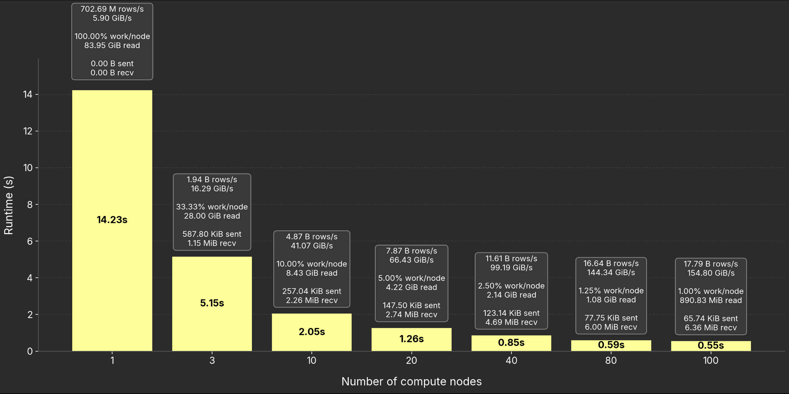
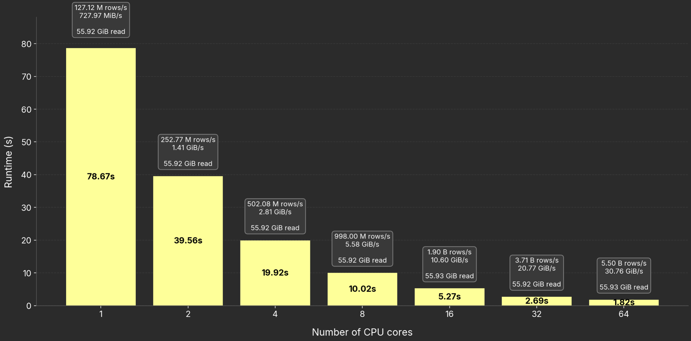

# Visualization Scripts

This folder contains Python scripts to render benchmark results as bar charts.

- `nodes_chart.py` — scaling results by **number of compute nodes**
- `cores_chart.py` — scaling results by **number of CPU cores**

Both scripts read the JSON benchmark output and produce `.png` charts with runtimes and metric boxes.

---

## Environment Setup

Install dependencies with `pyenv` (or your preferred Python environment):

```bash
brew update
brew install pyenv
brew install pyenv-virtualenv

pyenv install 3.11.9   # only if not already installed
pyenv virtualenv 3.11.9 bench-viz
pyenv activate bench-viz

pip install matplotlib numpy
```

---

## Nodes Chart

Render scaling results by **number of nodes**:

```bash
python nodes_chart.py ../results/.../results_nodes.json hot
```

### Arguments

- `results.json` : JSON file with benchmark results  
- `mode` : one of `cold`, `hot`, `hot_avg`  
- `--outdir` : optional, custom output folder for the chart  
- `--label-threshold` : multiple of label text height that a bar must exceed to place the runtime label inside (default: `2.5`)  
- `--always-inside` : force all runtime labels inside bars  
- `--always-outside` : force all runtime labels above bars  

### Examples

```bash
# Render the "hot" timings as a bar chart, output next to JSON
python nodes_chart.py ../results/.../uk_b100_results.json hot
# → ../results/.../uk_b100_results_nodes_hot.png

# Render the "cold" timings with a custom output folder
python nodes_chart.py ../results/.../uk_b100_results.json cold --outdir ./viz_out
# → ./viz_out/uk_b100_results_nodes_cold.png

# Render with a looser inside-label threshold
python nodes_chart.py ../results/.../uk_b100_results.json hot --label-threshold 2.0

# Force all runtime labels above bars (drawn in bar color)
python nodes_chart.py ../results/.../uk_b100_results.json hot --always-outside
```

---

## Cores Chart

Render scaling results by **number of cores**:

```bash
python cores_chart.py ../results/.../results_cores.json hot --max-cores 64
```

### Arguments

- `results.json` : JSON file with benchmark results  
- `mode` : one of `cold`, `hot`, `hot_avg`  
- `--max-cores` : optional, cap the maximum number of cores shown in the chart  
- `--outdir` : optional, custom output folder for the chart  
- `--label-threshold` : multiple of label text height that a bar must exceed to place the runtime label inside (default: `2.5`)  
- `--always-inside` : force all runtime labels inside bars  
- `--always-outside` : force all runtime labels above bars  

### Examples

```bash
# Render full cores chart, output next to JSON
python cores_chart.py ../results/.../uk_b100_results.json hot
# → ../results/.../uk_b100_results_cores_hot.png

# Render only up to 64 cores
python cores_chart.py ../results/.../uk_b100_results.json hot --max-cores 64
# → ../results/.../uk_b100_results_cores_hot_upto64.png

# Render only up to 64 cores, with custom output folder
python cores_chart.py ../results/.../uk_b100_results.json hot --max-cores 64 --outdir ./viz_out
# → ./viz_out/uk_b100_results_cores_hot_upto64.png

# Force all runtime labels inside bars
python cores_chart.py ../results/.../uk_b100_results.json hot --always-inside
```

---

## Visual Examples

### Nodes Chart Example


### Cores Chart Example

