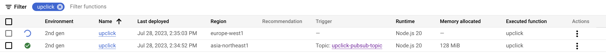

# UpClick GCP Demo

## Description

A demo GCP 2nd gen Pub/Sub NodeJS cloud function triggered by scheduler via pub/sub messages containing a target website.
The target website is tested for latency and related captured metrics, enriched by geo data using MaxMind geo-ip lite, are sent to ClickHouse Cloud.


### Tech stack

- GCP: 2nd Gen Pub/Sub Cloud Function,pub/sub topic, cloud scheduler
- ClickHouse
- NodeJS  


### Requirements

Beside having a GCP project active, you will need to have the following installed in your system:

- yarn 1.22.19
- node 20.3.0
- gcloud (CLI)
- ClickHouse Cloud trial (or run your own locally)
- Max Mind GEO Lite trial
  
You can get ClickHouse cloud trial [here](https://clickhouse.cloud/signUp) and a Max Mind Lite account [here](https://dev.maxmind.com/geoip/geolite2-free-geolocation-data).


## Deployment

### ClickHouse

You will need to create a table in your `default` database using this SQL [CREATE TABLE](./commands/CREATE_TABLE.sql) statement.

### Setting up the repo locally

The below commands will clone this repository on your local machine then install the required modules:

```
git clone https://github.com/nellicus/upclick-gcp
cd upclick-gcp
yarn install
```

will yield:

```
Cloning into 'upclick-gcp'...
remote: Enumerating objects: 32, done.
remote: Counting objects: 100% (32/32), done.
remote: Compressing objects: 100% (25/25), done.
remote: Total 32 (delta 9), reused 29 (delta 6), pack-reused 0
Receiving objects: 100% (32/32), 68.11 KiB | 929.00 KiB/s, done.
Resolving deltas: 100% (9/9), done.
yarn install v1.22.19
[1/5] 🔍  Validating package.json...
[2/5] 🔍  Resolving packages...
[3/5] 🚚  Fetching packages...
[4/5] 🔗  Linking dependencies...
[5/5] 🔨  Building fresh packages...
✨  Done in 1.65s.
```

### Create secrets file

Create a file named `.env.local` at the root of the project as:

```
APP_NAME: upclick_gcp

### CLICKHOUSE
CLICKHOUSE_HOST: https://your_clickhouse_cloud_service.region.provider.clickhouse.cloud:8443
CLICKHOUSE_USERNAME: default
CLICKHOUSE_PASSWORD: 'a_very_secret_password'

### MAXMIND
MAX_MIND_ACCOUNT_ID: your_max_mind_accound_id
MAXMIND_LICENSE_KEY: your_max_mind_license_key
```

Replace these values with ones specific to your environment.


## Launching locally

Now that you have modules installed and secrets file in place, you can launch the function locally, this will be binding to `localhost:8080`:

```
yarn start:local
yarn run v1.22.19
$ yarn build-local && cp .env.local dist/.env && cp .env.local .env && functions-framework --source=dist/index.js --target=upclick
$ yarn clean && tsc
$ rm -rf dist/
Loading env from /opt/test/upclick-gcp/.env
loaded secrets...
Serving function...
Function: upclick
Signature type: cloudevent
URL: http://localhost:8080/
```

This would normally be triggered by a pub/sub JSON payload in GCP, locally we simulate with the command `./commands/pub-sub-invoke-local.sh`,
this will send the base64 encoded representation of this payload:

```json
{"target":"www.clickhouse.com"}
```

See the [pub-sub-invoke-local.sh](/commands/pub-sub-invoke-local.sh) script for generating a new payload using different `target` value.

So, in a new terminal, invoke the command:

```
./commands/pub-sub-invoke-local.sh
```

while in the other terminal, our function will be running locally:

```
yarn start:local
yarn run v1.22.19
$ yarn build-local && cp .env.local dist/.env && cp .env.local .env && functions-framework --source=dist/index.js --target=upclick
$ yarn clean && tsc
$ rm -rf dist/
Loading env from /opt/test/upclick-gcp/.env
loaded secrets...
Serving function...
Function: upclick
Signature type: cloudevent
URL: http://localhost:8080/
```

these output lines below will indicate correct execution:

```
upclick function started...
Pub/Sub payload received: www.clickhouse.com
Sending metrics to ClickHouse...
{"target":"www.clickhouse.com","status_code":200,"latency":537,"continent_code":"EU","country_iso_code":"IT","country_name_en":"Italy","city_name_en":"Bologna","latitude":44.488,"longitude":11.3752}
done...bye!
```


## Deploying on GCP

A few preliminary steps are required before we can launch this on GPC.

You will want to make sure you're correctly set up with GCP CLI access using `gcloud info`, this will print all the info related to your gcloud configuration including gcp-project in use.

First of all, the function will refer to a service account, that will be used by the function also in order to inherit it the necessary permissions, so the service account will need to be granted the below permissions:

- Cloud Run Developer
- Pub/Sub Lite Editor

See here for a list of available [IAM Roles](https://cloud.google.com/run/docs/reference/iam/roles).

Since our function expects to find already a [pub/sub topic](https://cloud.google.com/pubsub/docs/create-topic) with name `upclick-pubsub-topic`, you will need to create such topic in your gpc project. You can do that via UI or via `gcloud` from CLI with:

`gcloud pubsub topics create upclick-pubsub-topic`

Then, in order to have your JSON payloads regularly pushed to your topic `upclick-pubsub-topic`, you will want to create a cloud scheduler, again this can be achieved both from GCP UI or `gcloud` CLI:

```
gcloud scheduler jobs create pubsub upclick-cloud-scheduler --topic upclick-pubsub-topic --schedule "* * * * *" --message-body '{"target":"www.clickhouse.com"}' --location europe-west1
name: projects/my-gcp-project/locations/europe-west1/jobs/upclick-cloud-scheduler
pubsubTarget:
  data: eyJ0YXJnZXQiOiJ3d3cuY2xpY2tob3VzZS5jb20ifQ==
  topicName: projects/my-gcp-project/topics/upclick-cloud-scheduler
retryConfig:
  maxBackoffDuration: 3600s
  maxDoublings: 16
  maxRetryDuration: 0s
  minBackoffDuration: 5s
schedule: '* * * * *'
state: ENABLED
timeZone: Etc/UTC
userUpdateTime: '2023-07-28T12:48:03Z'
```


Once that's done, you will have these JSON payloads pushed into your topic once a minute, so you can go ahead with below steps to actually deploy the function.

In order to deploy to all regions (`gcloud functions` doesn't yet allow deploying to multiple regions in one go), we use a little [bash script](./commands/deploy-all-regions.sh) to help ourselves, feeding the $gcp_region value to the `yarn deploy` script. 

Below the function execution output... truncated after the second region instance starts to be deployed:

```
./commands/deploy-all-regions.sh
yarn run v1.22.19
$ yarn build-local && yarn prep:dist && cd dist && gcloud functions deploy $npm_package_name --source=. --gen2 --trigger-topic=$npm_package_name-pubsub-topic --runtime=nodejs20 --memory=128MiB --entry-point=upclick --project $npm_package_config_gcp_project --service-account=$npm_package_config_gcp_service_account --region=asia-northeast1
$ yarn clean && tsc
$ rm -rf dist/
$ cp package.json dist/ && cp .env.local dist/.env
Preparing function...done.
X Deploying function...
    [Build] Logs are available at [https://console.cloud.google.com/cloud-build/builds;region=asia-northeast1/c8c635e6-7180-4b2d-bd3a-e3693115c1c9?project=994891621229]
  ✓ [Service]
  ✓ [Trigger]
  . [ArtifactRegistry]
  . [Healthcheck]
  . [Triggercheck]
Completed with warnings:
  [WARNING] *** Improve build performance by generating and committing package-lock.json.
You can view your function in the Cloud Console here: https://console.cloud.google.com/functions/details/asia-northeast1/upclick?project=my-gcp-project

buildConfig:
  build: projects/994891621229/locations/asia-northeast1/builds/c8c635e6-7180-4b2d-bd3a-e3693115c1c9
  entryPoint: upclick
  runtime: nodejs20
  source:
    storageSource:
      bucket: gcf-v2-sources-994891621229-asia-northeast1
      generation: '1690547590958925'
      object: upclick/function-source.zip
  sourceProvenance:
    resolvedStorageSource:
      bucket: gcf-v2-sources-994891621229-asia-northeast1
      generation: '1690547590958925'
      object: upclick/function-source.zip
environment: GEN_2
eventTrigger:
  eventType: google.cloud.pubsub.topic.v1.messagePublished
  pubsubTopic: projects/my-gcp-project/topics/upclick-pubsub-topic
  retryPolicy: RETRY_POLICY_DO_NOT_RETRY
  serviceAccountEmail: upclick-demo@my-gcp-project.iam.gserviceaccount.com
  trigger: projects/my-gcp-project/locations/asia-northeast1/triggers/upclick-007172
  triggerRegion: asia-northeast1
labels:
  deployment-tool: cli-gcloud
name: projects/my-gcp-project/locations/asia-northeast1/functions/upclick
serviceConfig:
  allTrafficOnLatestRevision: true
  availableCpu: '0.0833'
  availableMemory: 128Mi
  ingressSettings: ALLOW_ALL
  maxInstanceCount: 100
  maxInstanceRequestConcurrency: 1
  revision: upclick-00001-mip
  service: projects/my-gcp-project/locations/asia-northeast1/services/upclick
  serviceAccountEmail: upclick-demo@my-gcp-project.iam.gserviceaccount.com
  timeoutSeconds: 60
  uri: https://upclick-oqg7ghcnuq-an.a.run.app
state: ACTIVE
updateTime: '2023-07-28T12:34:52.416353122Z'
url: https://asia-northeast1-my-gcp-project.cloudfunctions.net/upclick
✨  Done in 117.50s.
yarn run v1.22.19
$ yarn build-local && yarn prep:dist && cd dist && gcloud functions deploy $npm_package_name --source=. --gen2 --trigger-topic=$npm_package_name-pubsub-topic --runtime=nodejs20 --memory=128MiB --entry-point=upclick --project $npm_package_config_gcp_project --service-account=$npm_package_config_gcp_service_account --region=europe-west1
$ yarn clean && tsc
$ rm -rf dist/
$ cp package.json dist/ && cp .env.local dist/.env
Preparing function...done.
⠛ Deploying function...
  ⠛ [Build] Build in progress... Logs are available at [https://console.cloud.google.com/cloud-build/builds;region=europe-west1/19d752e1-7355-47df-bd00-7c008d00a6c6?project=994891621229]
  . [Service]
  . [Trigger]
  . [ArtifactRegistry]
  . [Healthcheck]
  . [Triggercheck]
//TRUNCATED
```

At this stage you should see in your GCP project, under Cloud functions menu:



in a few minutes all the four regions listed in the bash helper script should be up and running, and triggering every time the cloud scheduler previously setup will push a JSON payload to the related pub/sub topic on GPC; in a matter of minutes, you should start receiving data from all your cloud function in your ClickHouse Cloud instance:

```sql
clickhouse-cloud :) SELECT count(*),target,status_code,avg(latency) FROM upclick_metrics GROUP BY target,status_code

SELECT
    count(*),
    target,
    status_code,
    avg(latency)
FROM upclick_metrics
GROUP BY
    target,
    status_code

Query id: d6b36a23-4ea8-4766-978f-0c3aaec45b1d

┌─count()─┬─target─────────────┬─status_code─┬───────avg(latency)─┐
│     197 │ www.clickhouse.com │         200 │ 1693.1725888324872 │
└─────────┴────────────────────┴─────────────┴────────────────────┘

1 row in set. Elapsed: 0.003 sec.
```
