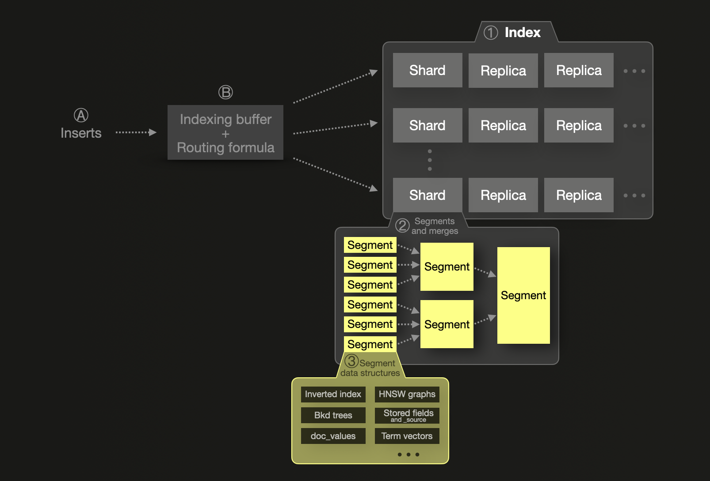
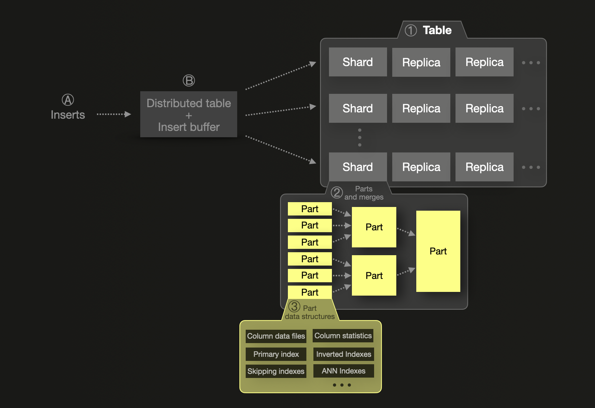

# On-disk format and insert processing primer

## Elasticsearch

### Logical and physical on-disk data structures

Elasticsearch stores and indexes JSON documents within an ① [index](https://www.elastic.co/blog/what-is-an-elasticsearch-index), a logical grouping of one or more physical shards. A shard can have one or more physical copies called replica shards for resilience. For scalability, shards and replicas can be [distributed](https://www.elastic.co/guide/en/elasticsearch/reference/current/scalability.html) over several nodes. A single shard ② consists of one or more immutable segments. A segment is the basic indexing structure of [Lucene](https://lucene.apache.org/), the Java library providing the indexing and search features on which Elasticsearch is based. A segment ③ is a container for several data structures (we list the most important ones here): 

* [Inverted index](https://en.wikipedia.org/wiki/Inverted_index) is the basic data structure for full-text searches.
* [Block K-D trees](https://users.cs.duke.edu/~pankaj/publications/papers/bkd-sstd.pdf) store [multi-dimensional points](https://www.elastic.co/fr/blog/lucene-points-6-0) and are used for searches on geospatial data and numeric and date ranges. 
* [Doc_values](https://www.elastic.co/guide/en/elasticsearch/reference/current/doc-values.html) store values in a column-oriented on-disk data structure, providing optimal data analytics access patterns for aggregations, sorts, and scripted field values access.
* [HNSW graphs](https://en.wikipedia.org/wiki/Hierarchical_Navigable_Small_World_graphs) are [utilized](https://www.elastic.co/search-labs/blog/vector-search-elasticsearch-rationale) for [vector searches](https://arxiv.org/pdf/1603.09320).
* [Stored fields](https://www.elastic.co/guide/en/elasticsearch/reference/current/mapping-store.html) is a document store and used for returning the original values of fields in the response to a search query. By default, stored fields also store [_source](https://www.elastic.co/guide/en/elasticsearch/reference/current/mapping-source-field.html) - which contains the original JSON document body passed at index time.
* [Term vectors](https://www.elastic.co/guide/en/elasticsearch/reference/current/term-vector.html) are per-document inverted indices.

In Elasticsearch, [index mappings](https://www.elastic.co/guide/en/elasticsearch/reference/current/mapping.html) (equivalent to table schemas in ClickHouse) control which of the above-listed segment data structures are populated from the fields of indexed JSON documents.

### Insert processing

Ⓐ Newly inserted documents Ⓑ first go into an in-memory [indexing buffer](https://www.elastic.co/guide/en/elasticsearch/reference/8.13/near-real-time.html) that is flushed by default once per second. A [routing formula](https://www.elastic.co/guide/en/elasticsearch/reference/current/mapping-routing-field.html) is used to determine the target shard for flushed documents, and a new segment is written for the shard on disk. To improve query efficiency and enable the physical deletion of deleted or updated documents, segments are continuously merged in the background into larger segments until they reach a [max size](https://lucene.apache.org/core/9_9_1/core/org/apache/lucene/index/MergePolicy.html#DEFAULT_MAX_CFS_SEGMENT_SIZE) of 5 GB. It is possible to [force](https://www.elastic.co/guide/en/elasticsearch/reference/current/indices-forcemerge.html) a merge into larger segments, though.

### On-disk compression

`Stored fields` [are](https://lucene.apache.org/core/9_9_0/core/org/apache/lucene/codecs/lucene90/Lucene90StoredFieldsFormat.html) stored in a compressed format (encoded with [LZ4](https://en.wikipedia.org/wiki/LZ4_(compression_algorithm)) by default, [optionally](https://www.elastic.co/guide/en/elasticsearch/reference/current/index-modules.html) with [Deflate](https://en.wikipedia.org/wiki/Deflate) for a higher compression ratio, at the [expense](https://www.elastic.co/guide/en/elasticsearch/reference/current/index-modules.html) of slower `stored fields` performance).

Binary `Doc_values` [used to be](https://issues.apache.org/jira/browse/LUCENE-9211) compressable with `LZ4`, but are [no longer](https://github.com/elastic/elasticsearch/issues/78266) compressed in Lucene 9. The Elasticsearch team is currently [discussing](https://github.com/elastic/elasticsearch/issues/78266#issuecomment-1898832324) to restore binary compression for certain field types, though. Generally, within `doc_values` each column [is](https://lucene.apache.org/core/9_9_0/core/org/apache/lucene/codecs/lucene90/Lucene90DocValuesFormat.html) encoded individually based on the column-values‘ data type, and cardinality - e.g a column containing numeric values can be ([depending](https://lucene.apache.org/core/9_9_0/core/org/apache/lucene/codecs/lucene90/Lucene90DocValuesFormat.html) on cardinality)  `delta-compressed`, `table-compressed`, `gcd-compressed`, `monotonic-compressed`, etc. Columns with binary data (e.g., strings) can be `prefix-compressed`. When [index sorting](./README.md#on-disk-data-ordering) is used, doc-ids can be encoded in a very compact and access-efficient way.

### On-disk data ordering

It is optionally possible to [configure](https://www.elastic.co/guide/en/elasticsearch/reference/7.17/index-modules-index-sorting.html) how the data stored in `stored fields` and `doc_values` is physically sorted on disk (before compression is applied). By default, Lucene does not apply any sorting. Index sorting provides three main advantages:
1. When segment and search sort orders are the same, [early termination](https://www.elastic.co/guide/en/elasticsearch/reference/current/index-modules-index-sorting.html#early-terminate) of the search request is possible. 
2. Index sorting can be used to colocate similar data, which [can](https://www.elastic.co/guide/en/elasticsearch/reference/current/tune-for-disk-usage.html#_use_index_sorting_to_colocate_similar_documents) significantly increase compression ratios for the on-disk compression of `Stored fields`.
3. Index sorting enables a compact and access-efficent encoding of doc-ids for `doc_values`, plus deduplication and prefix-compression of column data.

Index sorting comes with slower indexing and segment merging though.

## ClickHouse

### Logical and physical on-disk data structures

The logical on-disk data structuring and insert processing are similar to Elasticsearch:

ClickHouse stores rows in tables. Similar to an Elasticsearch index, the data of a ClickHouse table can be ① split into several shards that can be [distributed](https://www.youtube.com/watch?v=vBjCJtw_Ei0) over multiple nodes for scalability. Each shard can have physical copies called replicas for resilience. The data within a single shard is organized as a collection of ② immutable data parts containing ③ several data structures (we list the most important ones here): 

* [Column data files](https://clickhouse.com/docs/en/optimize/sparse-primary-indexes#data-is-stored-on-disk-ordered-by-primary-key-columns) contain the table’s compressed column data. 
* [Primary index](https://clickhouse.com/docs/en/optimize/sparse-primary-indexes#clickhouse-index-design) is used for skipping data during query processing.
* [Skipping indexes](https://clickhouse.com/docs/en/optimize/skipping-indexes) are secondary indexes for skipping data during query processing.
* [Column statistics](https://clickhouse.com/blog/clickhouse-release-23-11#column-statistics-for-prewhere) enable better query optimization.
* [Inverted indexes](https://en.wikipedia.org/wiki/Inverted_index) speed up full-text searches.
* [ANN Indexes](https://clickhouse.com/docs/en/engines/table-engines/mergetree-family/annindexes) speed up vector searches.    

  

A table’s schema controls which of the above data structures are created.

### Insert processing

Ⓐ newly inserted rows first go into an Ⓑ in-memory insert buffer (if [asynchronous data inserts](https://clickhouse.com/blog/asynchronous-data-inserts-in-clickhouse) are used) that is flushed by default once every 200 milliseconds. If multiple shards are used, a [distributed table](https://clickhouse.com/docs/en/engines/table-engines/special/distributed) is used for routing newly inserted rows to their target shard. A new part is written for the shard on disk. 

Similar to Elasticsearch segments, parts are continuously merged in the background into larger parts until they reach a [max size](https://clickhouse.com/docs/en/operations/settings/merge-tree-settings#max-bytes-to-merge-at-max-space-in-pool) of 150 GB. However, it is possible to [force](https://clickhouse.com/docs/en/sql-reference/statements/optimize) a merge into larger parts. Part merges have larger utility in ClickHouse than segment merges in Elasticsearch, though. Part merges are not just used to improve query efficiency and enable the physical deletion of deleted or updated rows, but ClickHouse allows a continuous incremental transformation of existing data using different merge strategies. A table’s [engine type](https://clickhouse.com/docs/en/engines/table-engines) determines the applied [merge strategy](https://www.youtube.com/watch?v=QDAJTKZT8y4). For example, [replacing merges](https://clickhouse.com/docs/en/engines/table-engines/mergetree-family/replacingmergetree#replacingmergetree) retain only the most recently inserted version of a row, and [aggregating merges](https://clickhouse.com/docs/en/engines/table-engines/mergetree-family/aggregatingmergetree#aggregatingmergetree) collapse rows with equal [primary key](https://clickhouse.com/docs/en/optimize/sparse-primary-indexes#a-table-with-a-primary-key) column values into an aggregated row. 

### On-disk compression

By default, ClickHouse applies [LZ4](https://en.wikipedia.org/wiki/LZ4_(compression_algorithm)) compression in the self-managed version, and [ZSTD](https://en.wikipedia.org/wiki/Zstd) in ClickHouse Cloud to all `column data files`. But other [general purpose](https://clickhouse.com/docs/en/sql-reference/statements/create/table#general-purpose-codecs) and [specialized codecs](https://clickhouse.com/docs/en/sql-reference/statements/create/table#specialized-codecs) can be used and also [combined](https://clickhouse.com/blog/optimize-clickhouse-codecs-compression-schema), individually per column. 

In addition, ClickHouse [compresses](https://github.com/ClickHouse/ClickHouse/blob/4e9d894e24041f7c462a486394f19d602403ae15/src/Storages/MergeTree/MergeTreeSettings.h#L151) the `Primary index` data structure [and](https://github.com/ClickHouse/ClickHouse/blob/4e9d894e24041f7c462a486394f19d602403ae15/src/Storages/MergeTree/MergeTreeSettings.h#L150) its associated [Mark files](https://clickhouse.com/docs/en/optimize/sparse-primary-indexes#mark-files-are-used-for-locating-granules) with `ZSTD`. It is possible to change the individual codec used for compressing the [primary index](https://github.com/ClickHouse/ClickHouse/blob/4e9d894e24041f7c462a486394f19d602403ae15/src/Storages/MergeTree/MergeTreeSettings.h#L153) and [mark files](https://github.com/ClickHouse/ClickHouse/blob/4e9d894e24041f7c462a486394f19d602403ae15/src/Storages/MergeTree/MergeTreeSettings.h#L152) though.

### On-disk data ordering

Data of `column data files` is stored on disk (with applied compression) ordered [by](https://clickhouse.com/docs/en/optimize/sparse-primary-indexes#data-is-stored-on-disk-ordered-by-primary-key-columns) primary key column(s). Similar to Elasticsearch, this enables to:
1. [prevent resorting and apply short-circuiting](https://clickhouse.com/blog/clickhouse-faster-queries-with-projections-and-primary-indexes#utilize-indexes-for-preventing-resorting-and-enabling-short-circuiting) when a query's search sort order matches the physical data order
2. Significantly [increase compression ratio of data files](https://clickhouse.com/docs/en/optimize/sparse-primary-indexes#optimal-compression-ratio-of-data-files)

