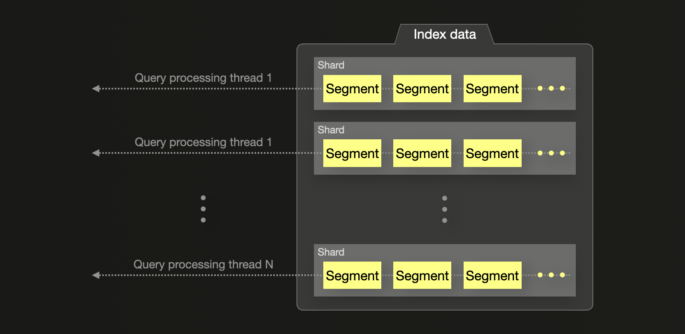
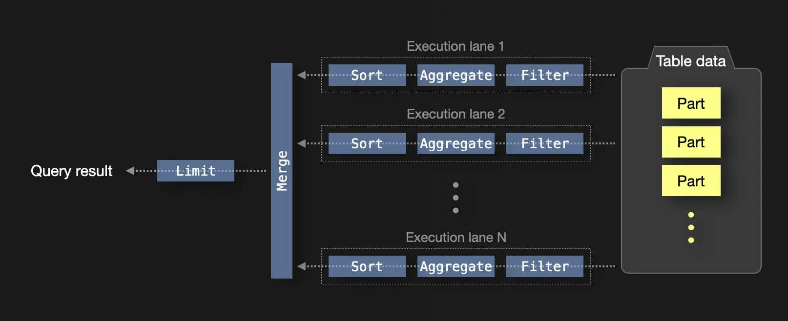

# Query processing primer

Based on the [Elasticsearch on-disk format](../on-disk-format-and-insert-processing/README.md#elasticsearch) and [ClickHouse on-disk format](../on-disk-format-and-insert-processing/README.md#clickhouse), we 
briefly describe their query processing techniques here.

## Elasticsearch

For its traditional [query DSL](https://www.elastic.co/guide/en/elasticsearch/reference/current/query-dsl.html), Elasticsearch would run each query with one parallel query processing thread per shard, with the segments within each shard being processed sequentially: 

However, since Elasticsearch 8.12, [segments can be searched in parallel](https://www.elastic.co/blog/whats-new-elasticsearch-platform-8-12-0) by query processing threads, with the notable exception of the [terms aggregation](https://www.elastic.co/guide/en/elasticsearch/reference/current/search-aggregations-bucket-terms-aggregation.html) (increasing the parallelization for terms aggregation would negatively impact their [accuracy](https://www.elastic.co/guide/en/elasticsearch/reference/current/search-aggregations-bucket-terms-aggregation.html#search-aggregations-bucket-terms-aggregation-shard-size)). 

Elasticsearch 8.11 [introduced](https://www.elastic.co/blog/whats-new-elasticsearch-platform-8-11-0) a new modern query language, [ES|QL](http://language), which performed better than the Elasticsearch query DSL in our benchmarks, and apparently is also capable of parallel segments processing. Currently, ESQL is [not](https://www.elastic.co/guide/en/elasticsearch/reference/current/esql.html) recommended for production yet (as of April 2023). 

## ClickHouse

By default, ClickHouse [runs](https://www.youtube.com/watch?v=hP6G2Nlz_cA) a SQL query with N concurrent execution lanes on a machine with N CPU cores:

Execution lanes decompose the to-be-processed table data into non-overlapping ranges processed in parallel by filter, aggregation, and sorting stages. The local results from each lane are eventually merged, and a limit operator is applied, in case the query features a limit clause.  