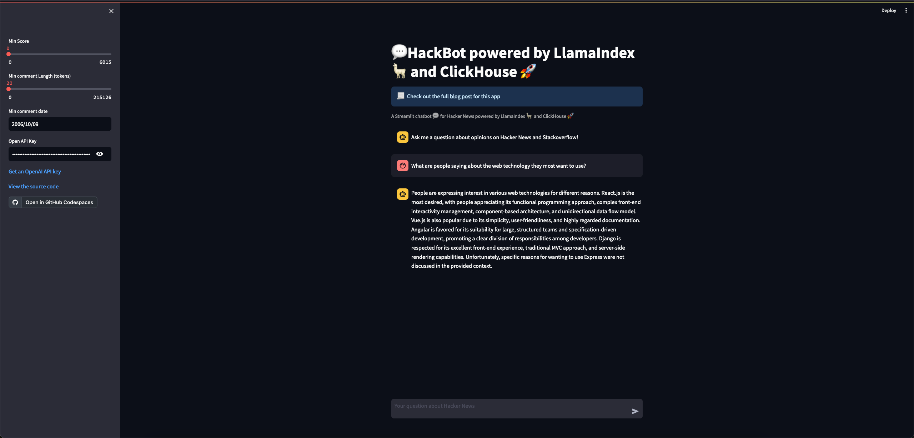
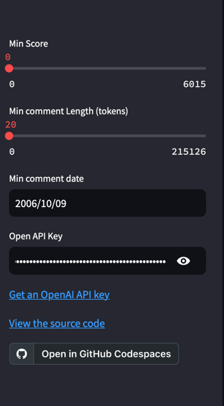
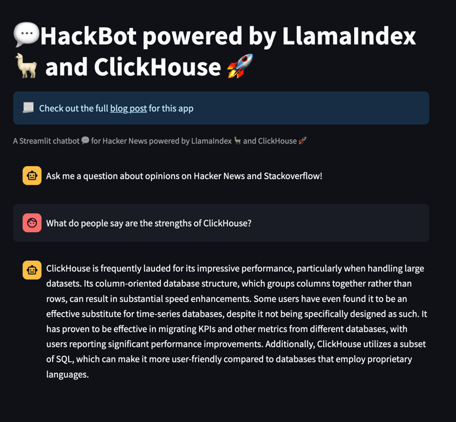
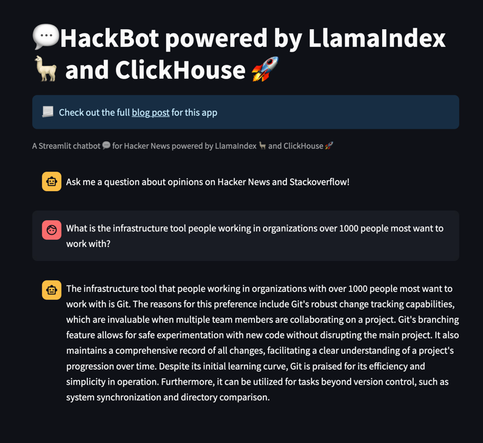
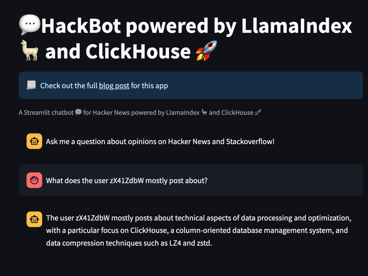

# Hackbot - A Streamlit chatbot 💬 for Hacker News powered by LlamaIndex 🦙 and ClickHouse 🚀

Simple chatbot app that uses LllamaIndex, ClickHouse,  Hacker News posts, and Stack Overflow survey results to allow an LLM (chatbot v4.0) to provide answers on people's opinions on technology. 



Answers are based on two sources held in ClickHouse:

 - 28 million Hacker News posts with vector embeddings generated by the `sentence-transformers/all-MiniLM-L6-v2` model. 
 - Stack Overflow survey results allowing statistics to be looked up, e.g., What is the most popular web development framework? These facts are used to provide additional context for querying posts and requesting a response from the LLM.

For example, users can query for:

"What are people's opinions on the most popular database?"

This requires:

1. Establish the most popular database through a SQL query to ClickHouse. Answer: Postgresql.
2. Query the posts with "What are people's opinions on Postgresql."
3. Provide context to LLM (Chatgpt 4.0) by asking, "What are people's opinions on Postgresql?"

This relies on Llama index to control the flow via the [`SQLAutoVectorQueryEngine`](https://docs.llamaindex.ai/en/latest/examples/query_engine/SQLAutoVectorQueryEngine.html) engine.

This query engine allows you to combine insights from structured tables ([Stack Overflow survey results](https://insights.stackoverflow.com/survey)) with your unstructured data ([Hacker News posts](https://github.com/ClickHouse/ClickHouse/issues/29693)). 

It first decides whether to query your structured tables for insights. Once it does, it can then infer a corresponding query to the vector store in order to fetch corresponding documents.

## Requirements

- ClickHouse 24.1
- Python 3.11+
- A [OpenAI API key](https://platform.openai.com/account/api-keys).

## Data

Hacker News post are for the period upto 2021. [Stack Overflow survey](https://insights.stackoverflow.com/survey) results are also for 2021.

IMPORTANT NOTE: The Hacker News rows consist of a `vector` embedding column. This has been generated using the `sentence-transformers/all-MiniLM-L6-v2` model from the `comment` column, producing vectors of 384 dimensions.

The `comment` column is usually quite short. To provide additional context, the `text` column therefore contains both the text of both the parent and child rows.

### Table schemas

```sql
CREATE TABLE hackernews
(
    `id` String,
    `doc_id` String,
    `comment` String,
    `text` String,
    `vector` Array(Float32),
    `node_info` Tuple(start Nullable(UInt64), end Nullable(UInt64)),
    `metadata` String,
    `type` Enum8('story' = 1, 'comment' = 2, 'poll' = 3, 'pollopt' = 4, 'job' = 5),
    `by` LowCardinality(String),
    `time` DateTime,
    `title` String,
    `post_score` Int32,
    `dead` UInt8,
    `deleted` UInt8,
    `length` UInt32,
    `parent` UInt32,
    `kids` Array(UInt32)
)
ENGINE = MergeTree
ORDER BY (toDate(time), length, post_score)

CREATE TABLE surveys
(
    `response_id` Int64,
    `development_activity` Enum8('I am a developer by profession' = 1, 'I am a student who is learning to code' = 2, 'I am not primarily a developer, but I write code sometimes as part of my work' = 3, 'I code primarily as a hobby' = 4, 'I used to be a developer by profession, but no longer am' = 5, 'None of these' = 6, 'NA' = 7),
    `employment` Enum8('Independent contractor, freelancer, or self-employed' = 1, 'Student, full-time' = 2, 'Employed full-time' = 3, 'Student, part-time' = 4, 'I prefer not to say' = 5, 'Employed part-time' = 6, 'Not employed, but looking for work' = 7, 'Retired' = 8, 'Not employed, and not looking for work' = 9, 'NA' = 10),
    `country` LowCardinality(String),
    `us_state` LowCardinality(String),
    `uk_county` LowCardinality(String),
    `education_level` Enum8('Secondary school (e.g. American high school, German Realschule or Gymnasium, etc.)' = 1, 'Bachelor’s degree (B.A., B.S., B.Eng., etc.)' = 2, 'Master’s degree (M.A., M.S., M.Eng., MBA, etc.)' = 3, 'Other doctoral degree (Ph.D., Ed.D., etc.)' = 4, 'Some college/university study without earning a degree' = 5, 'Something else' = 6, 'Professional degree (JD, MD, etc.)' = 7, 'Primary/elementary school' = 8, 'Associate degree (A.A., A.S., etc.)' = 9, 'NA' = 10),
    `age_started_to_code` Enum8('Younger than 5 years' = 1, '5 - 10 years' = 2, '11 - 17 years' = 3, '18 - 24 years' = 4, '25 - 34 years' = 5, '35 - 44 years' = 6, '45 - 54 years' = 7, '55 - 64 years' = 8, 'Older than 64 years' = 9, 'NA' = 10),
    `how_learned_to_code` Array(String),
    `years_coding` Nullable(UInt8),
    `years_as_a_professional_developer` Nullable(UInt8),
    `developer_type` Array(String),
    `organization_size` Enum8('Just me - I am a freelancer, sole proprietor, etc.' = 1, '2 to 9 employees' = 2, '10 to 19 employees' = 3, '20 to 99 employees' = 4, '100 to 499 employees' = 5, '500 to 999 employees' = 6, '1,000 to 4,999 employees' = 7, '5,000 to 9,999 employees' = 8, '10,000 or more employees' = 9, 'I don’t know' = 10, 'NA' = 11),
    `compensation_total` Nullable(UInt64),
    `compensation_frequency` Enum8('Weekly' = 1, 'Monthly' = 2, 'Yearly' = 3, 'NA' = 4),
    `language_have_worked_with` Array(String),
    `language_want_to_work_with` Array(String),
    `database_have_worked_with` Array(String),
    `database_want_to_work_with` Array(String),
    `platform_have_worked_with` Array(String),
    `platform_want_to_work_with` Array(String),
    `web_framework_have_worked_with` Array(String),
    `web_framework_want_to_work` Array(String),
    `other_tech_have_worked_with` Array(String),
    `other_tech_want_to_work` Array(String),
    `infrastructure_tools_have_worked_with` Array(String),
    `infrastructure_tools_want_to_work_with` Array(String),
    `developer_tools_have_worked_with` Array(String),
    `developer_tools_want_to_work_with` Array(String),
    `operating_system` Enum8('MacOS' = 1, 'Windows' = 2, 'Linux-based' = 3, 'BSD' = 4, 'Other (please specify):' = 5, 'Windows Subsystem for Linux (WSL)' = 6, 'NA' = 7),
    `frequency_visit_stackoverflow` Enum8('Multiple times per day' = 1, 'Daily or almost daily' = 2, 'A few times per week' = 3, 'A few times per month or weekly' = 4, 'Less than once per month or monthly' = 5, 'NA' = 6),
    `has_stackoverflow_account` Enum8('Yes' = 1, 'No' = 2, 'Not sure/can\'t remember' = 3, 'NA' = 4),
    `frequency_use_in_stackoverflow` Enum8('Multiple times per day' = 1, 'Daily or almost daily' = 2, 'A few times per week' = 3, 'A few times per month or weekly' = 4, 'Less than once per month or monthly' = 5, 'I have never participated in Q&A on Stack Overflow' = 6, 'NA' = 7),
    `consider_self_active_community_member` Enum8('Yes, definitely' = 1, 'Neutral' = 2, 'Yes, somewhat' = 3, 'No, not at all' = 4, 'No, not really' = 5, 'NA' = 6, 'Not sure' = 7),
    `member_other_communities` Enum8('Yes' = 1, 'No' = 2, 'NA' = 4),
    `age` Enum8('Under 18 years old' = 1, '18-24 years old' = 2, '25-34 years old' = 3, '35-44 years old' = 4, '45-54 years old' = 5, '55-64 years old' = 6, '65 years or older' = 7, 'NA' = 8, 'Prefer not to say' = 9),
    `annual_salary` Nullable(UInt64)
)
ENGINE = MergeTree
ORDER BY tuple()
```

### Loading

```sql
-- load hackernews (this can take around 20 mins depending on cluster specification and network bandwidth)
INSERT INTO hackernews SELECT * FROM s3('https://datasets-documentation.s3.eu-west-3.amazonaws.com/hackernews/embeddings/hackernews-llama.parquet')

-- load stackoverflow survey
INSERT INTO surveys SELECT * FROM s3('https://datasets-documentation.s3.eu-west-3.amazonaws.com/stackoverflow/surveys/2021//surveys-llama.parquet')
```

## Run application

Download sentence embedding model in advance to avoid initial load time.

```sql
mkdir embeddings
wget -O ./embeddings/sentence-transformers-all-MiniLM-L6-v2.tar.gz https://storage.googleapis.com/qdrant-fastembed/sentence-transformers-all-MiniLM-L6-v2.tar.gz
```

We recommend using a [virtual environment](https://docs.python.org/3/library/venv.html). 

Copy the configuration file `secrets.sample.toml`:

```bash
cp ./streamlit/secrets.sample.toml ./streamlit/secrets.toml
```

Modify the `secrets.toml` configuration to reflect the location of your ClickHouse instance.

```bash
# install dependencies
pip install -r requirements.txt
# run application
streamlit run hacker_insights.py
```

## Capabilities

**Users can query once an OpenAI API key is provided.**

Currently, all Hacker News posts are used for answering queries. Users can filter the HackerNews posts used for context through a minimum date filter. Additionally, posts can be restricted to require a minimum score and length.



Users can ask questions which:

1. Questions which require only an evaluation of peoples opinions. This is a classic RAG question, where the LLM response is enriched from responses from ClickHouse. The question is embedded before being used to identify relevant documents in ClickHouse with a vector search.

    

2. Require the structured survey data before querying for posts for more context e.g. "What is the infrastructure tool people working in organizations over 1000 people most want to work with?"

    This first generates a SQL query like the following using the LLM, querying ClickHouse:
    
    ```sql
    SELECT t, count(*) AS count FROM surveys WHERE organization_size >= 7 GROUP BY arrayJoin(infrastructure_tools_want_to_work_with) AS t ORDER BY count DESC LIMIT 1
    ```
    
    This identifies Git as the preferred tool. This fact is then used to construct a question of the form "reasons people in large organizations prefer to work with Git", which is in turn converted to a vector embedding.
    A query is issued to ClickHouse asking for the closest comments with the closest distance to this embedding. The relevant documents provide context to the LLM for a more detailed response:
    
    

3. Exploit metadata on the Hacker News posts to answer questions on specific users e.g. "What does the user `zX41ZdbW` mostly post about?"

    

Note: Currently, this metadata is limited to usernames and time of the post. If survey results from other years were added, the latter could be used to answer questions such as "What was the most popular database in 2022 and what were people's opinions?". We leave this as an area for further work.
