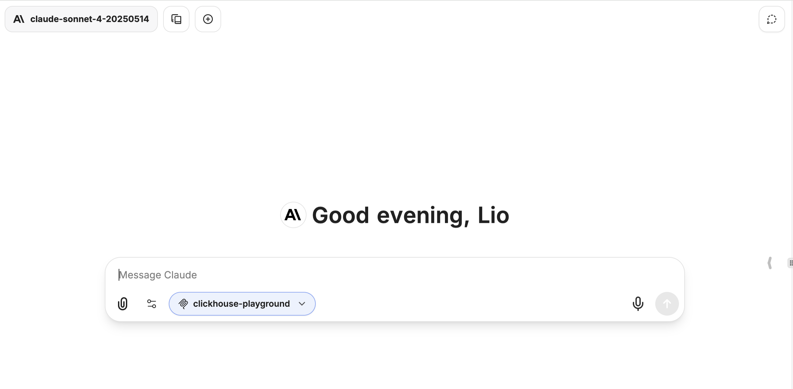

# Instrument Librechat and ClickHouse MCP Server using ClickStack

## Deploy ClickStart

The easiest way to get ClickStack up and running is to run it locally using Docker. For more details, refer to the [documentation](https://clickhouse.com/docs/use-cases/observability/clickstack/getting-started#deploy-stack-with-docker).

```
docker run -p 8080:8080 -p 4317:4317 -p 4318:4318 docker.hyperdx.io/hyperdx/hyperdx-all-in-one
```

Once ClickStack is running, get the [Ingestion API Key](https://clickhouse.com/docs/use-cases/observability/clickstack/getting-started/sample-data#copy-ingestion-api-key) from the Team settings menu.

## Configure librechat

LibreChat requires access to an LLM to function. This demo has been tested only with Anthropic models but other LLM providers should work similarly.

Rename the file `.env.example` to `.env` and provide your LLM API key. 

By example for Anthropic, scroll down to find the key `ANTHROPIC_API_KEY` and provide your API Key.

See the LibreChat [documentation](https://www.librechat.ai/docs/configuration/dotenv#anthropic) for more information.

In addition to the LLM key, copy the Ingestion API Key from ClickStack and assign it to the variable `CLICKSTACK_API_KEY` in the .env file.

## Configure ClickHouse MCP Server

[ClickHouse MCP Server](https://github.com/ClickHouse/mcp-clickhouse) allows LLMs to query ClickHouse.

You need to configure ClickHouse MCP Server to connect to your ClickHouse deployment.

By default, the MCP server is configured to connect to the public [ClickHouse SQL Playground](https://sql.clickhouse.com/).

To connect to your own ClickHouse deployment, edit the following environment variables in the `.env` file:
    - `CLICKHOUSE_HOST`: ClickHouse deployment URL
	- `CLICKHOUSE_USER`: ClickHouse username
	- `CLICKHOUSE_PASSWORD`: ClickHouse password

## Start librechat locally. 

Run `docker compose up` to start LibreChat.

You can access it at `http://localhost:3080` and sign up to get started.

On the main page, you need to select the configured LLM and the ClickHouse MCP Server before typing your question. 



Here are examples of prompts to get you started if the MCP server is connected to the default SQL Playground. 
- What are the datasets available? 
- How does the USD relate to GBP? 
- Who is the most frequent contributor to Clickhouse git repo using the available git stat data?


