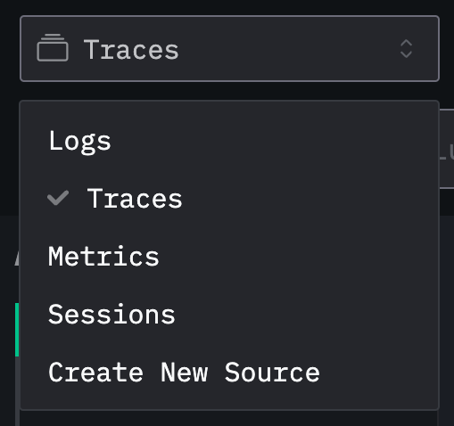
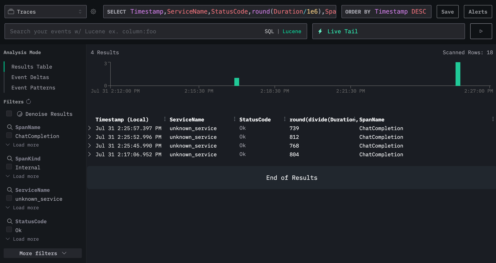

# Instrument OpenAI using OTel and ClickStack

In this example, we're going to learn how to instrument the OpenAI client with OTel and export the data to [ClickStack](https://clickhouse.com/docs/use-cases/observability/clickstack/overview).

If you want to follow along, you'll need to clone the repository:

```
git clone https://github.com/ClickHouse/examples.git
cd examples/clickstack/openai
```

Configure your OpenAI API key:

```
export OPENAI_API_KEY="sk-proj-xxx"
```

Once we've done that, we can run the basic instrumentation example:

```bash
uv run base.py
```

This script has the LLM write a Haiku and logs the observability data to the console.

Next, let's learn how to export that data into ClickStack.
We'll setup ClickStack locally by following the instructions in the [getting started guide](https://clickhouse.com/docs/use-cases/observability/clickstack/getting-started):

```bash
docker run -p 8080:8080 -p 4317:4317 -p 4318:4318 \
docker.hyperdx.io/hyperdx/hyperdx-all-in-one
```

Navigate to http://localhost:8080/team and copy the `Ingestion API Key` and then set it as the following environment variable:

```bash
export HYPERDX_API_KEY="xxx"
```

We can then run the following example, which writes the same Haiku, but exports observability data to ClickStack:

```
uv run clickstack.py
```

If we then go back to the HyperDX home page at http://localhost:8080 and select `Traces` from the dropdown:



We'll now see new events coming in after each invocation of the above script:

