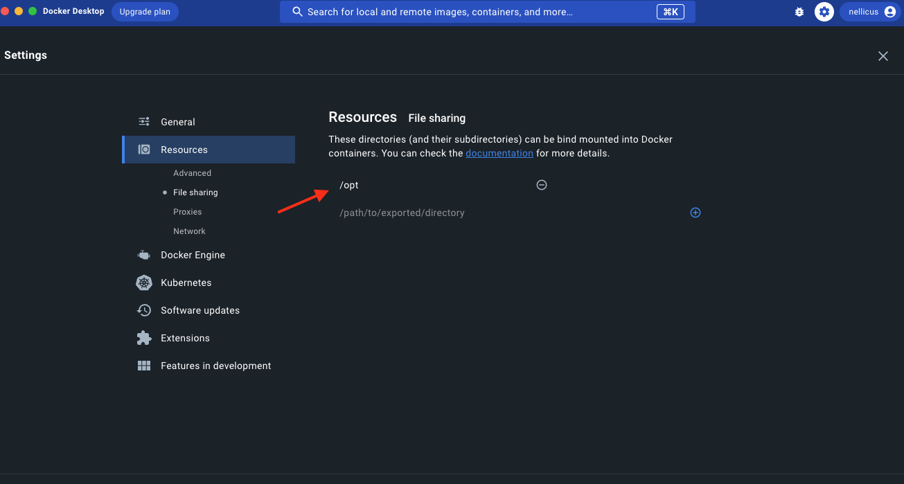

# ClickHouse Docker Compose recipes

A list of ClickHouse docker compose recipes

- [ClickHouse and Grafana](./recipes/ch-and-grafana/README.md)
- [ClickHouse and MinIO S3](./recipes/ch-and-minio-S3/README.md)
- [Clickhouse and LDAP (OpenLDAP)](./recipes/ch-and-openldap/README.md)
- [ClickHouse and Postgres](./recipes/ch-and-postgres/README.md)
- [Clickhouse and Vector syslog and apache demo data](./recipes/ch-and-vector/README.md)
- [Clickhouse Cluster: 2 CH nodes - 3 ClickHouse Keeper (1 Shard 2 Replicas)](./recipes/cluster_1S_2R/README.md)
- [Clickhouse Cluster: 2 CH nodes - 3 ClickHouse Keeper (2 Shards 1 Replica)](./recipes/cluster_2S_1R/README.md)
- [Clickhouse Cluster: 4 CH nodes - 3 ClickHouse Keeper (2 Shards 2 Replicas)](./recipes/cluster_2S_2R/README.md)
- [Clickhouse Cluster: 2 CH nodes - 3 ClickHouse Keeper (1 Shard 2 Replicas) - CH Proxy LB](./recipes/cluster_1S_2R_ch_proxy/README.md)
- [Clickhouse Cluster: 2 CH nodes - 3 ClickHouse Keeper (2 Shards 1 Replica) - CH Proxy LB](./recipes/cluster_2S_1R_ch_proxy/README.md)
- [Clickhouse Cluster: 4 CH nodes - 3 ClickHouse Keeper (2 Shards 2 Replicas) - CH Proxy LB](./recipes/cluster_2S_2R_ch_proxy/README.md)

These recipes are provided "AS-IS" and intended strictly and only for local quick and dirty testing.


## How to use

Each recipe runs as a pre-configured docker compose setup.

- clone this repository locally (`cd /opt && git clone https://github.com/ClickHouse/examples`)
- make sure the path _where_ you clone this repo (in this _example_ `/opt`) is added to your docker sharing settings

- `cd` into the desire recipe directory (e.g. `cd recipes/ch-and-grafana`)
- run `docker compose up` to launch the recipe
- ctrl+C will abort execution
- once done, run `docker compose down` to tear down the environment

## Resources

Make sure enough cpu cores, memory and disk are allocated for docker containers through docker settings.
Some of these recipes do use up to 8 different containers.

## Configuration files

The configuration files for ClickHouse server, ClickHouse Keeper, and all of the other components that
are deployed by the recipes are located in the `fs/volumes/` subdirectory of each recipe.  For example,
to learn how ClickHouse Keeper is configured for the `cluster_1S_2R` recipe, you would look at [keeper_config.xml](./recipes/cluster_1S_2R/fs/volumes/clickhouse-keeper-01/etc/clickhouse-keeper/keeper_config.xml) and the similar files for the other two Keeper servers.

## Connecting to ClickHouse

All recipes have the `default` user configured with no password and full privileges.

If you have `clickhouse client` on your workstation you can generally run `clickhouse client` and connect to the Docker ClickHouse instance.

If running a recipe with multiple ClickHouse ([example](https://github.com/ClickHouse/examples/tree/main/docker-compose-recipes/recipes/cluster_2S_1R)), while the first instance normally binds to your localhost as the default ClickHouse native protocol port [9000](https://github.com/ClickHouse/examples//blob/93291fe2ca143d7d0ec1ec02ad61f50dc2f83788/docker-compose-recipes/recipes/cluster_2S_2R/docker-compose.yaml#L13-L14) normally, however other instances will use a different port to bind the ClickHouse native TCP connection to your localhost ([example](https://github.com/ClickHouse/examples/blob/93291fe2ca143d7d0ec1ec02ad61f50dc2f83788/docker-compose-recipes/recipes/cluster_2S_2R/docker-compose.yaml#L28) where `clickhouse-02` binds on localhost port `9001`), in this case you will want to specify:

`clickhouse client --port 9001`


You may want to run `clickhouse client` within one of more of the containers so that the version of the client matches the version
of the server.  You can run a command like this:

```bash
docker compose exec clickhouse-01 clickhouse-client
```

Or, to open a shell on the server you can run the following and then look around or run `clickhouse client` from the shell:

```bash
docker compose exec clickhouse-01 bash
```

## Example use

To test ClickHouse with S3 functionalities, launch the [ClickHouse and MinIO S3](./recipes/ch-and-minio-S3/README.md) recipe:

```
➜ ch-and-minio-S3$ docker compose up
[+] Running 4/2
 ⠿ Network ch-and-minio-s3_default            Created                                                                                                                                                                                         0.0s
 ⠿ Container minio                            Created                                                                                                                                                                                         0.0s
 ⠿ Container clickhouse                       Created                                                                                                                                                                                         0.0s
 ⠿ Container ch-and-minio-s3-createbuckets-1  Created                                                                                                                                                                                         0.0s
Attaching to ch-and-minio-s3-createbuckets-1, clickhouse, minio
minio                            | Formatting 1st pool, 1 set(s), 1 drives per set.
minio                            | WARNING: Host local has more than 0 drives of set. A host failure will result in data becoming unavailable.
minio                            | MinIO Object Storage Server
minio                            | Copyright: 2015-2023 MinIO, Inc.
minio                            | License: GNU AGPLv3 <https://www.gnu.org/licenses/agpl-3.0.html>
minio                            | Version: RELEASE.2023-03-24T21-41-23Z (go1.19.7 linux/arm64)
minio                            |
minio                            | Status:         1 Online, 0 Offline.
minio                            | API: http://0.0.0.0:10000
minio                            | Console: http://0.0.0.0:10001
minio                            |
minio                            | Documentation: https://min.io/docs/minio/linux/index.html
minio                            | Warning: The standard parity is set to 0. This can lead to data loss.
ch-and-minio-s3-createbuckets-1  | Added `myminio` successfully.
ch-and-minio-s3-createbuckets-1  | ●  minio:10000
ch-and-minio-s3-createbuckets-1  |    Uptime: 1 second
ch-and-minio-s3-createbuckets-1  |    Version: 2023-03-24T21:41:23Z
ch-and-minio-s3-createbuckets-1  |    Network: 1/1 OK
ch-and-minio-s3-createbuckets-1  |    Drives: 1/1 OK
ch-and-minio-s3-createbuckets-1  |    Pool: 1
ch-and-minio-s3-createbuckets-1  |
ch-and-minio-s3-createbuckets-1  | Pools:
ch-and-minio-s3-createbuckets-1  |    1st, Erasure sets: 1, Drives per erasure set: 1
ch-and-minio-s3-createbuckets-1  |
ch-and-minio-s3-createbuckets-1  | 1 drive online, 0 drives offline
ch-and-minio-s3-createbuckets-1  | Bucket created successfully `myminio/clickhouse`.
ch-and-minio-s3-createbuckets-1  | mc: Please use 'mc anonymous'
ch-and-minio-s3-createbuckets-1 exited with code 0
clickhouse                       | Processing configuration file '/etc/clickhouse-server/config.xml'.
clickhouse                       | Merging configuration file '/etc/clickhouse-server/config.d/config.xml'.
clickhouse                       | Merging configuration file '/etc/clickhouse-server/config.d/docker_related_config.xml'.
clickhouse                       | Logging debug to /var/log/clickhouse-server/clickhouse-server.log
clickhouse                       | Logging errors to /var/log/clickhouse-server/clickhouse-server.err.log
minio                            |
minio                            |  You are running an older version of MinIO released 1 week ago
minio                            |  Update: Run `mc admin update`
minio                            |
minio                            |
clickhouse                       | Processing configuration file '/etc/clickhouse-server/config.xml'.
clickhouse                       | Merging configuration file '/etc/clickhouse-server/config.d/config.xml'.
clickhouse                       | Merging configuration file '/etc/clickhouse-server/config.d/docker_related_config.xml'.
clickhouse                       | Saved preprocessed configuration to '/var/lib/clickhouse/preprocessed_configs/config.xml'.
clickhouse                       | Processing configuration file '/etc/clickhouse-server/users.xml'.
clickhouse                       | Merging configuration file '/etc/clickhouse-server/users.d/users.xml'.
clickhouse                       | Saved preprocessed configuration to '/var/lib/clickhouse/preprocessed_configs/users.xml'.
```

