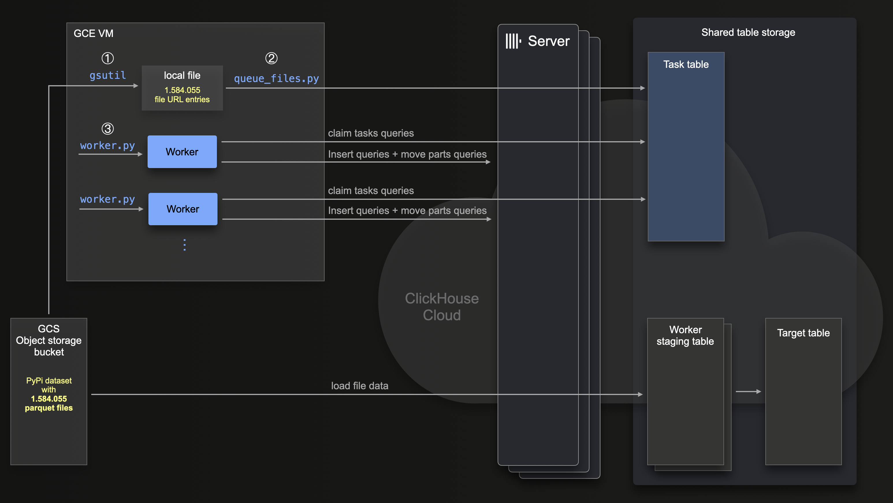

# Example for resiliently loading a large data set

For our [PyPi application](todo) we needed to initially load the current [PYPI dataset](https://clickhouse.com/blog/clickhouse-vs-snowflake-for-real-time-analytics-benchmarks-cost-analysis#pypi-dataset) from our (private) [gcs](https://cloud.google.com/storage?hl=en) bucket into a [ClickHouse Cloud](https://clickhouse.com/cloud) service.

This dataset has `625.57 billion rows` stored in `~1.5 million parquet files`.


This diagram sketches the steps we took (and describe in the following) to load the PyPi dataset reliably with ClickLoad:




Note that we use a [GCE VM](https://cloud.google.com/compute?hl=en) for running the main steps (that we describe in detail below) ①, ②, and ③. This VM needs network connectivity with both the source object storage bucket and the target ClickHouse service.

## Pre-requisites

We first create the target table and 12 materialized views on the ClickHouse service - see the [create_tables.sh](./create_tables.sh) script.

Next we create the [task table](https://github.com/ClickHouse/examples/tree/main/large_data_loads#table-schemas-for-job-task-table) for the ClickLoad [workers](https://github.com/ClickHouse/examples/blob/main/large_data_loads/src/worker.py). 

Note that we used Keeper nodes with 6 GB of RAM. As noted in the [pre-requisites](https://github.com/ClickHouse/examples/tree/main/large_data_loads#pre-requisites) for ClickLoad, Keeper needs ~1GB of RAM per Keeper node per 1 million scheduled files in the KeeperMap backed job task table

 


## Step ①: Create a file containing the bucket urls for all to be loaded files

We use the [gsutil cli tool](https://cloud.google.com/storage/docs/gsutil) for creating a local file containing the object storage urls of the ~1.5 million parquet files:
```shell
gsutil ls 'gs://clickhouse-pypi/file_downloads/*.parquet' | sed 's|gs://|https://storage.googleapis.com/%7C' > pypi-files.txt
```

Note that the call above uses `sed` to slightly transform the urls to be compatible with the format required by the ClickHouse [s3/gcs](https://clickhouse.com/docs/en/sql-reference/table-functions/s3) table function:

```shell
head pypi-files.txt
https://storage.googleapis.com/clickhouse_public_datasets/pypi/file_downloads/file_downloads-000000000000.parquet
https://storage.googleapis.com/clickhouse_public_datasets/pypi/file_downloads/file_downloads-000000000001.parquet
https://storage.googleapis.com/clickhouse_public_datasets/pypi/file_downloads/file_downloads-000000000002.parquet
https://storage.googleapis.com/clickhouse_public_datasets/pypi/file_downloads/file_downloads-000000000003.parquet
https://storage.googleapis.com/clickhouse_public_datasets/pypi/file_downloads/file_downloads-000000000004.parquet
https://storage.googleapis.com/clickhouse_public_datasets/pypi/file_downloads/file_downloads-000000000005.parquet
https://storage.googleapis.com/clickhouse_public_datasets/pypi/file_downloads/file_downloads-000000000006.parquet
https://storage.googleapis.com/clickhouse_public_datasets/pypi/file_downloads/file_downloads-000000000007.parquet
https://storage.googleapis.com/clickhouse_public_datasets/pypi/file_downloads/file_downloads-000000000008.parquet
https://storage.googleapis.com/clickhouse_public_datasets/pypi/file_downloads/file_downloads-000000000009.parquet
```

We verify that the file contains all ~1.5 million parquet file urls:
```shell
wc -l pypi-files.txt
1584055 
```

## Step ②: Scheduling the object storage files for ClickHouse import

```shell
python queue_files.py \
--host <CLICKHOUSE_HOST> \
--port 8443 \
--username default \
--password <PASSWORD> \
--file 'pypi-files.txt' \
--task_database default \
--task_table tasks
```

## Step ③: Spinning up 100 workers

We use the following shell script `start_workers` for starting (additional) workers:
```shell
#!/bin/bash
# Check if the number of arguments is correct
if [ "$#" -ne 2 ]; then
    echo "Usage: $0 <num_workers> <worker_id_offset>"
    exit 1
fi
CLICKHOUSE_HOST=${CLICKHOUSE_HOST:-localhost}
CLICKHOUSE_PORT=${CLICKHOUSE_PORT:-8443}
CLICKHOUSE_PASSWORD=${CLICKHOUSE_PASSWORD:-}
ACCESS_KEY=${ACCESS_KEY:-}
SECRET_KEY=${SECRET_KEY:-}
# Parse the arguments
worker_id_start="$2"
num_workers="$1"

echo "starting $num_workers workers..."

num_workers=$((num_workers + worker_id_start))

# Loop through and output the numbers in batches
for (( i=$worker_id_start; i<$num_workers; i++ )); do
    echo "worker: $i"
    nohup python worker.py --host ${CLICKHOUSE_HOST} --port ${CLICKHOUSE_PORT} --username default --password ${CLICKHOUSE_PASSWORD} --task_database default --worker_id="worker_${i}" --task_table tasks --cfg.bucket_access_key ${ACCESS_KEY} --cfg.bucket_access_secret ${SECRET_KEY} --database pypi --table pypi --cfg.format Parquet --cfg.structure  "timestamp DateTime64(6), country_code LowCardinality(String), url String, project String, \`file.filename\` String, \`file.project\` String, \`file.version\` String, \`file.type\` String, \`installer.name\` String, \`installer.version\` String, python String, \`implementation.name\` String, \`implementation.version\` String, \`distro.name\` String, \`distro.version\` String, \`distro.id\` String, \`distro.libc.lib\` String, \`distro.libc.version\` String, \`system.name\` String, \`system.release\` String, cpu String, openssl_version String, setuptools_version String, rustc_version String,tls_protocol String, tls_cipher String" --cfg.select "SELECT timestamp::Date as date, country_code, project, file.type as type, installer.name as installer, arrayStringConcat(arraySlice(splitByChar('.', python), 1, 2), '.') as python_minor, system.name as system, file.version as version" --cfg.query_settings input_format_null_as_default=1 input_format_parquet_import_nested=1 max_insert_threads=1 min_insert_block_size_bytes=0 min_insert_block_size_rows=10_000_000 > "worker-${i}.log" 2>&1 &
done
```

E.g. we can start 10 workers
```shell
start_workers 10 0
```

Then check the utilization of the target ClickHouse service, and when we see that the service isn't utilized enough yet, we can start additional workers.

E.g. we can start 90 additional workers
```shell
start_workers 90 10
```

## Result

TODO: how long did it take
- 8 million rows/s with 6 nodes
- 4 million rows/s with 3 nodes

- Show sanity queries for checking that amount of rows is the same

- show some retries from the logs

