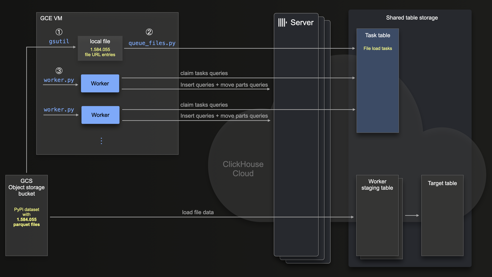

# Example for resiliently loading a large data set

For our [PyPi application](todo) we needed to initially load the current [PYPI dataset](https://clickhouse.com/blog/clickhouse-vs-snowflake-for-real-time-analytics-benchmarks-cost-analysis#pypi-dataset) from our (private) [gcs](https://cloud.google.com/storage?hl=en) bucket into a [ClickHouse Cloud](https://clickhouse.com/cloud) service.

This dataset has `625.57 billion rows` stored in `~1.5 million parquet files`.


This diagram sketches the steps we took (and describe in the following) to load the PyPi dataset reliably with ClickLoad:





Note that we use a [GCE VM](https://cloud.google.com/compute?hl=en) for running the main steps (that we describe in detail below) ①, ②, and ③. This VM needs network connectivity with both the source object storage bucket and the target ClickHouse service.

## Pre-requisites

We first create the target table and 12 materialized views on the ClickHouse service - see the [create_tables.sh](./create_tables.sh) script.

Next we create the [task table](https://github.com/ClickHouse/examples/tree/main/large_data_loads#table-schemas-for-job-task-table) for the ClickLoad [workers](https://github.com/ClickHouse/examples/blob/main/large_data_loads/src/worker.py). 

Note that we used Keeper nodes with 6 GB of RAM. As noted in the [pre-requisites](https://github.com/ClickHouse/examples/tree/main/large_data_loads#pre-requisites) for ClickLoad, Keeper needs ~1GB of RAM per Keeper node per 1 million scheduled files in the KeeperMap backed job task table

 


## Step ①: Create a file containing the bucket urls for all to be loaded files

We use the [gsutil cli tool](https://cloud.google.com/storage/docs/gsutil) for creating a local file containing the object storage urls of the ~1.5 million parquet files:
```shell
gsutil ls 'gs://clickhouse-pypi/file_downloads/*.parquet' | sed 's|gs://|https://storage.googleapis.com/%7C' > /opt/pypi/pypi-files.txt
```

Note that the call above uses `sed` to slightly transform the urls to be compatible with the format required by the ClickHouse [s3/gcs](https://clickhouse.com/docs/en/sql-reference/table-functions/s3) table function:

```shell
head /opt/pypi/pypi-files.txt
https://storage.googleapis.com/clickhouse_public_datasets/pypi/file_downloads/file_downloads-000000000000.parquet
https://storage.googleapis.com/clickhouse_public_datasets/pypi/file_downloads/file_downloads-000000000001.parquet
https://storage.googleapis.com/clickhouse_public_datasets/pypi/file_downloads/file_downloads-000000000002.parquet
https://storage.googleapis.com/clickhouse_public_datasets/pypi/file_downloads/file_downloads-000000000003.parquet
https://storage.googleapis.com/clickhouse_public_datasets/pypi/file_downloads/file_downloads-000000000004.parquet
https://storage.googleapis.com/clickhouse_public_datasets/pypi/file_downloads/file_downloads-000000000005.parquet
https://storage.googleapis.com/clickhouse_public_datasets/pypi/file_downloads/file_downloads-000000000006.parquet
https://storage.googleapis.com/clickhouse_public_datasets/pypi/file_downloads/file_downloads-000000000007.parquet
https://storage.googleapis.com/clickhouse_public_datasets/pypi/file_downloads/file_downloads-000000000008.parquet
https://storage.googleapis.com/clickhouse_public_datasets/pypi/file_downloads/file_downloads-000000000009.parquet
```

We verify that the file contains all ~1.5 million parquet file urls:
```shell
wc -l /opt/pypi/pypi-files.txt
1584055 
```

## Step ②: Scheduling the object storage files for ClickHouse import

```shell
python queue_files.py --host ${CLICKHOUSE_HOST} --port ${CLICKHOUSE_PORT} --username default --password ${CLICKHOUSE_PASSWORD} --file "/opt/pypi/pypi-files.txt" --task_database default --task_table tasks --files_chunk_size_min 500 --files_chunk_size_max 1000
```

## Step ③: Spinning up 100 workers

We use the following shell script `start_workers` for starting (additional) workers:
```shell
#!/bin/bash
# Check if the number of arguments is correct
if [ "$#" -ne 2 ]; then
    echo "Usage: $0 <num_workers> <worker_id_offset>"
    exit 1
fi
CLICKHOUSE_HOST=${CLICKHOUSE_HOST:-localhost}
CLICKHOUSE_PORT=${CLICKHOUSE_PORT:-8443}
CLICKHOUSE_PASSWORD=${CLICKHOUSE_PASSWORD:-}
ACCESS_KEY=${ACCESS_KEY:-}
SECRET_KEY=${SECRET_KEY:-}
# Parse the arguments
worker_id_start="$2"
num_workers="$1"

echo "starting $num_workers workers..."

num_workers=$((num_workers + worker_id_start))

# Loop through and output the numbers in batches
for (( i=$worker_id_start; i<$num_workers; i++ )); do
    echo "worker: $i"
    nohup python worker.py --host ${CLICKHOUSE_HOST} --port ${CLICKHOUSE_PORT} --username default --password ${CLICKHOUSE_PASSWORD} --task_database default --worker_id="worker_${i}" --task_table tasks --cfg.bucket_access_key ${ACCESS_KEY} --cfg.bucket_access_secret ${SECRET_KEY} --database pypi --table pypi --cfg.format Parquet --cfg.structure  "timestamp DateTime64(6), country_code LowCardinality(String), url String, project String, \`file.filename\` String, \`file.project\` String, \`file.version\` String, \`file.type\` String, \`installer.name\` String, \`installer.version\` String, python String, \`implementation.name\` String, \`implementation.version\` String, \`distro.name\` String, \`distro.version\` String, \`distro.id\` String, \`distro.libc.lib\` String, \`distro.libc.version\` String, \`system.name\` String, \`system.release\` String, cpu String, openssl_version String, setuptools_version String, rustc_version String,tls_protocol String, tls_cipher String" --cfg.select "SELECT timestamp::Date as date, country_code, project, file.type as type, installer.name as installer, arrayStringConcat(arraySlice(splitByChar('.', python), 1, 2), '.') as python_minor, system.name as system, file.version as version" --cfg.query_settings input_format_null_as_default=1 input_format_parquet_import_nested=1 max_insert_threads=1 min_insert_block_size_bytes=0 min_insert_block_size_rows=10_000_000 > "worker-${i}.log" 2>&1 &
done
```

E.g. we can start 10 workers
```shell
start_workers 10 0
```

Then check the utilization of the target ClickHouse service, and when we see that the service isn't utilized enough yet, we can start additional workers.

E.g. we can start 90 additional workers
```shell
start_workers 90 10
```

## Result

We run the data load with 100 parallel workers and 2 different CLickHouse Cloud service sizes:

### CLickHouse Cloud service size 1
- 6 ClickHouse servers
- 59 CPU cores per server
- 236 GB RAM per server

### CLickHouse Cloud service size 2
- 3 ClickHouse servers
- 59 CPU cores per server
- 236 GB RAM per server

Both services used a Keeper service with 3 nodes and 3 CPU cores and 6 GB RAM per node.

For both data loads we monitored the utilization of both the ClickHouse and the Keeper servers:

### ClickHouse server utilization during the data load
- CPU: max. 20 of the available 59 CPU cores were utilized
- Memory: max. 30 GB of the available 236 GB RAM were utilized

### Keeper server utilization during the data load
- CPU: max. 1.5 of the available 3 CPU cores were utilized
- Memory: max. 2 GB of the available 6 GB RAM were utilized

Based on this utilization numbers we could have started additional workers.

How long did the loading of the 625.57 billion rows stored in ~1.5 million parquet files take?

With 6 ClickHouse servers we could reliably load `30 billion rows per hour` which gives a insert throughput of `8 million rows per second`.

With 3 ClickHouse servers we could reliably load `15 billion rows per hour` which gives a insert throughput of `4 million rows per second`.

In the worker's log files we could see some retries meaning that some things transiently went wrong but this situations could always be successfully recovered by automatic retries.

After the data load we double checked the row count.


We check the row count on the object storage bucket:
```sql
SELECT
    count() AS count,
    formatReadableQuantity(count) AS count_formatted
FROM s3Cluster(
    'default',
    'https://storage.googleapis.com/clickhouse-pypi/file_downloads/file_downloads-*.parquet',
    <ACCESS_KEY>,
    <SECRET_KEY>,
    'Parquet'
)

┌────────count─┬─count_formatted─┐
│ 625572951817 │ 625.57 billion  │
└──────────────┴─────────────────┘

1 row in set. Elapsed: 7781.338 sec. Processed 625.57 billion rows, 31.82 MB (80.39 million rows/s., 4.09 KB/s.)
Peak memory usage: 651.00 MiB.
```

We check the row count in the target table
```sql
SELECT count()
FROM pypi.pypi

┌──────count()─┐
│ 625572951817 │
└──────────────┘

1 row in set. Elapsed: 0.019 sec.
```


## Setting up a continuous data load

Each worker executes an [endless loop](https://github.com/ClickHouse/examples/blob/cc4287fe759e67fd7af0ab3a5a79b42ac0c5a969/large_data_loads/src/worker.py#L191) checking for unprocessed tasks in the task queue with [sleep breaks](https://github.com/ClickHouse/examples/blob/cc4287fe759e67fd7af0ab3a5a79b42ac0c5a969/large_data_loads/src/worker.py#L203C16-L203C16) in case no new task is found. This allows the easy implementation of a continuous data ingestion process by simply adding new tasks with new file url chunks into the task table in case new files are detected in the object storage bucket. The running workers will then automatically claim these new scheduled tasks.

For our pypi application we export all new rows once a day - at midnight utc - from the original [public table in BigQuery](https://packaging.python.org/en/latest/guides/analyzing-pypi-package-downloads/#id10) into parquet files in our (private) gcs bucket into a folder reflecting the epoch timestamp for midnight UTC. 

Then we run the following cronjob on our gce vm once per hour:
```shell
#!/bin/bash

# Get the current date in epoch format
current_date_epoch=$(date -u +%s)

# The number of seconds in a day (86400 seconds)
seconds_in_a_day=86400

# Calculate the previous day's date in epoch format
previous_day_epoch=$((current_date_epoch - seconds_in_a_day))

# Calculate the epoch timestamp for midnight UTC
midnight_utc_epoch=$((previous_day_epoch / seconds_in_a_day * seconds_in_a_day))

file_path="https://storage.googleapis.com/clickhouse-pypi/file_downloads/incremental/${midnight_utc_epoch}-*.parquet"

gsutil ls "gs://clickhouse-pypi/file_downloads/incremental/${midnight_utc_epoch}-*.parquet" | sed 's|gs://|https://storage.googleapis.com/%7C' > /opt/pypi/pypi-${midnight_utc_epoch}.txt

python queue_files.py --host ${CLICKHOUSE_HOST} --port ${CLICKHOUSE_PORT} --username default --password ${CLICKHOUSE_PASSWORD} --file "/opt/pypi/pypi-${midnight_utc_epoch}.txt" --task_database default --task_table tasks --files_chunk_size_min 500 --files_chunk_size_max 1000
```

For most hourly calls the script will fail when the current day's daily export at midnight utc didn't occur yet. But once a day the script will pickup all new files from the daily export, and schedule them via `queue_files.py` into ClickLoad's task table triggering running workers to load the new files' data into the ClickHouse table(s).


