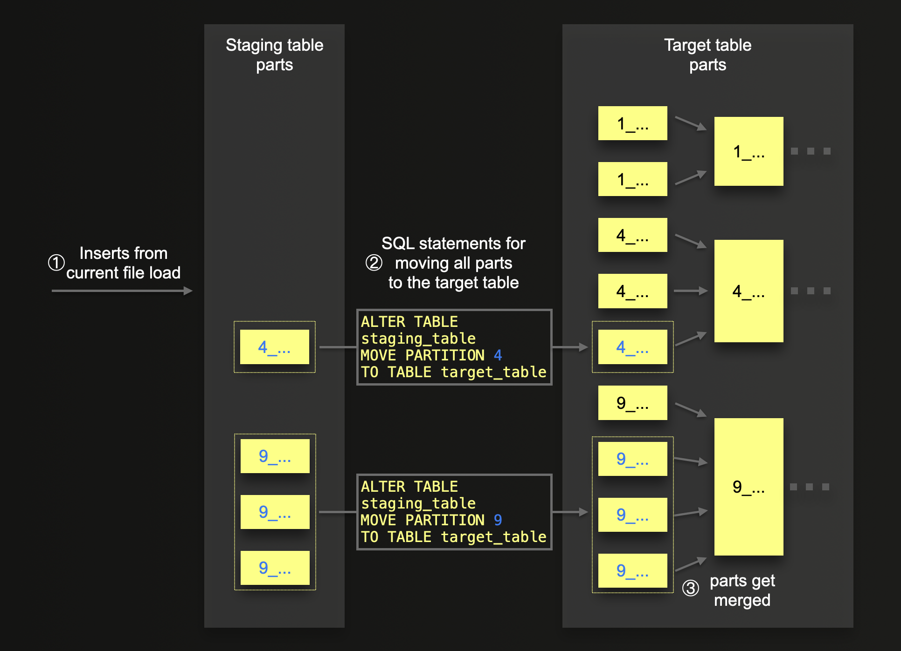

# How the script works in detail

Here we document some of the implementation details in more detail.

## Support for arbitrary partitioning keys

The script’s resilient data load mechanism is independent of any [partitioning](https://clickhouse.com/docs/en/engines/table-engines/mergetree-family/custom-partitioning-key) scheme of the target table. Our script doesn’t create any partitions by itself. And also doesn’t require that each loaded file belongs to a specific partition. Instead, the target table can have any (or no) [custom partition key](https://clickhouse.com/docs/en/engines/table-engines/mergetree-family/custom-partitioning-key), which we duplicate in the staging table (which is a DDL-level [clone](https://github.com/ClickHouse/examples/blob/cc4287fe759e67fd7af0ab3a5a79b42ac0c5a969/large_data_loads/src/worker.py#L399) of the target table). After each successful [file load](https://github.com/ClickHouse/examples/blob/cc4287fe759e67fd7af0ab3a5a79b42ac0c5a969/large_data_loads/src/worker.py#L261), we just [move](https://github.com/ClickHouse/examples/blob/cc4287fe759e67fd7af0ab3a5a79b42ac0c5a969/large_data_loads/src/worker.py#L269) over all (parts belonging to) partitions that were naturally created for the staging table during the ingest of data from the currently processed file. This means that overall exactly the same number of partitions is created for the target table as if we would insert all data (without using our script) directly into the target table. The following diagram sketches this:

A successful file load ① creates some parts (indicated as yellow rectangles in the diagram above) for the staging table. These parts potentially belong to partitions. Partitions don’t exist by themselves in ClickHouse. Instead, each part indicates the partition it belongs to via its individual directory name (which is often referred to as the part’s name). The data for each part is stored within a directory, whose name [is a combination of](https://github.com/ClickHouse/ClickHouse/blob/ff66d2937617f2c66e57b9539f34b6e4ea8ed183/src/Storages/MergeTree/MergeTreeData.h#L126) `partition-id`, min and max [block](https://clickhouse.com/docs/en/development/architecture#block) ids, and [merge-level](https://clickhouse.com/blog/supercharge-your-clickhouse-data-loads-part1), all separated by the `_` character. In the example in the diagram above, the target table (and, therefore, also the staging table) uses the [month](https://clickhouse.com/docs/en/sql-reference/functions/date-time-functions#tomonth) of a [DateTime](https://clickhouse.com/docs/en/sql-reference/data-types/datetime) column value for [partitioning](https://clickhouse.com/docs/en/engines/table-engines/mergetree-family/custom-partitioning-key) the data. Therefore the name of each part directory starts with a (numeric) month indicating the part’s `partition-id`. In our example, the current batch transfer created one part belonging to the April (`4_…`) partition and 3 parts belonging to the September (`9_…`) partition. Because the data ingested from the currently processed file coincidentally contained rows with partitioning key values for exactly these two months. 

After the whole batch transfer succeeded, [per](https://github.com/ClickHouse/examples/blob/cc4287fe759e67fd7af0ab3a5a79b42ac0c5a969/large_data_loads/src/worker.py#L568) existing partition in the staging table, we [use](https://github.com/ClickHouse/examples/blob/cc4287fe759e67fd7af0ab3a5a79b42ac0c5a969/large_data_loads/src/worker.py#L595) a ([atomic](https://github.com/ClickHouse/ClickHouse/issues/4729)) [ALTER TABLE … MOVE PARTITION … TO …](https://clickhouse.com/docs/en/sql-reference/statements/alter/partition#move-partition-to-table) operation to ② move these new parts (indicated with a blue directory name) from the staging table to the target table, which already contains parts from previous file transfers (indicated with black directory names belonging to the January-, April-, and September-partition). 

If the target table (and therefore also the staging table) doesn’t use a partition key, all parts belong to the same `all` partition. And all part directory names start with  `all_`. 

Note that eventually, in the background, the target table’s parts are ③ [merged](https://clickhouse.com/blog/supercharge-your-clickhouse-data-loads-part1#more-parts--more-background-part-merges) (per [level](https://clickhouse.com/blog/supercharge-your-clickhouse-data-loads-part1#more-parts--more-background-part-merges)) into larger parts. Parts belonging to different partitions are never merged with each other.

Also, note that [ClickHouse Cloud](https://clickhouse.com/cloud) stores all data [shared](https://clickhouse.com/blog/clickhouse-cloud-boosts-performance-with-sharedmergetree-and-lightweight-updates#clickhouse-cloud-enters-the-stage) in object storage. Moving parts doesn’t copy/move any data inside the object storage but simply changes links to the existing parts.  
