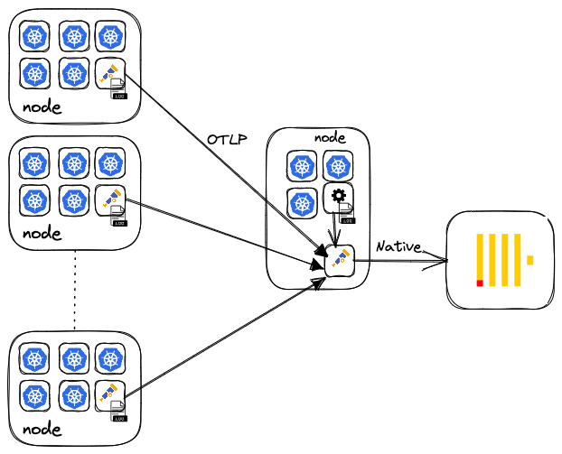

# Log collection with the Open Telemetry Collector

Collect logs and store in ClickHouse using the Open Telemetry Collector.

Installs an Open Telemetry collector as a deployment (for an aggregator/gateway) and as a deamonset to collect logs from each node.



## Install helm chart

```bash
helm repo add open-telemetry https://open-telemetry.github.io/opentelemetry-helm-charts
```

## Download files

Download the agent and aggregator value files for the helm chart.

```
wget https://raw.githubusercontent.com/ClickHouse/examples/main/observability/logs/kubernetes/otel_to_otel/agent.yml
wget https://raw.githubusercontent.com/ClickHouse/examples/main/observability/logs/kubernetes/otel_to_otel/gateway.yml
```

## Gateway Configuration

Deploying the Collector as a gateway requires a few simple configuration changes. Principally, we specify the mode as `deployment` and ensure any collection is disabled. 

The [gateway.yml](./gateway.yml) contains the following required changes.

```yaml
# Valid values are "daemonset", "deployment", and "statefulset".
mode: "deployment"
```

Agent-specific configuration occurs under the `config` key. To receive data from agents, we configure an oltp receiver to use gRPC on port 4317. The batch processor can be used to maximize bulk inserts to ClickHouse, with `timeout` property allowing the user to control the maximum latency of inserts (time from collection to ClickHouse insert). Note we recommend a [batch size of at least 1000](https://clickhouse.com/docs/en/cloud/bestpractices/bulk-inserts/#:~:text=Generally%2C%20we%20recommend%20inserting%20data,between%2010%2C000%20to%20100%2C000%20rows.) and setting the timeout to the highest possible value to avoid small inserts. We configure a clickhouse exporter, using the [dsn syntax supported by the Go client](https://github.com/ClickHouse/clickhouse-go#dsn), to securely send logs to port 9440, specify a table as `OTEL_logs` and declare a pipeline to tie everything together. The pipeline explicitly connects the receiver, processors, and exporter into a single execution flow.


Ensure you modify the [target ClickHouse cluster](https://github.com/ClickHouse/examples/blob/main/observability/logs/kubernetes/otel_to_otel/gateway.yml#L78) via the `dsn` key and [resources](https://github.com/ClickHouse/examples/blob/main/observability/logs/kubernetes/otel_to_otel/gateway.yml#L223-L226) to fit your environment.

```yaml
config:
 receivers:
   OTLP:
     protocols:
       grpc:
         endpoint: 0.0.0.0:4317
       http:
         endpoint: 0.0.0.0:4318
 processors:
   memory_limiter: null
   batch:
     send_batch_size: 100000
     timeout: 5s
 exporters:
   clickhouse:
     # send logs to OTEL db
     dsn: clickhouse://default:<password>@<host>:9440/OTEL?secure=true
     logs_table_name: OTEL_logs
     ttl_days: 0
     timeout: 10s
     sending_queue:
       queue_size: 100
     retry_on_failure:
       enabled: true
       initial_interval: 5s
       max_interval: 30s
       max_elapsed_time: 300s
 service:
   extensions:
     - health_check
     - memory_ballast
   pipelines:
     logs:
       exporters:
         - clickhouse
       processors:
         - memory_limiter
         - batch
       receivers:
         - OTLP
```


## Install the gateway

Install the collector as a deployment. 

```bash
helm install otel-collector open-telemetry/opentelemetry-collector --values gateway.yml --create-namespace --namespace otel

kubectl -n=otel get pods
NAME                                 READY   STATUS    RESTARTS   AGE
collector-gateway-74c7dd4f7b-zwllq   1/1     Running   0          9s
```

This will create a table `otel_logs` in the `otel` database of the following schema:

```sql
CREATE TABLE otel.otel_logs
(
    `Timestamp` DateTime64(9) CODEC(Delta(8), ZSTD(1)),
    `TraceId` String CODEC(ZSTD(1)),
    `SpanId` String CODEC(ZSTD(1)),
    `TraceFlags` UInt32 CODEC(ZSTD(1)),
    `SeverityText` LowCardinality(String) CODEC(ZSTD(1)),
    `SeverityNumber` Int32 CODEC(ZSTD(1)),
    `ServiceName` LowCardinality(String) CODEC(ZSTD(1)),
    `Body` String CODEC(ZSTD(1)),
    `ResourceAttributes` Map(LowCardinality(String), String) CODEC(ZSTD(1)),
    `LogAttributes` Map(LowCardinality(String), String) CODEC(ZSTD(1)),
    INDEX idx_trace_id TraceId TYPE bloom_filter(0.001) GRANULARITY 1,
    INDEX idx_res_attr_key mapKeys(ResourceAttributes) TYPE bloom_filter(0.01) GRANULARITY 1,
    INDEX idx_res_attr_value mapValues(ResourceAttributes) TYPE bloom_filter(0.01) GRANULARITY 1,
    INDEX idx_log_attr_key mapKeys(LogAttributes) TYPE bloom_filter(0.01) GRANULARITY 1,
    INDEX idx_log_attr_value mapValues(LogAttributes) TYPE bloom_filter(0.01) GRANULARITY 1,
    INDEX idx_body Body TYPE tokenbf_v1(32768, 3, 0) GRANULARITY 1
)
ENGINE = MergeTRee
PARTITION BY toDate(Timestamp)
ORDER BY (ServiceName, SeverityText, toUnixTimestamp(Timestamp), TraceId)
SETTINGS index_granularity = 8192, ttl_only_drop_parts = 1
```

## Agent Configuration

Once we have an aggregator in our cluster, we can deploy the OTEL collector as an agent. In this case, we set the mode to `daemonset` and enable the logs' collection and enrichment with k8s metadata.

```yaml
mode: "daemonset"
presets:
 logsCollection:
   enabled: true
   includeCollectorLogs: false
   storeCheckpoints: true
 kubernetesAttributes:
   enabled: true
```

Our pipeline, in this instance, is configured to utilize an oltp exporter to send logs to the aggregator. Again we use the batch processor to ensure large bulk sizes and modify the `k8sattributes` processor to enrich our logs.

```yaml
config:
 exporters:
   OTLP:
     endpoint: otel-collector-gateway:4317
     tls:
       insecure: true
     sending_queue:
       num_consumers: 4
       queue_size: 100
     retry_on_failure:
       enabled: true
```

## Install the Agent

Installs the collector as a daemonset. Ensure you modify the [resources]() to fit your environment.

```bash
helm install otel-agent open-telemetry/opentelemetry-collector --values agent.yml --create-namespace --namespace otel

 
kubectl -n=otel get pods
NAME                                 READY   STATUS    RESTARTS   AGE
agent-agent-2wgsm                    1/1     Running   0          5s
agent-agent-588w9                    1/1     Running   0          5s
```

## Confirm logs are arriving


```sql
SELECT count()
FROM otel.otel_logs

┌─count()─┐
│ 4695341 │
└─────────┘
```